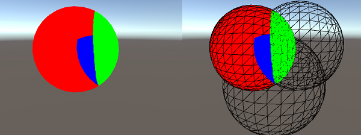
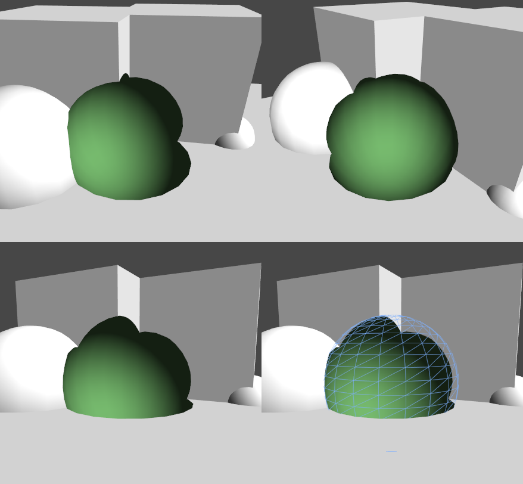

#ShaderLab：模板

模板缓冲区可用作一般目的的每像素遮罩，以便保存或丢弃像素。

模板缓冲区通常是每像素 8 位整数。该值可以写入、递增或递减。后续绘制调用可以根据该值进行测试，以确定在运行像素着色器之前是否应丢弃像素。


##语法

###Ref
````
	Ref referenceValue
````
要比较的参考值（如果 Comp 是 _always_ 以外的任何值）和/或要写入缓冲区的值（如果 Pass、Fail 或 ZFail 设置为替换）。值为 0 到 255 之间的整数。

###ReadMask
````
	ReadMask readMask
````
这是一个 8 位掩码，值为 0 到 255 之间的整数，用于比较参考值和缓冲区的内容 (_referenceValue_ & _readMask_) _comparisonFunction_ (_stencilBufferValue_ & _readMask_)。默认值：_255_。

###WriteMask
````
	WriteMask writeMask
````
这是一个 8 位掩码，值为 0 到 255 之间整数，写入缓冲区时使用。请注意，与其他写掩码一样，它指定写操作将影响模板缓冲区的哪些位（例如 WriteMask 0 表示不会影响任何位，也不会写入 0）。默认值：_255_。

###Comp
````
	Comp comparisonFunction
````
用于将参考值与缓冲区的当前内容进行比较的函数。默认值：_always_。

###Pass
````
	Pass stencilOperation
````
如果模板测试（和深度测试）通过，如何处理缓冲区的内容。默认值：_keep_。

###Fail
````
	Fail stencilOperation
````
如果模板测试（和深度测试）失败，如何处理缓冲区的内容。默认值：_keep_。

###ZFail
````
	ZFail stencilOperation
````
如果模板测试通过但深度测试失败，如何处理缓冲区的内容。默认值：_keep_。


Comp、Pass、Fail 和 ZFail 将应用于正面几何体，除非指定了 _Cull Front_，在这种情况下将应用于背面几何体。您还可以通过定义 CompFront、PassFront、FailFront 或 ZFailFront（用于正面几何体）以及 CompBack、PassBack、FailBack 或 ZFailBack（用于背面几何体）来显式指定双面模板状态。

###比较函数
比较函数为以下函数之一：

| | |
|:---|:---|
|**Greater** |仅渲染参考值大于缓冲区值的像素。|
|**GEqual** |仅渲染参考值大于或等于缓冲区值的像素。|
|**Less** |仅渲染参考值小于缓冲区值的像素。|
|**LEqual** |仅渲染参考值小于或等于缓冲区值的像素。|
|**Equal** |仅渲染参考值等于缓冲区值的像素。|
|**NotEqual** |仅渲染参考值不同于缓冲区值的像素。|
|**Always** |使模板测试始终通过。|
|**Never** |使模板测试始终失败。|

###模板操作
模板操作为以下操作之一：

| | |
|:---|:---|
|**Keep** |保持缓冲区的当前内容。|
|**Zero** |将 0 写入缓冲区。|
|**Replace** |将参考值写入缓冲区。|
|**IncrSat** |递增缓冲区中的当前值。如果该值已经是 255，则保持为 255。|
|**DecrSat** |递减缓冲区中的当前值。如果该值已经是 0，则保持为 0。|
|**Invert** |将所有位求反。|
|**IncrWrap** |递增缓冲区中的当前值。如果该值已经是 255，则变为 0。|
|**DecrWrap** |递减缓冲区中的当前值。如果该值已经是 0，则变为 255。|


##延迟渲染路径

在延迟渲染路径中渲染的对象的模板功能在某种程度上受到限制，因为在基础通道和光照通道期间，模板缓冲区用于其他目的。在这两个阶段中，着色器中定义的模板状态将被忽略，而仅在最终通道期间考虑。因此，不可能基于模板测试来屏蔽这些对象，但是它们仍然可以修改缓冲区内容，以供稍后在帧中渲染的对象使用。在延迟路径之后在前向渲染路径中渲染的对象（例如透明对象或没有表面着色器的对象）将再次正常设置其模板状态。

延迟渲染路径使用模板缓冲区的三个最高位，加上最多四个最高位（具体取决于场景中使用的光遮罩层数）。可以使用模板读写掩码在“干净”的位范围内操作，也可以使用 Camera.clearStencilAfterLightingPass 强制摄像机在光照通道后清理模板缓冲区。

###示例


第一个示例着色器将在深度测试通过的任何位置写入值“2”。模板测试设置为始终通过。


````
Shader "Red" {
	SubShader {
		Tags { "RenderType"="Opaque" "Queue"="Geometry"}
		Pass {
			Stencil {
				Ref 2
				Comp always
				Pass replace
			}
		
			CGPROGRAM
			#pragma vertex vert
			#pragma fragment frag
			struct appdata {
				float4 vertex : POSITION;
			};
			struct v2f {
				float4 pos : SV_POSITION;
			};
			v2f vert(appdata v) {
				v2f o;
				o.pos = UnityObjectToClipPos(v.vertex);
				return o;
			}
			half4 frag(v2f i) : SV_Target {
				return half4(1,0,0,1);
			}
			ENDCG
		}
	} 
}
````

仅当像素的第一个（红色）着色器已通过，第二个着色器才会通过，因为它要检查与值“2”的相等性。它还将递减 Z 测试失败的缓冲区中的值。


````
Shader "Green" {
	SubShader {
		Tags { "RenderType"="Opaque" "Queue"="Geometry+1"}
		Pass {
			Stencil {
				Ref 2
				Comp equal
				Pass keep 
				ZFail decrWrap
			}
		
			CGPROGRAM
			#pragma vertex vert
			#pragma fragment frag
			struct appdata {
				float4 vertex : POSITION;
			};
			struct v2f {
				float4 pos : SV_POSITION;
			};
			v2f vert(appdata v) {
				v2f o;
				o.pos = UnityObjectToClipPos(v.vertex);
				return o;
			}
			half4 frag(v2f i) : SV_Target {
				return half4(0,1,0,1);
			}
			ENDCG
		}
	} 
}
````

第三个着色器仅在模板值为“1”的任何位置通过，因此只有红色和绿色球体交叉处的像素符合条件；即，模板由红色着色器设置为“2”并由绿色着色器递减为“1”的情况。


````
Shader "Blue" {
	SubShader {
		Tags { "RenderType"="Opaque" "Queue"="Geometry+2"}
		Pass {
			Stencil {
				Ref 1
				Comp equal
			}
		
			CGPROGRAM
			#include "UnityCG.cginc"
			#pragma vertex vert
			#pragma fragment frag
			struct appdata {
				float4 vertex : POSITION;
			};
			struct v2f {
				float4 pos : SV_POSITION;
			};
			v2f vert(appdata v) {
				v2f o;
				o.pos = UnityObjectToClipPos(v.vertex);
				return o;
			}
			half4 frag(v2f i) : SV_Target {
				return half4(0,0,1,1);
			}
			ENDCG
		}
	}
}
````

结果：

 


下面是另一个更有针对性的效果的示例。首先使用此着色器渲染球体，以标记模板缓冲区中的正确区域：


````
Shader "HolePrepare" {
	SubShader {
		Tags { "RenderType"="Opaque" "Queue"="Geometry+1"}
		ColorMask 0
		ZWrite off
		Stencil {
			Ref 1
			Comp always
			Pass replace
		}

		CGINCLUDE
			struct appdata {
				float4 vertex : POSITION;
			};
			struct v2f {
				float4 pos : SV_POSITION;
			};
			v2f vert(appdata v) {
				v2f o;
				o.pos = UnityObjectToClipPos(v.vertex);
				return o;
			}
			half4 frag(v2f i) : SV_Target {
				return half4(1,1,0,1);
			}
		ENDCG

		Pass {
			Cull Front
			ZTest Less
		
			CGPROGRAM
			#pragma vertex vert
			#pragma fragment frag
			ENDCG
		}
		Pass {
			Cull Back
			ZTest Greater
		
			CGPROGRAM
			#pragma vertex vert
			#pragma fragment frag
			ENDCG
		}
	} 
}
````

然后再一次渲染为相当标准的表面着色器，但是例外之处是正面剔除，禁用了深度测试，而且模板测试丢弃先前标记的像素：


````
Shader "Hole" {
	Properties {
		_Color ("Main Color", Color) = (1,1,1,0)
	}
	SubShader {
		Tags { "RenderType"="Opaque" "Queue"="Geometry+2"}

		ColorMask RGB
		Cull Front
		ZTest Always
		Stencil {
			Ref 1
			Comp notequal 
		}

		CGPROGRAM
		#pragma surface surf Lambert
		float4 _Color;
		struct Input {
			float4 color : COLOR;
		};
		void surf (Input IN, inout SurfaceOutput o) {
			o.Albedo = _Color.rgb;
			o.Normal = half3(0,0,-1);
			o.Alpha = 1;
		}
		ENDCG
	} 
}
````

结果：

 
