表面着色器示例
=======================


以下是[__表面着色器__](SL-SurfaceShaders.html)的几个示例。以下示例重点说明如何使用内置光照模型；有关如何实现自定义光照模型的示例，请参阅[表面着色器光照示例](SL-SurfaceShaderLightingExamples.html)。

简单着色器
------


我们将从一个非常简单的着色器 (Shader) 开始，并在此基础上加以丰富。下面的着色器将表面颜色设置为“白色”。它使用内置的兰伯特（漫射）光照模型。

````
  Shader "Example/Diffuse Simple" {
      SubShader {
        Tags { "RenderType" = "Opaque" }
        CGPROGRAM
        #pragma surface surf Lambert
        struct Input {
            float4 color : COLOR;
        };
        void surf (Input IN, inout SurfaceOutput o) {
            o.Albedo = 1;
        }
        ENDCG
      }
      Fallback "Diffuse"
    }
````

以下是设置了两个[光源](class-Light.html)的模型：

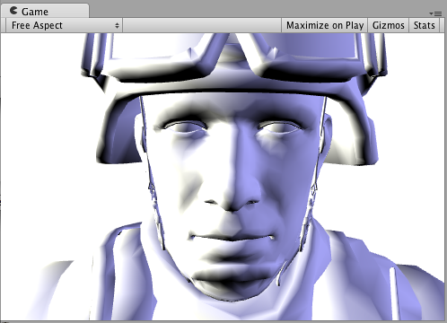 

纹理
-------


一个全白的对象很无聊，所以让我们添加一个纹理。我们将向着色器添加 [Properties](SL-Properties.html) 代码块，这样我们将在材质中看到纹理选择器。其他更改在下文中以粗体显示。

````
  Shader "Example/Diffuse Texture" {
      Properties {
        _MainTex ("Texture", 2D) = "white" {}
      }
      SubShader {
        Tags { "RenderType" = "Opaque" }
        CGPROGRAM
        #pragma surface surf Lambert
        struct Input {
            float2 uv_MainTex;
        };
        sampler2D _MainTex;
        void surf (Input IN, inout SurfaceOutput o) {
            o.Albedo = tex2D (_MainTex, IN.uv_MainTex).rgb;
        }
        ENDCG
      } 
      Fallback "Diffuse"
    }
````

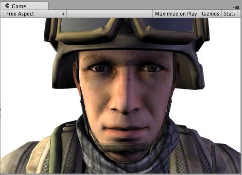 

法线贴图
--------------


我们来添加一些法线贴图：

````
  Shader "Example/Diffuse Bump" {
      Properties {
        _MainTex ("Texture", 2D) = "white" {}
        _BumpMap ("Bumpmap", 2D) = "bump" {}
      }
      SubShader {
        Tags { "RenderType" = "Opaque" }
        CGPROGRAM
        #pragma surface surf Lambert
        struct Input {
          float2 uv_MainTex;
          float2 uv_BumpMap;
        };
        sampler2D _MainTex;
        sampler2D _BumpMap;
        void surf (Input IN, inout SurfaceOutput o) {
          o.Albedo = tex2D (_MainTex, IN.uv_MainTex).rgb;
          o.Normal = UnpackNormal (tex2D (_BumpMap, IN.uv_BumpMap));
        }
        ENDCG
      } 
      Fallback "Diffuse"
    }
````

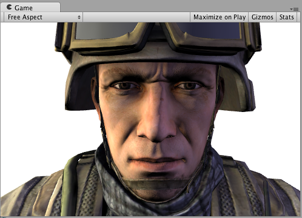 


边缘光照
------------


现在，尝试添加一些边缘光照以突出游戏对象的边缘。我们将根据表面法线和视图方向之间的角度添加一些发射光照。为此，我们将使用内置的表面着色器变量 `viewDir`。

````
  Shader "Example/Rim" {
      Properties {
        _MainTex ("Texture", 2D) = "white" {}
        _BumpMap ("Bumpmap", 2D) = "bump" {}
        _RimColor ("Rim Color", Color) = (0.26,0.19,0.16,0.0)
        _RimPower ("Rim Power", Range(0.5,8.0)) = 3.0
      }
      SubShader {
        Tags { "RenderType" = "Opaque" }
        CGPROGRAM
        #pragma surface surf Lambert
        struct Input {
            float2 uv_MainTex;
            float2 uv_BumpMap;
            float3 viewDir;
        };
        sampler2D _MainTex;
        sampler2D _BumpMap;
        float4 _RimColor;
        float _RimPower;
        void surf (Input IN, inout SurfaceOutput o) {
            o.Albedo = tex2D (_MainTex, IN.uv_MainTex).rgb;
            o.Normal = UnpackNormal (tex2D (_BumpMap, IN.uv_BumpMap));
            half rim = 1.0 - saturate(dot (normalize(IN.viewDir), o.Normal));
            o.Emission = _RimColor.rgb * pow (rim, _RimPower);
        }
        ENDCG
      } 
      Fallback "Diffuse"
    }
````

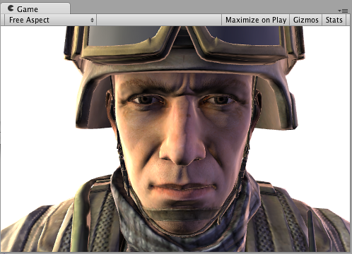 


细节纹理
--------------


为获得不同效果，让我们添加一个与基础纹理结合的细节纹理。细节纹理通常在材质中使用相同的 UV，但使用不同平铺，因此我们需要使用不同的输入 UV 坐标。

````
  Shader "Example/Detail" {
      Properties {
        _MainTex ("Texture", 2D) = "white" {}
        _BumpMap ("Bumpmap", 2D) = "bump" {}
        _Detail ("Detail", 2D) = "gray" {}
      }
      SubShader {
        Tags { "RenderType" = "Opaque" }
        CGPROGRAM
        #pragma surface surf Lambert
        struct Input {
            float2 uv_MainTex;
            float2 uv_BumpMap;
            float2 uv_Detail;
        };
        sampler2D _MainTex;
        sampler2D _BumpMap;
        sampler2D _Detail;
        void surf (Input IN, inout SurfaceOutput o) {
            o.Albedo = tex2D (_MainTex, IN.uv_MainTex).rgb;
            o.Albedo *= tex2D (_Detail, IN.uv_Detail).rgb * 2;
            o.Normal = UnpackNormal (tex2D (_BumpMap, IN.uv_BumpMap));
        }
        ENDCG
      } 
      Fallback "Diffuse"
    }
````

使用纹理棋盘格不一定有实际意义，但在此示例中可用于说明其作用：

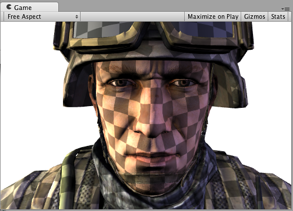 


屏幕空间中的细节纹理
------------------------------


屏幕空间中的细节纹理对于士兵头部模型没有实际意义，但是在这里可用于说明如何使用内置的 `screenPos` 输入：

````
  Shader "Example/ScreenPos" {
      Properties {
        _MainTex ("Texture", 2D) = "white" {}
        _Detail ("Detail", 2D) = "gray" {}
      }
      SubShader {
        Tags { "RenderType" = "Opaque" }
        CGPROGRAM
        #pragma surface surf Lambert
        struct Input {
            float2 uv_MainTex;
            float4 screenPos;
        };
        sampler2D _MainTex;
        sampler2D _Detail;
        void surf (Input IN, inout SurfaceOutput o) {
            o.Albedo = tex2D (_MainTex, IN.uv_MainTex).rgb;
            float2 screenUV = IN.screenPos.xy / IN.screenPos.w;
            screenUV *= float2(8,6);
            o.Albedo *= tex2D (_Detail, screenUV).rgb * 2;
        }
        ENDCG
      } 
      Fallback "Diffuse"
    }
````
从上面的着色器删除了法线贴图，只是为了缩短代码长度：

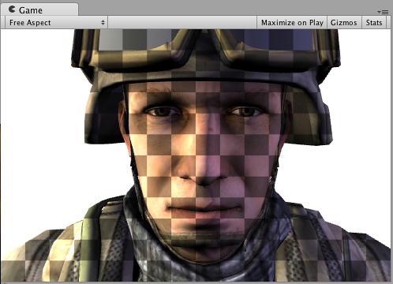 


立方体贴图反射
------------------


下面的着色器将使用内置 `worldRefl` 输入来进行立方体贴图反射。它与内置的反射/漫射着色器非常类似：

````
  Shader "Example/WorldRefl" {
      Properties {
        _MainTex ("Texture", 2D) = "white" {}
        _Cube ("Cubemap", CUBE) = "" {}
      }
      SubShader {
        Tags { "RenderType" = "Opaque" }
        CGPROGRAM
        #pragma surface surf Lambert
        struct Input {
            float2 uv_MainTex;
            float3 worldRefl;
        };
        sampler2D _MainTex;
        samplerCUBE _Cube;
        void surf (Input IN, inout SurfaceOutput o) {
            o.Albedo = tex2D (_MainTex, IN.uv_MainTex).rgb * 0.5;
            o.Emission = texCUBE (_Cube, IN.worldRefl).rgb;
        }
        ENDCG
      } 
      Fallback "Diffuse"
    }
````

因为它将反射颜色指定为 __Emission__，所以我们得到了一个非常闪亮的士兵：

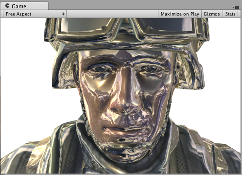 


如果您想做一些受法线贴图影响的反射，需要稍微复杂一些：需要将 `INTERNAL_DATA` 添加到 `Input` 结构，并使用 `WorldReflectionVector` 函数在写入法线输出后计算每像素反射矢量。

````
  Shader "Example/WorldRefl Normalmap" {
      Properties {
        _MainTex ("Texture", 2D) = "white" {}
        _BumpMap ("Bumpmap", 2D) = "bump" {}
        _Cube ("Cubemap", CUBE) = "" {}
      }
      SubShader {
        Tags { "RenderType" = "Opaque" }
        CGPROGRAM
        #pragma surface surf Lambert
        struct Input {
            float2 uv_MainTex;
            float2 uv_BumpMap;
            float3 worldRefl;
            INTERNAL_DATA
        };
        sampler2D _MainTex;
        sampler2D _BumpMap;
        samplerCUBE _Cube;
        void surf (Input IN, inout SurfaceOutput o) {
            o.Albedo = tex2D (_MainTex, IN.uv_MainTex).rgb * 0.5;
            o.Normal = UnpackNormal (tex2D (_BumpMap, IN.uv_BumpMap));
            o.Emission = texCUBE (_Cube, WorldReflectionVector (IN, o.Normal)).rgb;
        }
        ENDCG
      } 
      Fallback "Diffuse"
    }
````

下面是一个进行了法线贴图的闪亮士兵：

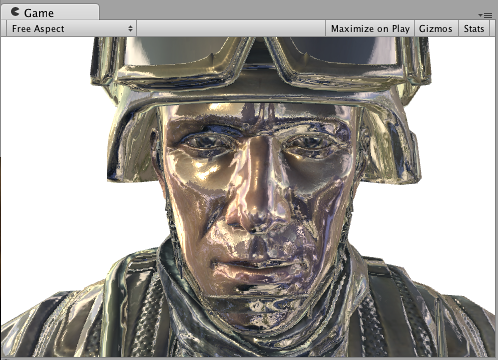 


通过世界空间位置进行的切片
-------------------------------


下面的着色器通过丢弃几乎水平的环形中的像素来对游戏对象“切片”。为实现此效果，它使用了基于像素世界位置的 Cg/HLSL 函数 `clip()`。我们将使用内置的表面着色器变量 `worldPos`。

````
  Shader "Example/Slices" {
      Properties {
        _MainTex ("Texture", 2D) = "white" {}
        _BumpMap ("Bumpmap", 2D) = "bump" {}
      }
      SubShader {
        Tags { "RenderType" = "Opaque" }
        Cull Off
        CGPROGRAM
        #pragma surface surf Lambert
        struct Input {
            float2 uv_MainTex;
            float2 uv_BumpMap;
            float3 worldPos;
        };
        sampler2D _MainTex;
        sampler2D _BumpMap;
        void surf (Input IN, inout SurfaceOutput o) {
            clip (frac((IN.worldPos.y+IN.worldPos.z*0.1) * 5) - 0.5);
            o.Albedo = tex2D (_MainTex, IN.uv_MainTex).rgb;
            o.Normal = UnpackNormal (tex2D (_BumpMap, IN.uv_BumpMap));
        }
        ENDCG
      } 
      Fallback "Diffuse"
    }
````

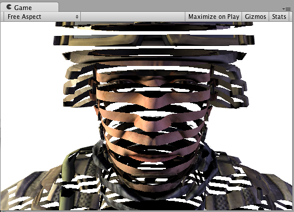 


使用顶点修改器进行法线挤出
-------------------------------------


可以使用“顶点修改器”函数来修改顶点着色器中的传入顶点数据。这可用于程序化动画和沿法线挤出等操作。表面着色器编译指令 `vertex:functionName` 将用于此目的，其中的一个函数采用 `inout appdata_full` 参数。

以下着色器沿着法线按照材质中指定的量移动顶点：

````
  Shader "Example/Normal Extrusion" {
      Properties {
        _MainTex ("Texture", 2D) = "white" {}
        _Amount ("Extrusion Amount", Range(-1,1)) = 0.5
      }
      SubShader {
        Tags { "RenderType" = "Opaque" }
        CGPROGRAM
        #pragma surface surf Lambert vertex:vert
        struct Input {
            float2 uv_MainTex;
        };
        float _Amount;
        void vert (inout appdata_full v) {
            v.vertex.xyz += v.normal * _Amount;
        }
        sampler2D _MainTex;
        void surf (Input IN, inout SurfaceOutput o) {
            o.Albedo = tex2D (_MainTex, IN.uv_MainTex).rgb;
        }
        ENDCG
      } 
      Fallback "Diffuse"
    }
````

沿着法线移动顶点会产生一个肥胖的士兵：

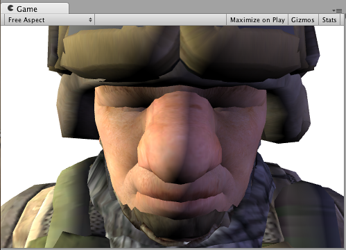 


每顶点计算的自定义数据
-------------------------------


使用顶点修改器函数，还可以在顶点着色器中计算自定义数据，然后将数据按像素传递给表面着色器函数。此情况下使用相同的编译指令 `vertex:functionName`，但该函数应采用两个参数：`inout appdata_full` 和 `out Input`。您可以在其中填写除内置值以外的任何输入成员。

**注意：**以这种方式使用的自定义输入成员不得包含以“uv”开头的名称，否则它们将无法正常工作。

下面的示例定义了一个在顶点函数中计算的自定义 `float3 customColor` 成员：

````
  Shader "Example/Custom Vertex Data" {
      Properties {
        _MainTex ("Texture", 2D) = "white" {}
      }
      SubShader {
        Tags { "RenderType" = "Opaque" }
        CGPROGRAM
        #pragma surface surf Lambert vertex:vert
        struct Input {
            float2 uv_MainTex;
            float3 customColor;
        };
        void vert (inout appdata_full v, out Input o) {
            UNITY_INITIALIZE_OUTPUT(Input,o);
            o.customColor = abs(v.normal);
        }
        sampler2D _MainTex;
        void surf (Input IN, inout SurfaceOutput o) {
            o.Albedo = tex2D (_MainTex, IN.uv_MainTex).rgb;
            o.Albedo *= IN.customColor;
        }
        ENDCG
      } 
      Fallback "Diffuse"
    }
````

在此示例中，`customColor` 设置为法线的绝对值：

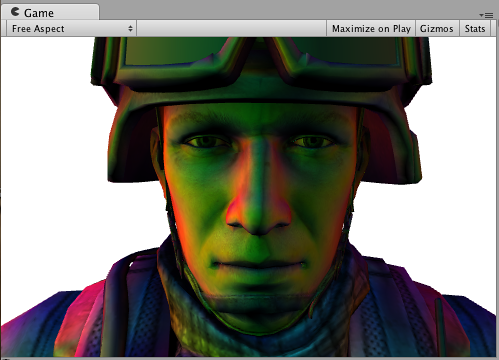 

更实际的用途可能是计算内置输入变量不提供的任何每顶点数据；或优化着色器计算。例如，可以在游戏对象的顶点处计算边缘光照，而不是在表面着色器中按照每个像素进行计算。


最终颜色修改器
--------------------


可以使用“最终颜色修改器”函数来修改着色器计算的最终颜色。表面着色器编译指令 `finalcolor:functionName` 将用于此目的，其中的一个函数采用 `Input IN, SurfaceOutput o, inout fixed4 color` 参数。

下面是一个简单的着色器，它将色调应用于最终颜色。这与仅对表面反照率颜色应用色调不同：此色调还会影响来自光照贴图、光照探针和类似额外来源的任何颜色。

````
  Shader "Example/Tint Final Color" {
      Properties {
        _MainTex ("Texture", 2D) = "white" {}
        _ColorTint ("Tint", Color) = (1.0, 0.6, 0.6, 1.0)
      }
      SubShader {
        Tags { "RenderType" = "Opaque" }
        CGPROGRAM
        #pragma surface surf Lambert finalcolor:mycolor
        struct Input {
            float2 uv_MainTex;
        };
        fixed4 _ColorTint;
        void mycolor (Input IN, SurfaceOutput o, inout fixed4 color)
        {
            color *= _ColorTint;
        }
        sampler2D _MainTex;
        void surf (Input IN, inout SurfaceOutput o) {
             o.Albedo = tex2D (_MainTex, IN.uv_MainTex).rgb;
        }
        ENDCG
      } 
      Fallback "Diffuse"
    }
````


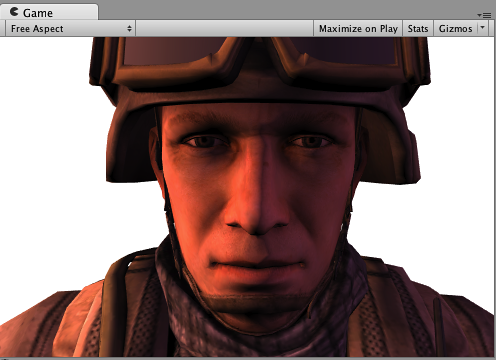 


使用最终颜色修改器自定义雾效
------------------------------------


使用最终颜色修改器（见上文）的常见情况是在前向渲染中实现完全自定义的雾效。雾效需要影响最终计算的像素着色器颜色，这正是 `finalcolor` 修改器的功能。

下面是一个根据与屏幕中心的距离应用雾效色调的着色器。此着色器将顶点修改器与自定义顶点数据 (`fog`) 和最终颜色修改器组合在一起。用于前向渲染附加通道时，雾效需要淡化为黑色。此示例将解决这一问题并检查是否有 `UNITY_PASS_FORWARDADD`。

````
  Shader "Example/Fog via Final Color" {
      Properties {
        _MainTex ("Texture", 2D) = "white" {}
        _FogColor ("Fog Color", Color) = (0.3, 0.4, 0.7, 1.0)
      }
      SubShader {
        Tags { "RenderType" = "Opaque" }
        CGPROGRAM
        #pragma surface surf Lambert finalcolor:mycolor vertex:myvert
        struct Input {
            float2 uv_MainTex;
            half fog;
        };
        void myvert (inout appdata_full v, out Input data)
        {
            UNITY_INITIALIZE_OUTPUT(Input,data);
            float4 hpos = UnityObjectToClipPos(v.vertex);
  		  hpos.xy/=hpos.w;
            data.fog = min (1, dot (hpos.xy, hpos.xy)*0.5);
        }
        fixed4 _FogColor;
        void mycolor (Input IN, SurfaceOutput o, inout fixed4 color)
        {
            fixed3 fogColor = _FogColor.rgb;
            #ifdef UNITY_PASS_FORWARDADD
            fogColor = 0;
            #endif
            color.rgb = lerp (color.rgb, fogColor, IN.fog);
        }
        sampler2D _MainTex;
        void surf (Input IN, inout SurfaceOutput o) {
             o.Albedo = tex2D (_MainTex, IN.uv_MainTex).rgb;
        }
        ENDCG
      } 
      Fallback "Diffuse"
    }
````


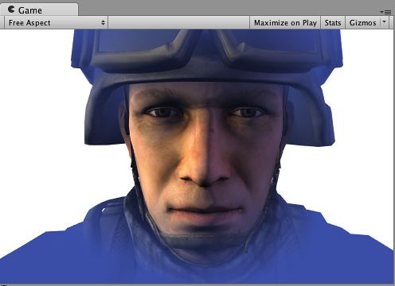 

线性雾效
----------

````
Shader "Example/Linear Fog" {
  Properties {
    _MainTex ("Base (RGB)", 2D) = "white" {}
  }
  SubShader {
    Tags { "RenderType"="Opaque" }
    LOD 200
    
    CGPROGRAM
    #pragma surface surf Lambert finalcolor:mycolor vertex:myvert
	#pragma multi_compile_fog

    sampler2D _MainTex;
    uniform half4 unity_FogStart;
    uniform half4 unity_FogEnd;

    struct Input {
      float2 uv_MainTex;
      half fog;
    };

    void myvert (inout appdata_full v, out Input data) {
      UNITY_INITIALIZE_OUTPUT(Input,data);
      float pos = length(UnityObjectToViewPos(v.vertex).xyz);
      float diff = unity_FogEnd.x - unity_FogStart.x;
      float invDiff = 1.0f / diff;
      data.fog = clamp ((unity_FogEnd.x - pos) * invDiff, 0.0, 1.0);
    }
    void mycolor (Input IN, SurfaceOutput o, inout fixed4 color) {
      #ifdef UNITY_PASS_FORWARDADD
		UNITY_APPLY_FOG_COLOR(IN.fog, color, float4(0,0,0,0));
	  #else
		UNITY_APPLY_FOG_COLOR(IN.fog, color, unity_FogColor);
      #endif
    }

    void surf (Input IN, inout SurfaceOutput o) {
      half4 c = tex2D (_MainTex, IN.uv_MainTex);
      o.Albedo = c.rgb;
      o.Alpha = c.a;
    }
    ENDCG
  } 
  FallBack "Diffuse"
}
````

贴花
----------

贴花通常用于在运行时向材质添加细节（例如，子弹冲击力效果）。贴花在延迟渲染中特别有用，因为贴花在照亮之前会改变 G 缓冲区，因此可以节省开销。

在常规情况下，贴花应该在不透明对象之后渲染，并且不应该是阴影投射物，如以下示例中的 ShaderLab“Tags”中所示。

````
Shader "Example/Decal" {
  Properties {
    _MainTex ("Base (RGB)", 2D) = "white" {}
  }
  SubShader {
    Tags { "RenderType"="Opaque" "Queue"="Geometry+1" "ForceNoShadowCasting"="True" }
    LOD 200
    Offset -1, -1
    
    CGPROGRAM
    #pragma surface surf Lambert decal:blend
    
    sampler2D _MainTex;
    
    struct Input {
      float2 uv_MainTex;
    };
    
    void surf (Input IN, inout SurfaceOutput o) {
        half4 c = tex2D (_MainTex, IN.uv_MainTex);
        o.Albedo = c.rgb;
        o.Alpha = c.a;
      }
    ENDCG
    }
}
````
