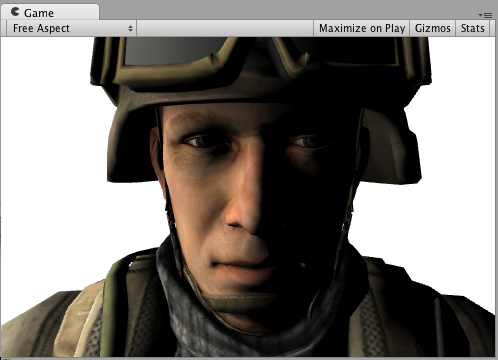
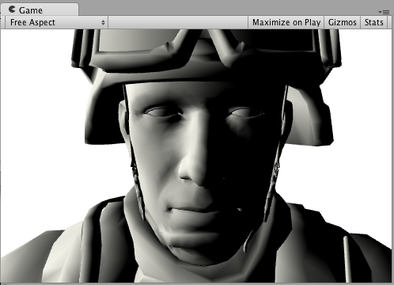
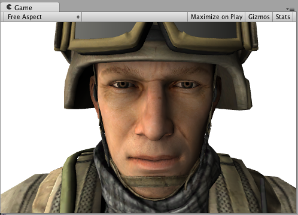
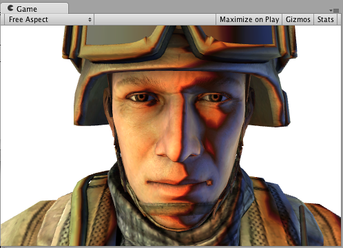
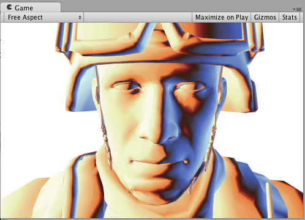
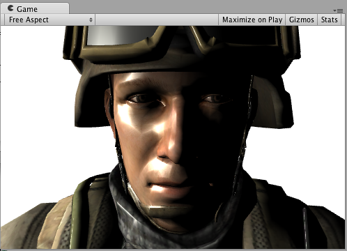

#表面着色器光照示例

本页提供了[表面着色器](SL-SurfaceShaders.html)中的自定义[表面着色器光照模型](SL-SurfaceShaderLighting.html)的示例。要进一步了解常规表面着色器指南，请参阅[表面着色器示例](SL-SurfaceShaderExamples.html)。

因为__延迟光照__与一些自定义的每材质光照模型不兼容，所以下面的大多数示例都使着色器仅编译到__前向渲染__。

##漫射

以下是使用内置兰伯特光照模型的着色器示例：

````
  Shader "Example/Diffuse Texture" {
      Properties {
        _MainTex ("Texture", 2D) = "white" {}
      }
      SubShader {
        Tags { "RenderType" = "Opaque" }
        CGPROGRAM
        #pragma surface surf Lambert
      
        struct Input {
            float2 uv_MainTex;
        };
      
        sampler2D _MainTex;
      
        void surf (Input IN, inout SurfaceOutput o) {
            o.Albedo = tex2D (_MainTex, IN.uv_MainTex).rgb;
        }
        ENDCG
      }
      Fallback "Diffuse"
    }
````

以下是有纹理和没有纹理的外观（在场景中使用一个方向光）：




以下示例显示了如何通过编写自定义光照模型（而不是使用内置兰伯特模型）来实现相同的结果。

为此，您需要使用许多表面着色器光照模型函数。下面是一个简单的兰伯特光照模型。请注意，只有`CGPROGRAM` 部分发生变化；周围的着色器代码完全相同：

````
	Shader "Example/Diffuse Texture" {
			Properties {
				_MainTex ("Texture", 2D) = "white" {}
			}
			SubShader {
			Tags { "RenderType" = "Opaque" }
			CGPROGRAM
			  #pragma surface surf SimpleLambert
  
			  half4 LightingSimpleLambert (SurfaceOutput s, half3 lightDir, half atten) {
				  half NdotL = dot (s.Normal, lightDir);
				  half4 c;
				  c.rgb = s.Albedo * _LightColor0.rgb * (NdotL * atten);
				  c.a = s.Alpha;
				  return c;
			  }
  
			struct Input {
				float2 uv_MainTex;
			};
		
			sampler2D _MainTex;
		
			void surf (Input IN, inout SurfaceOutput o) {
				o.Albedo = tex2D (_MainTex, IN.uv_MainTex).rgb;
			}
			ENDCG
			}
			Fallback "Diffuse"
		}
````

这个简单的漫射光照模型使用了 `LightingSimpleLambert` 函数。它通过以下方式计算光照：计算表面法线和光线方向之间的点积，然后应用光衰减和颜色。


##漫射环绕

以下示例显示了__环绕漫射__，这是对__漫射__光照的修改，其中光照“环绕着”对象的边缘。它对于模拟次表面散射效果很有用。只有 `CGPROGRAM` 部分发生变化，这里同样省略了周围的着色器代码：

````
	...ShaderLab code...
		CGPROGRAM
		#pragma surface surf WrapLambert

		half4 LightingWrapLambert (SurfaceOutput s, half3 lightDir, half atten) {
			half NdotL = dot (s.Normal, lightDir);
			half diff = NdotL * 0.5 + 0.5;
			half4 c;
			c.rgb = s.Albedo * _LightColor0.rgb * (diff * atten);
			c.a = s.Alpha;
			return c;
		}

		struct Input {
			float2 uv_MainTex;
		};
	
		sampler2D _MainTex;
			void surf (Input IN, inout SurfaceOutput o) {
			o.Albedo = tex2D (_MainTex, IN.uv_MainTex).rgb;
		}
		ENDCG
		...ShaderLab code...
````

以下是有纹理和没有纹理的外观（在场景中使用一个方向光）：

 


##卡通渐变 (Toon Ramp)

以下示例显示了一个“渐变”光照模型，该模型使用纹理渐变来定义表面如何响应光源和法线之间的角度。这可以用于各种效果，并且在与__卡通__光照一起使用时尤其有效。

````
  	...ShaderLab code...
  		CGPROGRAM
  		#pragma surface surf Ramp

  		sampler2D _Ramp;

  		half4 LightingRamp (SurfaceOutput s, half3 lightDir, half atten) {
  			half NdotL = dot (s.Normal, lightDir);
  			half diff = NdotL * 0.5 + 0.5;
  			half3 ramp = tex2D (_Ramp, float2(diff)).rgb;
  			half4 c;
  			c.rgb = s.Albedo * _LightColor0.rgb * ramp * atten;
  			c.a = s.Alpha;
  			return c;
  		}

  		struct Input {
  			float2 uv_MainTex;
  		};
	
  		sampler2D _MainTex;
	
  		void surf (Input IN, inout SurfaceOutput o) {
  			o.Albedo = tex2D (_MainTex, IN.uv_MainTex).rgb;
  		}
  		ENDCG
  	   	...ShaderLab code... 
````

以下是有纹理和没有纹理的外观（在场景中使用一个方向光）：

 



 


##简单镜面反射

以下示例显示了一个简单的镜面反射光照模型，类似于内置的 BlinnPhong 光照模型。


````
  	...ShaderLab code...
  		CGPROGRAM
  		#pragma surface surf SimpleSpecular

  		half4 LightingSimpleSpecular (SurfaceOutput s, half3 lightDir, half3 viewDir, half atten) {
  			half3 h = normalize (lightDir + viewDir);

  			half diff = max (0, dot (s.Normal, lightDir));

  			float nh = max (0, dot (s.Normal, h));
  			float spec = pow (nh, 48.0);

  			half4 c;
  			c.rgb = (s.Albedo * _LightColor0.rgb * diff + _LightColor0.rgb * spec) * atten;
  			c.a = s.Alpha;
  			return c;
  		}

  		struct Input {
  			float2 uv_MainTex;
  		};
	
  		sampler2D _MainTex;
	
  		void surf (Input IN, inout SurfaceOutput o) {
  			o.Albedo = tex2D (_MainTex, IN.uv_MainTex).rgb;
  		}
  		ENDCG
  	   	...ShaderLab code... 
````

以下是有纹理和没有纹理的外观（在场景中使用一个方向光）：

 


##自定义 GI

我们将从一个模仿 Unity 内置 GI 的着色器开始：

````
    Shader "Example/CustomGI_ToneMapped" {
    	Properties {
    		_MainTex ("Albedo (RGB)", 2D) = "white" {}
    	}
    	SubShader {
    		Tags { "RenderType"="Opaque" }
		
    		CGPROGRAM
    		#pragma surface surf StandardDefaultGI
    
    		#include "UnityPBSLighting.cginc"
    
    		sampler2D _MainTex;
    
    		inline half4 LightingStandardDefaultGI(SurfaceOutputStandard s, half3 viewDir, UnityGI gi)
    		{
    			return LightingStandard(s, viewDir, gi);
    		}
    
    		inline void LightingStandardDefaultGI_GI(
    			SurfaceOutputStandard s,
    			UnityGIInput data,
    			inout UnityGI gi)
    		{
    			LightingStandard_GI(s, data, gi);
    		}
    
    		struct Input {
    			float2 uv_MainTex;
    		};
    
        		void surf (Input IN, inout SurfaceOutputStandard o) {
        			o.Albedo = tex2D(_MainTex, IN.uv_MainTex);
        		}
        		ENDCG
        	}
    	    FallBack "Diffuse"
        }
````

现在，让我们在 GI 上添加一些色调映射：

````
    Shader "Example/CustomGI_ToneMapped" {
    	Properties {
    		_MainTex ("Albedo (RGB)", 2D) = "white" {}
    		_Gain("Lightmap tone-mapping Gain", Float) = 1
    		_Knee("Lightmap tone-mapping Knee", Float) = 0.5
    		_Compress("Lightmap tone-mapping Compress", Float) = 0.33
    	}
    	SubShader {
    		Tags { "RenderType"="Opaque" }
		
    		CGPROGRAM
    		#pragma surface surf StandardToneMappedGI
    
    		#include "UnityPBSLighting.cginc"
    
    		half _Gain;
    		half _Knee;
    		half _Compress;
    		sampler2D _MainTex;
    
    		inline half3 TonemapLight(half3 i) {
    			i *= _Gain;
    			return (i > _Knee) ?(((i - _Knee)*_Compress) + _Knee) : i;
    		}
    
    		inline half4 LightingStandardToneMappedGI(SurfaceOutputStandard s, half3 viewDir, UnityGI gi)
    		{
    			return LightingStandard(s, viewDir, gi);
    		}
    
    		inline void LightingStandardToneMappedGI_GI(
    			SurfaceOutputStandard s,
    			UnityGIInput data,
    			inout UnityGI gi)
    		{
    			LightingStandard_GI(s, data, gi);
    
    			gi.light.color = TonemapLight(gi.light.color);
    			#ifdef DIRLIGHTMAP_SEPARATE
    				#ifdef LIGHTMAP_ON
    					gi.light2.color = TonemapLight(gi.light2.color);
    				#endif
    				#ifdef DYNAMICLIGHTMAP_ON
    					gi.light3.color = TonemapLight(gi.light3.color);
    				#endif
    			#endif
    			gi.indirect.diffuse = TonemapLight(gi.indirect.diffuse);
    			gi.indirect.specular = TonemapLight(gi.indirect.specular);
    		}
    
    		struct Input {
    			float2 uv_MainTex;
    		};
    
        		void surf (Input IN, inout SurfaceOutputStandard o) {
        			o.Albedo = tex2D(_MainTex, IN.uv_MainTex);
        		}
        		ENDCG
        	}
        	FallBack "Diffuse"
        }
````
