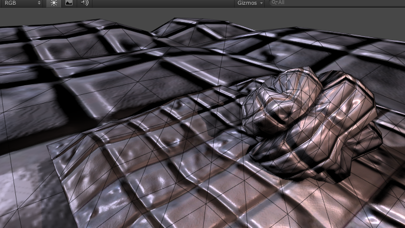
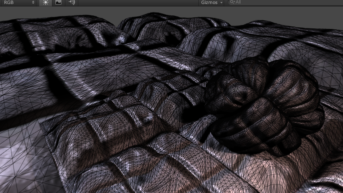
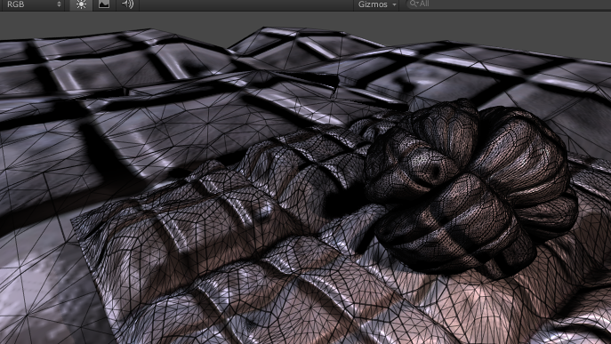
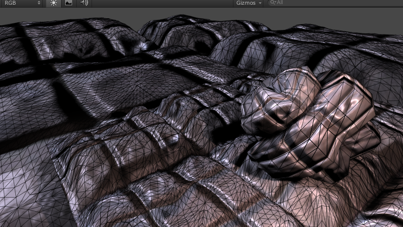
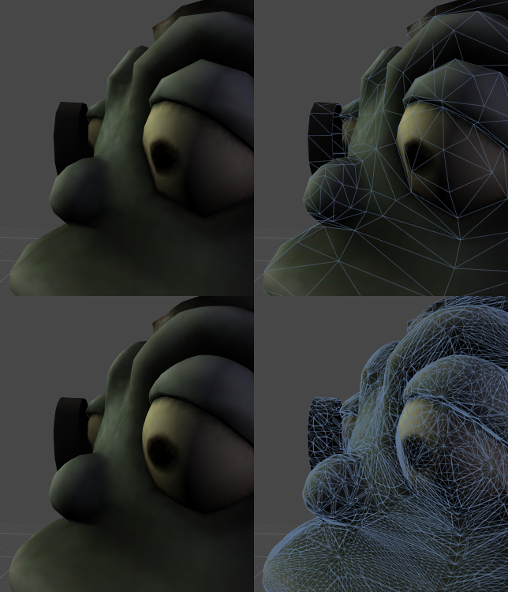

支持 DX11/OpenGL Core 曲面细分的表面着色器
======================================


[表面着色器](SL-SurfaceShaders.html)在一定程度上支持 DirectX 11/OpenGL Core GPU 曲面细分。具体情况为：

* 曲面细分由 `tessellate:FunctionName` 修改器指示。该函数计算三角形边和内部曲面细分因子。
* 使用曲面细分时，对于域着色器中的每个生成的顶点，将在曲面细分_之后_调用“顶点修改器”(`vertex:FunctionName`)。这里通常要进行位移贴图。
* 即使没有任何位移贴图，表面着色器也可以选择计算 [Phong 曲面细分](https://www.google.lt/search?q=phong+tessellation)来平滑模型表面。


对于曲面细分的支持目前存在以下局限性：

* 仅限于三角形域 - 不支持四边形和等值线曲面细分。
* 使用曲面细分时，着色器会自动编译到着色器模型 [4.6 目标](SL-ShaderCompileTargets.html)，这会阻止在较旧的图形目标上运行。

---

在顶点修改器中不支持 GPU 曲面细分和位移
--------------------------------------------------------


接下来这个示例中的表面着色器在_不_使用曲面细分的情况下执行某种位移贴图。它仅根据来自位移贴图的数量沿着法线移动顶点：


````
    Shader "Tessellation Sample" {
            Properties {
                _MainTex ("Base (RGB)", 2D) = "white" {}
                _DispTex ("Disp Texture", 2D) = "gray" {}
                _NormalMap ("Normalmap", 2D) = "bump" {}
                _Displacement ("Displacement", Range(0, 1.0)) = 0.3
                _Color ("Color", color) = (1,1,1,0)
                _SpecColor ("Spec color", color) = (0.5,0.5,0.5,0.5)
            }
            SubShader {
                Tags { "RenderType"="Opaque" }
                LOD 300
            
                CGPROGRAM
                #pragma surface surf BlinnPhong addshadow fullforwardshadows vertex:disp nolightmap
                #pragma target 4.6

                struct appdata {
                    float4 vertex : POSITION;
                    float4 tangent : TANGENT;
                    float3 normal : NORMAL;
                    float2 texcoord : TEXCOORD0;
                };

                sampler2D _DispTex;
                float _Displacement;

                void disp (inout appdata v)
                {
                    float d = tex2Dlod(_DispTex, float4(v.texcoord.xy,0,0)).r * _Displacement;
                    v.vertex.xyz += v.normal * d;
                }

                struct Input {
                    float2 uv_MainTex;
                };

                sampler2D _MainTex;
                sampler2D _NormalMap;
                fixed4 _Color;

                void surf (Input IN, inout SurfaceOutput o) {
                    half4 c = tex2D (_MainTex, IN.uv_MainTex) * _Color;
                    o.Albedo = c.rgb;
                    o.Specular = 0.2;
                    o.Gloss = 1.0;
                    o.Normal = UnpackNormal(tex2D(_NormalMap, IN.uv_MainTex));
                }
                ENDCG
            }
            FallBack "Diffuse"
        }
````

以上着色器相当标准：

* 顶点修改器 `disp` 对位移贴图进行采样并沿法线移动顶点。
* 它使用自定义的“顶点数据输入”结构 (`appdata`)，而不是默认的 `appdata_full`。目前这还不是必需的，但是使用尽可能小的结构进行曲面细分会更高效。
* 由于我们的顶点数据没有第二个 UV 坐标，所以我们添加 `nolightmap` 指令来排除光照贴图。

下图显示了应用此着色器的一些简单游戏对象。


 


---


固定量的曲面细分
----------------------------


如果模型的面在屏幕上的大小大致相同，则向网格添加固定量的曲面细分（整个网格上的曲面细分级别相同）。

以下示例脚本应用了固定量的曲面细分。


````
    Shader "Tessellation Sample" {
            Properties {
                _Tess ("Tessellation", Range(1,32)) = 4
                _MainTex ("Base (RGB)", 2D) = "white" {}
                _DispTex ("Disp Texture", 2D) = "gray" {}
                _NormalMap ("Normalmap", 2D) = "bump" {}
                _Displacement ("Displacement", Range(0, 1.0)) = 0.3
                _Color ("Color", color) = (1,1,1,0)
                _SpecColor ("Spec color", color) = (0.5,0.5,0.5,0.5)
            }
            SubShader {
                Tags { "RenderType"="Opaque" }
                LOD 300
            
                CGPROGRAM
                #pragma surface surf BlinnPhong addshadow fullforwardshadows vertex:disp tessellate:tessFixed nolightmap
                #pragma target 4.6

                struct appdata {
                    float4 vertex : POSITION;
                    float4 tangent : TANGENT;
                    float3 normal : NORMAL;
                    float2 texcoord : TEXCOORD0;
                };

                float _Tess;

                float4 tessFixed()
                {
                    return _Tess;
                }

                sampler2D _DispTex;
                float _Displacement;

                void disp (inout appdata v)
                {
                    float d = tex2Dlod(_DispTex, float4(v.texcoord.xy,0,0)).r * _Displacement;
                    v.vertex.xyz += v.normal * d;
                }

                struct Input {
                    float2 uv_MainTex;
                };

                sampler2D _MainTex;
                sampler2D _NormalMap;
                fixed4 _Color;

                void surf (Input IN, inout SurfaceOutput o) {
                    half4 c = tex2D (_MainTex, IN.uv_MainTex) * _Color;
                    o.Albedo = c.rgb;
                    o.Specular = 0.2;
                    o.Gloss = 1.0;
                    o.Normal = UnpackNormal(tex2D(_NormalMap, IN.uv_MainTex));
                }
                ENDCG
            }
            FallBack "Diffuse"
        }
````

在上面的例子中，`tessFixed` 曲面细分函数以单个 float4 值的形式返回四个曲面细分因子：三角形的每个边一共三个因子，还有三角形内部的一个因子。

该示例返回材质属性中设置的常量值。


 

---


基于距离的曲面细分
---------------------------


您还可以根据与摄像机之间的距离来更改曲面细分级别。
例如，可定义两个距离值：

* 曲面细分处于最大值时的距离（例如，10 米）。
* 曲面细分级别递减时的距离（例如，20 米）。


````
    Shader "Tessellation Sample" {
            Properties {
                _Tess ("Tessellation", Range(1,32)) = 4
                _MainTex ("Base (RGB)", 2D) = "white" {}
                _DispTex ("Disp Texture", 2D) = "gray" {}
                _NormalMap ("Normalmap", 2D) = "bump" {}
                _Displacement ("Displacement", Range(0, 1.0)) = 0.3
                _Color ("Color", color) = (1,1,1,0)
                _SpecColor ("Spec color", color) = (0.5,0.5,0.5,0.5)
            }
            SubShader {
                Tags { "RenderType"="Opaque" }
                LOD 300
            
                CGPROGRAM
                #pragma surface surf BlinnPhong addshadow fullforwardshadows vertex:disp tessellate:tessDistance nolightmap
                #pragma target 4.6
                #include "Tessellation.cginc"

                struct appdata {
                    float4 vertex : POSITION;
                    float4 tangent : TANGENT;
                    float3 normal : NORMAL;
                    float2 texcoord : TEXCOORD0;
                };

                float _Tess;

                float4 tessDistance (appdata v0, appdata v1, appdata v2) {
                    float minDist = 10.0;
                    float maxDist = 25.0;
                    return UnityDistanceBasedTess(v0.vertex, v1.vertex, v2.vertex, minDist, maxDist, _Tess);
                }

                sampler2D _DispTex;
                float _Displacement;

                void disp (inout appdata v)
                {
                    float d = tex2Dlod(_DispTex, float4(v.texcoord.xy,0,0)).r * _Displacement;
                    v.vertex.xyz += v.normal * d;
                }

                struct Input {
                    float2 uv_MainTex;
                };

                sampler2D _MainTex;
                sampler2D _NormalMap;
                fixed4 _Color;

                void surf (Input IN, inout SurfaceOutput o) {
                    half4 c = tex2D (_MainTex, IN.uv_MainTex) * _Color;
                    o.Albedo = c.rgb;
                    o.Specular = 0.2;
                    o.Gloss = 1.0;
                    o.Normal = UnpackNormal(tex2D(_NormalMap, IN.uv_MainTex));
                }
                ENDCG
            }
            FallBack "Diffuse"
        }
````

这里，曲面细分函数在曲面细分之前将三角形三个角的顶点数据作为其三个参数。

Unity 需要此数据来计算曲面细分级别，而这取决于顶点位置。

该示例包含一个内置的 helper 文件 Tessellation.cginc，并从该文件中调用 `UnityDistanceBasedTess` 函数来完成所有工作。此函数计算每个顶点到摄像机的距离，并推导出最终的曲面细分因子。


 

---

基于边长的曲面细分
------------------------------


纯粹基于距离的曲面细分仅在三角形大小非常相似时才能起到有效的作用。在上图中，具有小三角形的游戏对象被过度曲面细分，而具有大三角形的游戏对象则曲面细分不足。

一种改善方法是根据屏幕上的三角形边长来计算曲面细分级别。Unity 应该将更大的细分因子应用于更长的边。


````
    Shader "Tessellation Sample" {
            Properties {
                _EdgeLength ("Edge length", Range(2,50)) = 15
                _MainTex ("Base (RGB)", 2D) = "white" {}
                _DispTex ("Disp Texture", 2D) = "gray" {}
                _NormalMap ("Normalmap", 2D) = "bump" {}
                _Displacement ("Displacement", Range(0, 1.0)) = 0.3
                _Color ("Color", color) = (1,1,1,0)
                _SpecColor ("Spec color", color) = (0.5,0.5,0.5,0.5)
            }
            SubShader {
                Tags { "RenderType"="Opaque" }
                LOD 300
            
                CGPROGRAM
                #pragma surface surf BlinnPhong addshadow fullforwardshadows vertex:disp tessellate:tessEdge nolightmap
                #pragma target 4.6
                #include "Tessellation.cginc"

                struct appdata {
                    float4 vertex : POSITION;
                    float4 tangent : TANGENT;
                    float3 normal : NORMAL;
                    float2 texcoord : TEXCOORD0;
                };

                float _EdgeLength;

                float4 tessEdge (appdata v0, appdata v1, appdata v2)
                {
                    return UnityEdgeLengthBasedTess (v0.vertex, v1.vertex, v2.vertex, _EdgeLength);
                }

                sampler2D _DispTex;
                float _Displacement;

                void disp (inout appdata v)
                {
                    float d = tex2Dlod(_DispTex, float4(v.texcoord.xy,0,0)).r * _Displacement;
                    v.vertex.xyz += v.normal * d;
                }

                struct Input {
                    float2 uv_MainTex;
                };

                sampler2D _MainTex;
                sampler2D _NormalMap;
                fixed4 _Color;

                void surf (Input IN, inout SurfaceOutput o) {
                    half4 c = tex2D (_MainTex, IN.uv_MainTex) * _Color;
                    o.Albedo = c.rgb;
                    o.Specular = 0.2;
                    o.Gloss = 1.0;
                    o.Normal = UnpackNormal(tex2D(_NormalMap, IN.uv_MainTex));
                }
                ENDCG
            }
            FallBack "Diffuse"
        }
````

在此示例中，从 _Tessellation.cginc_ 调用 `UnityEdgeLengthBasedTess` 函数来完成所有工作。


 


出于性能原因，请改为调用 UnityEdgeLengthBasedTessCull 函数，该函数将执行样条曲线视锥体剔除。这会使着色器的成本略微提高，但为摄像机视图之外的网格部分节省了大量 GPU 工作。

---


Phong 曲面细分
------------------


[Phong 曲面细分](https://www.google.lt/search?q=phong+tessellation)将修改细分面的位置，使得生成的表面稍微跟随网格法线。这是使简单多边形网格变得更加平滑的一种非常有效的方法。

Unity 的表面着色器可以使用 `tessphong:VariableName` 编译指令自动计算 Phong 曲面细分。下面是着色器示例：

````
    Shader "Phong Tessellation" {
            Properties {
                _EdgeLength ("Edge length", Range(2,50)) = 5
                _Phong ("Phong Strengh", Range(0,1)) = 0.5
                _MainTex ("Base (RGB)", 2D) = "white" {}
                _Color ("Color", color) = (1,1,1,0)
            }
            SubShader {
                Tags { "RenderType"="Opaque" }
                LOD 300
            
                CGPROGRAM
                #pragma surface surf Lambert vertex:dispNone tessellate:tessEdge tessphong:_Phong nolightmap
                #include "Tessellation.cginc"

                struct appdata {
                    float4 vertex : POSITION;
                    float3 normal : NORMAL;
                    float2 texcoord : TEXCOORD0;
                };

                void dispNone (inout appdata v) { }

                float _Phong;
                float _EdgeLength;

                float4 tessEdge (appdata v0, appdata v1, appdata v2)
                {
                    return UnityEdgeLengthBasedTess (v0.vertex, v1.vertex, v2.vertex, _EdgeLength);
                }

                struct Input {
                    float2 uv_MainTex;
                };

                fixed4 _Color;
                sampler2D _MainTex;

                void surf (Input IN, inout SurfaceOutput o) {
                    half4 c = tex2D (_MainTex, IN.uv_MainTex) * _Color;
                    o.Albedo = c.rgb;
                    o.Alpha = c.a;
                }

                ENDCG
            }
            FallBack "Diffuse"
        }
````

以下是常规着色器（上排）和使用 Phong 曲面细分的着色器（下排）之间的比较。可以看出，即使没有任何位移贴图，表面也会变得更圆。


 


---

* <span class="page-edit">2018-03-20  Page amended with [editorial review](DocumentationEditorialReview.html)
</span>
* <span class="page-history">在 2018.1 版中添加了__Metal 曲面细分__</span>
