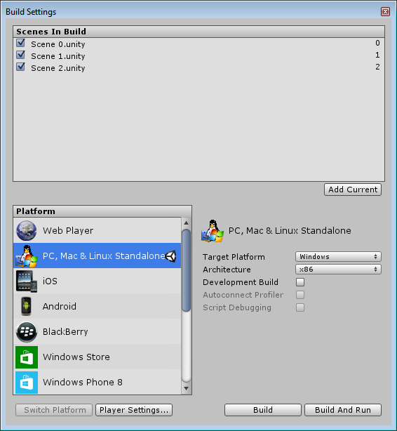

# 保存工作

Unity 会存储许多关于项目的不同类型的信息，其中一些信息的保存方式不同于其他信息。这意味着工作的具体保存*时间*取决于所做的更改。

当然，我们建议您定期保存，并使用[版本控制系统 (VCS)](VersionControl.html) 来保留对工作的增量更改，并允许进行尝试和回滚更改，而不必担心工作丢失的风险。

##保存对当前场景的更改（“Save Scene”）

 

场景更改包括对层级视图中任何对象的修改。例如，添加、移动或删除游戏对象，还包括在 Inspector 中更改层级视图游戏对象的参数。

要保存对场景的更改，请从 File 菜单中选择 Save Scene，或按 **Ctrl/Cmd + S**。
这样可以保存当前对场景的更改*并*执行“**Save Project**”（见下文）。

**这意味着执行“Save Scene”时，*所有内容*都会保存。**

---------------

##保存项目范围的变更（“Save Project”）

 

可在 Unity 中进行的某些更改不是特定于场景的，而是*项目范围的*。通过从 File 菜单中选择“Save Project”，可以独立于场景更改来保存这些设置。

使用“Save Project”不会保存对场景的更改，只保存项目范围的更改。例如，如果使用临时场景对预制件进行了一些更改，则可能希望保存项目，而不保存对场景的更改。

使用“Save Project”时保存的项目范围更改包括：

### 所有“Project Settings”：

使用“Save Project”时，将保存每个“Project Settings”菜单项的所有设置，例如自定义输入轴、用户定义的标签或图层以及物理重力强度。

保存项目时，对这些设置的更改将保存在 Library 文件夹中：

- **Input**：保存为 ´InputManager.asset´
- **Tags** And Layers：保存为 ´TagManager.asset´
- **Audio**：保存为 ´AudioManager.asset´
- **Time**：保存为 ´TimeManager.asset´
- **Player**：保存为 ´ProjectSettings.asset´
- **Physics**：保存为 ´DynamicsManager.asset´
- **Physics 2D**：保存为 ´Physics2DSettings.asset´
- **Quality**：保存为 ´QualitySettings.asset´
- **Graphics**：保存为 ´GraphicsSettings.asset´
- **Network**：保存为 ´NetworkManager.asset´
- **Editor**：保存为 ´EditorUserSettings.asset´

###“Build Settings”

Build Settings 也作为 ´EditorBuildSettings.asset´ 保存在 Library 文件夹中。

### Project 窗口中对资源的更改

与项目范围设置一起保存的还有对*没有“Apply”按钮的*资源的更改，例如对以下任何一项的更改：

- 材质参数
- 预制件
- 动画控制器（状态机）
- 化身遮罩
- 没有“Apply”按钮的任何其他资源更改

---------------

## 立即写入磁盘的更改（无需保存）：

有些类型的更改会立即写入磁盘，根本不需要执行“Save”操作。这些更改包括：

### 要求用户按“Apply”按钮的任何导入设置更改

大多数资源类型的导入设置都要求按下“Apply”按钮才能使更改生效。此操作会导致根据新设置重新导入资源。点击 Apply 按钮后会立即保存这些更改。例如：

- 更改图像资源的纹理类型
- 更改 3D 模型资源的缩放因子
- 更改音频资源的压缩设置
- 具有“Apply”按钮的任何其他导入设置更改

### 立即保存的其他更改：

一些其他类型的数据会立即或自动保存到磁盘，无需执行“Save”操作：

- 创建新资源，例如：新材质或预制件（但不包括对这些资源进行的后续更改）
- 烘焙光照数据（烘焙完成时保存）
- 烘焙导航数据（烘焙完成时保存）
- 烘焙遮挡剔除数据（烘焙完成时保存）
- 脚本执行顺序更改（按下“Apply”后，此数据保存在每个脚本的 .meta 文件中）
