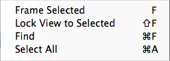

#Scene 视图导航

Scene 视图具有一组可用于快速有效移动的导航控件。

##场景视图辅助图标

场景视图辅助图标 (Scene Gizmo) 位于 Scene 视图的右上角。此控件用于显示 Scene 视图摄像机的当前方向，并允许快速修改视角和投影模式。

 

场景视图辅助图标在立方体的每一面都有一个锥形臂。最前面的锥形臂标有 __X__、__Y__ 和 __Z__。单击任何锥形轴臂会将 Scene 视图摄像机对齐到该锥形轴臂所代表的轴（例如：顶视图、左视图和前视图）。还可以右键单击该立方体来显示一个包含视角列表的菜单。要返回默认视角，请右键单击场景视图辅助图标，然后单击 __Free__。

此外还可启用和关闭__透视图 (Perspective)__。这种情况下会在__透视图 (Perspective)__ 和__正交视图 (Orthographic)__（有时称为“等距”）之间更改 Scene 视图的投影模式。为此，请单击场景视图辅助图标中心的立方体或其下方的文本。正交视图没有透视，可与其中一个锥形轴臂的单击操作结合使用来获得前视图、顶视图或侧视图。

*（上述场景来自于 [BITGEM](https://www.assetstore.unity3d.com/en/#!/publisher/1299)）*

如果 Scene 视图处于一个尴尬的视点（颠倒或是让人感到困惑的角度），请按住 Shift 键并单击场景视图辅助图标中心的立方体，即可返回__透视图__，使用从侧面和略微从上方观察的角度查看场景。

单击场景视图辅助图标右上角的挂锁可启用或禁用场景的旋转。禁用场景旋转后，右键单击鼠标可以平移视图而不是旋转视图。此时的功能与手形工具 (Hand tool) 相同（请参阅下面的[_手形工具_](#handtool)）。

请注意，在 __2D 模式__中，不显示场景视图辅助图标，因为此情况下唯一的选择是让视图垂直于 XY 平面。

###场景视图辅助图标：Mac 触控板手势
在带触控板的 Mac 上，可用两根手指拖动来缩放视图。

还可以使用三根手指来模拟单击__场景视图辅助图标__锥形臂的效果：向上、向左、向右或向下拖动可将 Scene 视图摄像机对齐到相应的方向。在 OS X 10.7“Lion”中，可能需要更改触控板设置才能启用此功能：

* 打开 System Preferences 并找到 Trackpad（或在 Spotlight 中输入 trackpad）。
* 单击进入“More Gestures”选项。
* 单击名称为“Swipe between pages”的第一个选项，然后将其设置为“Swipe left or right with three fingers”或“Swipe with two or three fingers”。

##在 Scene 视图中移动、旋转和缩放

移动、旋转和缩放是 Scene 视图导航中的关键操作。Unity 提供了几种方法来执行这些操作以提供最大的便利性：

###箭头移动

可使用__箭头键__在场景中移动，就好像在场景中“走动”一样。向上和向下箭头使摄像机朝所在方向前后移动。向左和向右箭头可横向平移视图。使用箭头时按住 __Shift__ 键可以加快移动速度。

 
###手形工具

选择手形工具（快捷键：__Q__）时，可使用以下鼠标控制方式：

 __移动：__单击并拖动可拖动摄像机。

 __旋转：__按住 __Alt__，然后左键单击并拖动可围绕当前轴心点旋转摄像机。此选项在 2D 模式下不可用，因为该模式下采用正交视图。

 __缩放：__按住 __Alt__，然后单击鼠标右键并拖动可缩放 Scene 视图。在 Mac 上也可以按住 __Control__，然后左键单击并拖动。

按住 __Shift__ 可提高移动和缩放的速度。

###飞越模式

使用__飞越模式 (Flythrough mode)__ 可以通过第一人称飞行来导航 Scene 视图，类似于在许多游戏中导航的方式。

* 单击并按住鼠标右键。
* 使用鼠标移动视图，使用 __WASD__ 键向左/向右/向前/向后移动，使用 __Q__ 和 __E__ 键向上和向下移动。
* 按住 __Shift__ 键可以加快移动速度。

飞越模式是专为__透视模式__设计的。在__正交模式__中，按住鼠标右键并移动鼠标会使摄像机旋转。

请注意，飞越模式在 2D 模式中不可用。相反，按住鼠标右键并移动鼠标可以在 Scene 视图中平移。

###移动快捷键

为了提高效率，无论选择哪种变换组件工具，都可以使用所有以下控制方式。
最方便的控制方式取决于所使用的鼠标或触控板：

|__操作__ |__3 键鼠标__  |__2 键鼠标或触控板__ |__只有一个鼠标键或触控板的 Mac__ |
|:---|:---|:---|:---|
|__移动__ |按住 Alt+鼠标中键，然后拖动 |按住 Alt+Control+左键单击，然后拖动 |按住 Alt+Command+左键单击，然后拖动 |
|__旋转__（在 2D 模式中不可用） |按住 Alt+左键单击，然后拖动 |按住 Alt+左键单击，然后拖动 |按住 Alt+左键单击，然后拖动 |
|__缩放__ |使用鼠标滚轮，或按住 Alt+右键单击，然后拖动 |按住 Alt+右键单击，然后拖动 |使用双指轻扫方法可放大或缩小，或按住 Alt-Control+左键单击，然后拖动 |

##将视图居中于游戏对象上

要将 Scene 视图居中于游戏对象上，请在层级视图中选择该游戏对象，然后将鼠标移到 Scene 视图上并按 __F__。此功能也可在菜单栏中的 __Edit__ > __Frame Selected__ 下找到。要将视图锁定到游戏对象（即使游戏对象正在移动），请按 __Shift+F__。此功能也可在菜单栏中的 __Edit__ > __Lock View to Selected__ 下找到。

 

场景视图辅助图标被秘密称为 Tetraxial Perspectagon。
