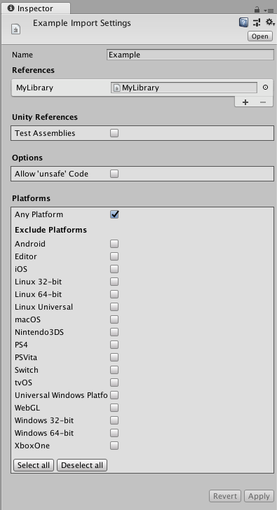
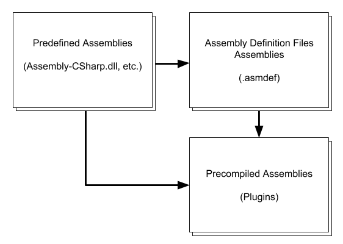

#脚本编译和程序集定义文件

##关于

Unity 自动定义脚本如何编译到托管程序集。通常情况下，随着向项目添加的脚本越来越多，Unity Editor 中用于迭代脚本更改的编译时间也会相应增加。

可使用程序集定义文件根据文件夹中的脚本来定义您自己的托管程序集。为此，请将项目脚本分成具有明确定义的依赖项的多个程序集，以确保在脚本中进行更改时仅重新构建所需的程序集。这样可以减少编译时间。应将每个托管程序集视为 Unity 项目中的单个库。


上面的**图 1** 说明了如何将项目脚本拆分为多个程序集。仅更改 Main.dll 中的脚本不会导致其他任何程序集重新编译。由于 Main.dll 包含的脚本较少，因此编译速度也比 CSharp.dll 快。
同样，只有 Stuff.dll 中的脚本更改才会导致 Main.dll 和 Stuff.dll 重新编译。

##如何使用程序集定义文件

程序集定义文件是通过 __Assets__ > __Create__ > __Assembly Definition__ 创建的资源文件。这些文件的扩展名为 .asmdef。


将一个程序集定义文件添加到 Unity 项目中的某个文件夹，即可将该文件夹中的所有脚本编译为一个程序集。可在 Inspector 中定义程序集的名称。

**注意**：程序集定义文件所在的文件夹的名称以及程序集定义文件的文件名对程序集的名称没有影响。





添加对项目其他程序集定义文件的引用也需要使用 Inspector。要查看 Inspector，请单击程序集定义文件，随后应该会出现该面板。要添加引用，请单击 __References__ 部分下的 __+__ 图标，然后选择您的文件。

Unity 使用引用来编译程序集，还定义程序集之间的依赖关系。

要标记该程序集以进行测试，请在 Inspector 中启用 Test Assemblies。这样会在程序集定义文件中添加对 unit.framework.dll 和 UnityEngine.TestRunner.dll 的引用。

在标记程序集以进行测试时，请确保：

* 预定义的程序集（Assembly-CSharp.dll 等）不会自动引用标记为进行测试的程序集定义文件。

* 该程序集未包含在正常构建中。要将程序集包含在播放器构建中，请在构建脚本中使用 [BuildOptions.IncludeTestAssemblies](../ScriptReference/BuildOptions.IncludeTestAssemblies.html)。请注意，这样只会在构建中包含程序集，而不会执行任何测试。

**注意**：如果在程序集内的脚本中使用 *unsafe* 关键字，必须在 Inspector 中启用 __Allow ‘unsafe’ Code__ 选项。这样将在编译程序集时将 /unsafe 选项传递给 C# 编译器。


可在 Inspector 中为程序集定义文件设置平台兼容性。在此处可选择排除或包含特定平台。

##文件夹层级视图中的多个程序集定义文件

在文件夹层级视图中保留多个程序集定义文件（扩展名：.asmdef）会使每个脚本添加到具有最短路径距离的程序集定义文件。

示例：

如果有一个 _Assets/ExampleFolder/MyLibrary.asmdef_ 文件和一个 _Assets/ExampleFolder/ExampleFolder2/Utility.asmdef_ 文件，
则：

* 位于 __Assets__ > __ExampleFolder__ > __ExampleFolder2__ 文件夹内的任何脚本都将编译为 Assets/ExampleFolder/ExampleFolder2/Utility.asmdef 定义的程序集。

* 位于 __Assets__ > __ExampleFolder__ 文件夹内而不在 __Assets__ > __ExampleFolder__ > __ExampleFolder2__ 文件夹内的任何文件都将编译为 Assets/ExampleFolder/MyLibrary.asmdef 定义的程序集。

##程序集定义文件不是构建系统文件
 **注意**：程序集定义文件不是程序集构建文件。它们不支持构建系统中常见的条件构建规则。
  
也正因为如此，程序集定义文件不支持预处理器指令（define 指令）的设置，因为它们始终为静态。

##向后兼容性和隐式依赖关系
程序集定义文件向后兼容 Unity 中的现有[预定义编译系统](ScriptCompileOrderFolders.html)。这意味着预定义的程序集始终依赖于每个程序集定义文件的程序集。
这类似于所有脚本都依赖于与 Unity 中的活动构建目标兼容的所有预编译程序集（插件/.dll）。




**图 3** 中的图表说明了预定义程序集、程序集定义文件程序集和预编译程序集之间的依赖关系。

Unity 为程序集定义文件设定的优先级高于[预定义编译系统](ScriptCompileOrderFolders.html)。
这意味着，在程序集定义文件的文件夹中具有来自预定义编译的任何特殊文件夹名称对编译没有任何影响。Unity 将这些文件夹视为没有任何特殊含义的常规文件夹。

强烈建议要么对项目中的所有脚本使用程序集定义文件，要么根本不使用。否则，程序集定义文件每次重新编译时，不使用程序集定义文件的脚本也会始终重新编译。这样就弱化了使用程序集定义文件的优势。

##API
在 UnityEditor.Compilation 命名空间中，有一个静态的 [CompilationPipeline](../ScriptReference/Compilation.CompilationPipeline.html) 类用于检索关于程序集定义文件和 Unity 构建的所有程序集的信息。

##文件格式
程序集定义文件是 JSON 文件。它们具有以下字段：

|**字段** | **类型** |
|:--|:--|
|__name__|string|
|__references（可选）__|字符串数组|
|__includePlatforms（可选）__ | 字符串数组|
|__excludePlatforms（可选）__ | 字符串数组|

不要在同一程序集定义文件中同时使用 __includePlatforms__ 和 __excludePlatforms__ 字段。

可使用 ```CompilationPipeline.GetAssemblyDefinitionPlatforms``` 检索平台名称。

##示例
MyLibrary.asmdef

```
{
    "name": "MyLibrary",
    "references": [ "Utility" ],
    "includePlatforms": ["Android", "iOS"]
}
```
MyLibrary2.asmdef

```
{
    "name": "MyLibrary2",
    "references": [ "Utility" ],
     "excludePlatforms": ["WebGL"]
}
```


---

* <span class="page-edit">2018-03-07  Page published with limited [editorial review](DocumentationEditorialReview.html)
</span>

* <span class="page-history">[2017.3](https://docs.unity3d.com/2017.3/Documentation/Manual/30_search.html?q=newin20173) 中的新功能 <span class="search-words">NewIn20173</span></span>

* <span class="page-history">在 2018.1 中更新了自定义脚本程序集</span>
