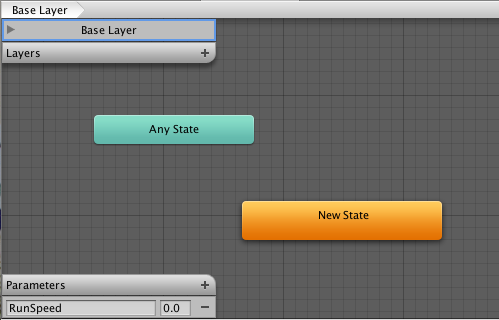

教程：为“原地就位”的人形动画编写根运动脚本
==================================================================


有时，动画表现为“原地就位”，这意味着如果您将此动画放入场景，它不会移动所依附的角色。换言之，该动画没有包含“根运动”。为此，我们可通过脚本修改根运动。为了将这一切融合到一起，请遵循以下步骤（注意，实现相同结果有很多不同方法，这只是一种方案）。


* 打开包含“原地就位”动画的 FBX 文件的检视面板，然后选择 __Animation__ 选项卡
* 确保 __Muscle Definition__ 设置为要控制的 Avatar（假设此 Avatar 称为 _Dude_，并且已将其添加到 __Hierarchy 视图__）。
* 从可用剪辑中选择动画剪辑
* 确保 __Loop Pose__ 正确设置（旁边的指示灯为绿色），并已选中 __Loop Pose__ 的复选框


 


* 在动画查看器中预览动画以确保动画的开头和结尾顺利衔接，并且角色正在“原地就位”移动
* 在动画剪辑上，[创建曲线](animeditor-AnimationCurves.html)来控制角色的速度（可通过 __Animation Import Inspector__ __Curves &gt; +__ 添加曲线）
* 为该曲线提供有意义的名称，例如“Runspeed”


 


* 新建 __Animator Controller__（将其命名为 __RootMotionController__）
* 将所需的动画剪辑放入其中，此时应该会创建一个具有动画名称的状态（例如 __Run__）
* 将参数添加到与曲线同名的控制器（在本示例中为“Runspeed”）


 


* 在 __Hierarchy__ 中选择角色 __Dude__（其检视面板应该已经具有 __Animator__ 组件）。
* 将 __RootMotionController__ 拖到 Animator 的 __Controller__ 属性上
* 如果现在按 Play，应该会看到“Dude”在原地奔跑

最后，要控制运动，我们需要创建脚本 (RootMotionScript.cs) 来实现 [OnAnimatorMove](../ScriptReference/MonoBehaviour.OnAnimatorMove.html) 回调：


````
using UnityEngine;
using System.Collections;

[RequireComponent(typeof(Animator))]
	
public class RootMotionScript : MonoBehaviour {
			
	void OnAnimatorMove()
	{
            Animator animator = GetComponent<Animator>(); 
                              
            if (animator)
            {
	 Vector3 newPosition = transform.position;
               newPosition.z += animator.GetFloat("Runspeed") * Time.deltaTime; 
	 transform.position = newPosition;
            }
	}
}


````


应将 RootMotionScript.cs 连接到“Dude”对象。进行此操作时，Animator 组件将检测到脚本有 [OnAnimatorMove](../ScriptReference/MonoBehaviour.OnAnimatorMove.html) 函数并将 __Apply Root Motion__ 属性显示为 _Handled by Script_


 

