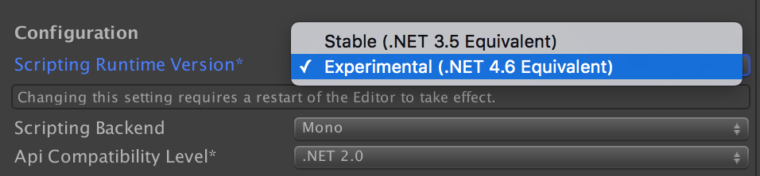

#脚本运行时升级（Scripting Runtime Upgrade）
对于2017.1 版本，使用.NET 4.6的选项将是一个实验性的每个项目选项。此选项在 GUI 中作为一个 Player Setting 位于 __Scripting Backend__ 和 __Api Compatibility Level__ 上方：

 

等效的脚本 API 为 __PlayerSettings.scriptingRuntimeVersion__ 属性。__请注意，更改此设置需要重新启动 Editor，因为它会影响 Editor 以及播放器。__

默认情况下，Unity 行为方式或 .NET 功能的可用性应该不会改变。一旦选择在项目中使用新的 .NET 4.6，您就可以在用户脚本和预编译的程序集内使用 C# 6、.NET 4.6 类库和新的运行时功能。

## 常见问题解答

### 这会影响哪些平台？

所有平台，但影响方式不同：

- 启用此选项后，Editor 和 Standalone（独立平台）使用新版本的 Mono。

- 所有游戏主机平台仅在面向新的 .NET 版本时才能使用 IL2CPP。

- iOS 和 WebGL 将继续仅支持 IL2CPP。

- Android 将继续同时支持 Mono 和 IL2CPP。

- 其他平台仍在进行相关工作以便支持新的 Mono 或 IL2CPP

*截至目前 (2017.1b4)，主要在桌面平台、iOS 和 Android 上使用此选项。其他平台的支持仍在开发中。*

### IL2CPP 如何？

IL2CPP 全面支持新的 .NET 4.6 API 和功能。

### 更新后的 Mono/IL2CPP 的稳定性如何？

新的 Mono/IL2CPP 已通过 Unity 的内部自动化测试。当然，我们预计您仍可能遇到问题。如果遇到任何问题，请提交错误报告。

### 此预览版是否包含新的 GC？

不包含。这是对类库和运行时的升级，但我们仍在使用 Boehm GC。我们正计划推出与 IL2CPP 结合使用的新版 Boehm（因此 IL2CPP 和 Mono 将具有完全相同的 GC）。

### 等等，为什么我们没有新的 GC？

较新的 Mono 垃圾回收器 (SGen) 要求在 Unity 中进行额外的工作，一旦新的运行时和类库稳定后就会跟进。

### 我可以用这个新的 Mono 来调试托管的代码吗？

新的 Mono 需要 VSTU 3.1。请安装此必要版本以便在 Windows 上使用新的 Mono 运行时。

### 使用新的 .NET 版本时，为什么我的编译包更大？

.NET 4.6 类库比我们当前的 .NET 3.5 类库大得多。我们正在积极致力于改进托管链接器以便进一步减小大小。

此外，我们正在开发一个新的 Unity 特有类库 API 配置文件（与我们当前的 __unity__ 配置文件类似），此配置文件将

a) 专门用于在 AOT 平台上工作

b) 具有更小的外围应用 (surface area)，并在内部采用可剥离/可链接的设计

c) 支持 [netstandard 2.0](https://github.com/dotnet/standard/blob/master/docs/netstandard-20/README.md)（尚待正式发布）

### 我在试用这个新选项时，发现一些问题。我该怎么办？

请提交错误报告。我们将迅速修复问题！

----

*  2018-03-19  Page published with no [editorial review](DocumentationEditorialReview.html)

  
* Unity [2017.1](../Manual/30_search.html?q=newin20171) 中的新功能 NewIn20171
* 
* 从 2018.1 开始，MonoDevelop 由 Visual Studio 取代
