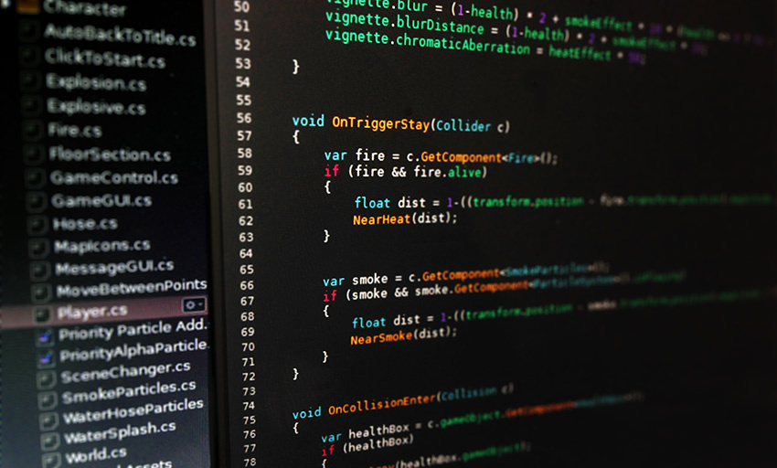

#脚本

 

脚本是所有游戏中必不可少的组成部分。即使是最简单的游戏也需要脚本来响应玩家的输入并安排游戏中应发生的事件。除此之外，脚本可用于创建图形效果，控制对象的物理行为，甚至为游戏中的角色实现自定义的 AI 系统。

脚本编写是一项需要花费一些时间和精力来学习的技能。本部分的目的不是教您如何从头开始编写脚本代码，而是解释适用于 Unity 脚本的主要概念。

**相关教程**：[脚本 (Scripting)](https://unity3d.com/learn/tutorials/topics/scripting)

请参阅[知识库的 Editor 部分](https://support.unity3d.com/hc/en-us/categories/201964166-Unity-Editor)了解故障排除、提示和技巧信息。
