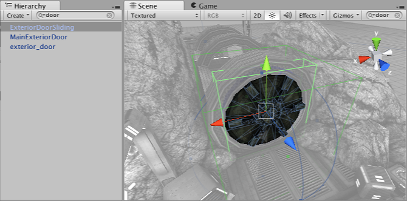
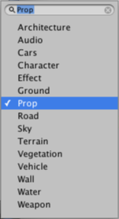

#搜索

处理大型复杂场景时，搜索特定对象会很有用。使用 Unity 中的__搜索__功能，可以过滤出需要查看的对象或一组对象。可按名称、按组件类型搜索资源，在某些情况下，还可按资源_标签_搜索资源（见下文）。可从 Search 下拉菜单中选择搜索模式。

##场景搜索

Scene 和 Hierarchy 视图都有一个搜索框，允许按名称过滤对象。由于这两个视图基本上只是同一组对象的不同表示，因此输入的任何搜索查询都将在两个搜索框中重复并同时应用于两个视图。请注意，正在进行搜索时，两个视图都会略有变化：Scene 视图将以灰色显示过滤出的对象，而 Hierarchy 视图将丢失层级结构信息，并只显示按名称列出的对象：

搜索框右侧的小叉号按钮会删除搜索查询并将视图恢复为正常状态。搜索框左侧的菜单允许选择是按名称、按类型还是同时按这两者过滤对象。

##项目搜索和标签

Project 视图中也有一个搜索框。此处的搜索适用于_资源_而不是场景中的实例。

可用于资源的另一个选项是按__标签__搜索以及按名称和类型搜索。标签只是一小段文本，可用于对特定资源进行分组。如果单击 Project 窗口左侧第二个标签按钮，将看到一个包含现有标签的菜单，并在顶部有一个文本框。然后，可请求分配了特定标签的资源。也可以创建新标签。例如，可添加“Vehicles”标签，以便轻松找到所有车辆资源。可在 Inspector 底部的 _Asset Labels_ 框中为资源添加标签。

文本框可用于过滤现有标签或输入新标签的文本；在输入时按空格键或 Enter 键即可将新标签文本添加到资源。当前应用于资源的标签会在菜单的左侧显示一个勾号标记。只需从菜单中“选择”一个已应用的标签即可删除该标记。请注意，任何资源都可以包含任意所需数量的标签，因此可同时属于多个不同的标签组。

请参阅 [Inspector](UsingTheInspector.html) 手册页面以了解更多信息。
