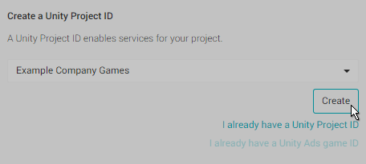

#设置项目启用 Unity 服务

要开始使用 Unity 的系列服务，必须先将项目链接到 **Unity 服务项目 ID** (Unity Services Project ID)。Unity Services Project ID 是在所有 Unity 服务中使用的在线标识符。这些 ID 可以直接在 Services 窗口中创建，也可以在 [Unity 服务网站](https://developer.cloud.unity3d.com)上在线创建。最简单的方法是使用 Unity 中的 Services 窗口，如下所示：

要打开 Services 窗口，请选择 __Window > Unity Services__，或者单击工具栏中的云端按钮。.如果您尚未将项目与服务 ID (Services ID) 关联，会出现以下提示：

可以在此窗口中新建项目 ID 或选择现有 ID。

要创建项目 ID，必须指定__组织__ (Organization) 和__项目名称__ (Project Name)。

如果这是首次使用任何 Unity 服务，则需要同时选择组织和项目名称。__Select organization__ 字段通常是您的公司名称。

您首次开立 Unity 帐户时（通常是在您首次下载并安装 Unity 时），将在帐户下创建一个默认"组织" (Organization)。此默认组织与您的帐户用户名同名。如果这是您希望项目关联的组织，请从列表中选择该组织。

有时，用户需要能够在多个组织中工作；例如，如果您与不同团队合作来处理不同项目，则有这样的需求。如果您需要与多个组织合作，可以在[组织 ID 网页](https://id.unity.com/organizations)上添加和管理您的组织。如果您属于多个组织，这些组织将显示在列表中。

选择组织，然后单击 __Create__。

新的 Unity Services Project ID 的项目名称会自动填入您第一次创建项目时为项目选择的名称。稍后可以在 __Services__ 窗口的 __Settings__ 部分中更改项目名称。

有时可能需要将项目与 Unity Services Project ID 重新关联。在此情况下，请从已注册到 Unity 服务的现有项目列表中选择项目。

