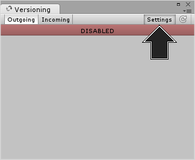
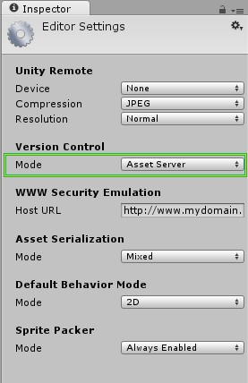
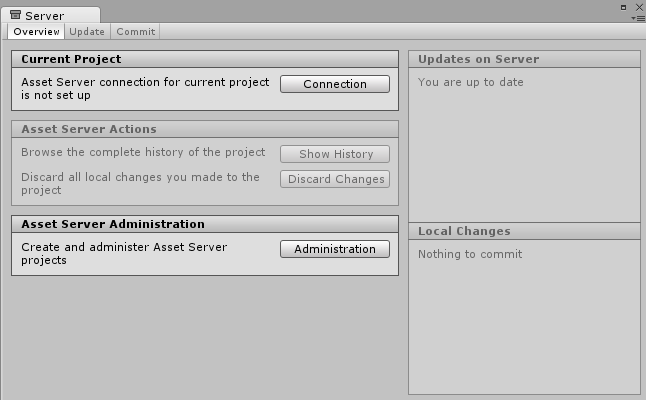

设置 Asset Server
===========================

|**警告：这是旧版文档** |
|:---|
|注意，从 2017.1 版开始，Asset Server 产品已弃用。我们建议在您的Unity项目中使用 Plastic SCM 或 Perforce 进行版本控制。2017-06-30|

服务器端安装
------------------------


Asset Server 只需在服务器计算机上进行简单的一次性安装。与 Asset Server 的交互是通过 Unity 完成的。Unity 可以安装在服务器计算机上，但不需要这样做。必须从客户端计算机管理它，在其中可以添加项目和用户。必须使用特定的用户凭据来配置每个额外的客户端以便与项目同步。

您可以在 Mac OS X 10.4 或更高版本、Windows XP、Windows Vista 和各种 Linux 发行版（包括 CentOS、Ubuntu 和 Suse Linux）上安装 Asset Server。
请从此处[下载 Unity Asset Server](http://www.unity3d.com/asset-server)。

安装程序将安装所有必要的文件、设置数据库并启动 Asset Server。在安装过程结束时，系统将要求创建__管理员密码__。从 Unity 中管理 Asset Server 时需要此密码。必须先以管理员身份连接到 Asset Server，然后才能创建项目或用户。


管理 Asset Server
-------------------------------

Asset Server 允许任意数量的__用户__连接到__项目__。管理员必须首先使用 Unity 作为客户端连接到服务器并创建新的项目和用户。

本指南将介绍如何启动和运行服务器并使其随时可用。

请注意，__Asset Server__ 现在是旧版产品。我们建议使用 __Plastic SCM__ 或 __Perforce__ 在 Unity 项目中进行版本控制。

[PlasticSCM](plasticSCMIntegration.html)
[PerForce](perForceIntegration.html)


**1.**
启动 __Unity__ 并打开一个空项目。选择 __Window &gt; Version Control__，然后单击 __Settings__ 按钮。



随后将在 __Inspector__ 中显示 __Version Control__ 设置，现在请从 __Mode__ 下拉菜单中选择 __Asset Server__。



**2.** 现在我们要运行 Asset Server。找到并运行以下文件：

**Windows：**C:\Program Files (x86)\Unity\AssetServer\bin\AssetServerControl.exe

**Macintosh：**/Library/UnityAssetServer

*注意：Yosemite 10.10.3 用户需要通过硬盘驱动器的库目录（而不是用户的库目录）进行搜索。*

**3.** 现在可选择 __Window &gt; Version Control__。随后将打开 Asset Server 的管理选项卡。

单击 Administration 按钮。



**4.** 在 __Server Address__ 字段中，输入您要管理的 Asset Server 所在的计算机的 __IP 地址__或__主机名__。如果 Asset Server 安装在本地计算机上，则可在 __Server Address__ 字段中输入“localhost”。接下来，提供管理员名称和密码。管理员名称始终为“admin”，密码是安装 Asset Server 时输入的密码。最后，单击 __Connect__ 按钮。您现在已连接到 Asset Server，并可以执行初始设置。


###管理项目和用户

每个服务器可以包含多个项目，每个用户可以拥有一个或多个项目的权限。项目通常互不相关，并且在资源集合中是唯一的。最好是“将一个项目视为一个游戏”。

可通过单击 __Server Administration__ 选项卡中的 __Create__ 按钮创建新项目。


首先选择现有项目，然后单击 __New User__ 按钮，即可创建新用户。


在一个项目中创建用户后，可通过启用用户列表中用户名左侧的复选框将用户添加到另一个项目。

您可以为单个项目启用或禁用用户访问权限。
要从服务器中完全删除项目或用户，请使用 __Delete Project__ 和 __Delete User__ 按钮。

###防火墙设置

Unity Asset Server 使用 TCP 端口 __10733__。您可能需要在防火墙和/或路由器中启用与此端口的连接。


高级
--------


Asset Server 是使用 PostgreSQL 的修改版本构建的。直接访问 SQL 数据库需要一些关于 SQL 和 Unix/Linux 命令行的技术知识。建议用户谨慎操作。

###备份

我们提供了一个命令行工具来备份 Asset Server。应在运行 Asset Server 的计算机上使用管理员帐户运行该工具。将 BACKUP_LOCATION 替换为您希望备份工具放置备份的路径名：

Mac OS X 
`sudo /Library/UnityAssetServer/bin/as_backup ` BACKUP_LOCATION

Linux 
`sudo /opt/unity_asset_server/bin/as_backup ` BACKUP_LOCATION

Windows 
`"%ProgramFiles%\Unity\AssetServer\bin\as_backup.cmd" ` BACKUP_LOCATION

as_backup 将在 BACKUP_LOCATION 位置创建一个目录，其中包含每个项目的一个或多个文件，还有一些文件包含每个项目的相关信息以及所有用户及其密码的备份。

###恢复备份

要恢复通过 as_backup 生成的 Asset Server 备份，请首先执行 Asset Server 的全新安装，不要创建任何项目。（恢复过程将拒绝覆盖同名的现有项目。）

然后运行提供的备份恢复工具 `as_restore`，将其指向使用 as_backup 创建的备份的位置：

Mac OS X 
`sudo /Library/UnityAssetServer/bin/as_restore ` BACKUP_LOCATION

Linux 
`sudo /opt/unity_asset_server/bin/as_restore ` BACKUP_LOCATION

Windows 
`"%ProgramFiles%\Unity\AssetServer\bin\as_restore.cmd" ` BACKUP_LOCATION

请注意，您还可以使用 as_backup 和 as_restore 将 Asset Server 安装结果从一台计算机移动到另一台计算机，方法是在源计算机上执行备份，将备份目录移动到目标计算机（或通过网络文件共享方式安装该目录），然后运行 as_restore 将数据插入新安装的 Asset Server 实例。即使源和目标 Asset Server 具有不同版本或在不同操作系统上运行，这种做法也是有效的。

###找到 Asset Server 项目的数据库名称

要查看项目数据库中的表，首先需要确定实际数据库的名称。在托管 Asset Server 的计算机上运行以下命令行命令：

Mac OS X 
`/Library/UnityAssetServer/bin/psql -U admin -h localhost -d postgres -c 'select * from all_databases**view'`

Linux 
`/opt/unity_asset_server/bin/psql -U admin -h localhost -d postgres -c 'select * from all_databases**view'`

Windows 
`"%ProgramFiles%\Unity\AssetServer\bin\psql.exe" -U admin -h localhost -d postgres -c "select * from all_databases**view"`

此命令及其他命令将提示您输入密码。每次发生这种情况时，请输入在安装期间设置的数据库管理员密码。得到的结果将是遵循以下基本布局的表：


````
    databasename | projectname | description | version 
    --------------------+--------------------+--------------------------+---------
     sandbox | Sandbox | Created with Unity 2.0.0 | 1.0
     game | Game | Created with Unity 2.0.0 | 1.0
     my_game_project | My Game Project | Created with Unity 2.0.0 | 1.0
    (3 rows)


````

现在您需要确定要备份的项目的“databasename”。创建数据库时，默认的“databasename”与 Unity 中显示的“projectname”相同，但采用小写字母并将空格替换为下划线。

请注意，如果您的服务器在不同端口上托管多个 PostgreSQL 数据库，可能需要显式提供用于连接到 Asset Server 数据库的端口。在这种情况下，请将 -p 10733 添加到给定的命令（假设您的实例使用了默认端口 10733）。例如：

Linux 
`/opt/unity_asset_server/bin/psql -U admin -h localhost -d postgres -c 'select * from all_databases**view' -p 10733`

###其他 SQL 功能

这些命令及所有其他命令将使用 PostgreSQL 发行版中的工具。您可以在此处阅读更多关于这些工具的信息：http://www.postgresql.org/docs/8.3/interactive/reference-client.html

------

*  <span class="page-edit">2017-06-30  Page amended with no [editorial review](DocumentationEditorialReview.html)
</span>
*  <span class="page-history">在 [2017.1](https://docs.unity3d.com/2017.1/Documentation/Manual/30_search.html?q=newin20171) 中已弃用 Asset Server</span>
