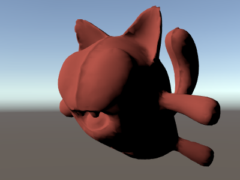

# 着色器：ShaderLab 和固定函数着色器


本教程将教您创建自己的着色器的第一步，帮助您控制游戏外观并优化图形性能。

Unity 提供了一个强大的着色和材质语言，名为 __ShaderLab__。其风格类似于 CgFX 和 Direct3D 效果 (.FX) 语言：将需要显示的所有内容都描述为[材质](class-Material.html)。

着色器描述 Unity 的[材质检视面板](class-Material.html)中公开的属性，并描述多个着色器实现方案（__子着色器__），这些实现方案针对不同的图形硬件功能，分别描述完整的图形硬件渲染状态，以及要使用的顶点/片元程序。着色器程序是用高级 [Cg/HLSL](SL-ShadingLanguage.html) 编程语言编写的。

在本教程中，我们将介绍如何使用所谓的“固定函数”表示法来编写_非常简单的_着色器。在[下一章节](ShaderTut2.html)中，我们将介绍顶点和片元[着色器程序](SL-ShaderPrograms.html)。我们假定读者已基本了解 [OpenGL](http://opengl.org/documentation/red_book) 或 Direct3D 渲染状态，并且大致了解 [HLSL](https://msdn.microsoft.com/en-us/library/bb509561.aspx)、[Cg](http://http.developer.nvidia.com/Cg/Cg_language.html)、[GLSL](http://www.opengl.org/documentation/glsl) 或 [Metal](https://developer.apple.com/library/ios/documentation/Metal/Reference/MetalShadingLanguageGuide/Introduction/Introduction.html) 着色器编程语言。


## 准备开始

要创建新着色器，请从主菜单中选择 __Assets &gt; Create &gt; Shader &gt; Unlit Shader__，或者复制现有着色器并在此基础上进行修改。要编辑新着色器，在 [Project 视图](ProjectView.html)中双击该着色器即可。

Unity 允许使用所谓的“固定函数”表示法来编写_非常简单的_着色器。为简单起见，我们将从这样的着色器开始。在内部，固定函数着色器在着色器导入时转换为常规[顶点和片元程序](SL-ShaderPrograms.html)。

我们将从一个非常基本的着色器开始：

```
Shader "Tutorial/Basic" {
    Properties {
        _Color ("Main Color", Color) = (1,0.5,0.5,1)
    }
    SubShader {
        Pass {
            Material {
                Diffuse [_Color]
            }
            Lighting On
        }
    }
}
```

这个简单的着色器演示了最基本的着色器之一。它定义了一个名为 __Main Color__ 的颜色属性，并且为其分配默认的粉色 (red=100% green=50% blue=50% alpha=100%)。然后，它通过调用 __Pass__ 来渲染对象，在该通道中将漫射材质组件设置为属性 __\_Color__ 并开启每顶点光照。

要测试此着色器，请创建一个新材质，从下拉菜单中选择着色器 (__Tutorial &gt; Basic__)，并将材质指定给某个对象。在材质检视面板中调整颜色并观察更改。现在该挑战一下更复杂的任务了！

 


## 基本顶点光照


如果打开现有的复杂着色器，可能会有点不知所措。为了帮助您入门，我们将剖析 Unity 附带的内置 __VertexLit__ 着色器。此着色器使用固定函数管线来执行标准的每顶点光照。


```
Shader "VertexLit" {
    Properties {
        _Color ("Main Color", Color) = (1,1,1,0.5)
        _SpecColor ("Spec Color", Color) = (1,1,1,1)
        _Emission ("Emmisive Color", Color) = (0,0,0,0)
        _Shininess ("Shininess", Range (0.01, 1)) = 0.7
        _MainTex ("Base (RGB)", 2D) = "white" { }
    }

    SubShader {
        Pass {
            Material {
                Diffuse [_Color]
                Ambient [_Color]
                Shininess [_Shininess]
                Specular [_SpecColor]
                Emission [_Emission]
            }
            Lighting On
            SeparateSpecular On
            SetTexture [_MainTex] {
                constantColor [_Color]
                Combine texture * primary DOUBLE, texture * constant
            }
        }
    }
}

```


所有着色器都以关键字 [Shader](SL-Shader.html) 开头，后跟一个表示着色器名称的字符串。这是在__检视面板__中显示的名称。此着色器的所有代码必须放在随后的大括号内：__{ }__（称为代码块）。


* 名称应该言简意赅。不一定要与 **.shader** 文件名匹配。
* 要将着色器放入到 Unity 中的子菜单中，请使用斜杠，例如 __MyShaders/Test__ 将在名为 __MyShaders__ 的子菜单中显示为 __Test__，或显示为 __MyShaders &gt; Test__。

着色器包含 __Properties__ 代码块及随后的 __SubShader__ 代码块。以下各节中将逐一介绍。


## Properties


在着色器代码块的开头，您可以定义美术师可在[材质检视面板](class-Material.html)中编辑的任何属性。在 __VertexLit__ 示例中，属性如下所示：


 

属性在 [Properties](SL-Properties.html) 代码块中的单独行上列出。每个属性都以内部名称（__Color__、__MainTex__）开头。后面括号中显示的是在检视面板中显示的名称以及属性类型。随后列出此属性的默认值：


 

[属性参考](SL-Properties.html)中列出了可能的类型。默认值取决于属性类型。在颜色示例中，默认值应为一个四分量矢量。

我们现在定义了属性，并准备开始编写实际着色器。


## 着色器主体


在我们继续之前，让我们定义着色器文件的基本结构。

不同的图形硬件具有不同的功能。例如，某些显卡支持片元程序，其他显卡则不支持；有些显卡在每个通道中可以放下四个纹理，而有些只能放下两个或一个；为了让您充分利用用户拥有的任何硬件，着色器可以包含多个__子着色器 (SubShader)__。当 Unity 渲染着色器时，它将遍历所有子着色器并采用硬件支持的第一个子着色器。


```
Shader "Structure Example" {
    Properties { /* ...shader properties...}
    SubShader {
	// ...需要 DX11/GLES3.1 硬件的子着色器...
    }
    SubShader {
	// ...可能看起来更差但可在任何硬件上运行的子着色器 :)
    }
}

```

该系统允许 Unity 支持所有现有硬件并最大限度提高每个硬件上的质量。但是，也导致某些着色器长度增加。

在每个 SubShader 代码块中，您可以设置所有通道共享的渲染状态；并定义渲染通道本身。[SubShader 参考](SL-SubShader.html)中提供了可用命令的完整列表。


## 通道


每个子着色器是多个通道的集合。每个通道都将渲染对象几何体，因此必须至少有一个通道。我们的 VertexLit 着色器只有一个通道：


```
// ...代码片段...
Pass {
    Material {
        Diffuse [_Color]
        Ambient [_Color]
        Shininess [_Shininess]
        Specular [_SpecColor]
        Emission [_Emission]
    }
    Lighting On
    SeparateSpecular On
    SetTexture [_MainTex] {
        constantColor [_Color]
        Combine texture * primary DOUBLE, texture * constant
    }
}
// ...代码片段...

```

通道中定义的任何命令都会将图形硬件配置为以特定方式渲染几何体。

在上面的示例中，我们有一个 __[Material](SL-Material.html)__ 代码块，可将我们的属性值绑定到固定函数光照材质设置。__Lighting On__ 命令可开启标准顶点光照，而 __SeparateSpecular On__ 则可以对镜面高光启用单独的颜色。

到目前为止，所有这些命令都直接映射到固定函数 OpenGL/Direct3D 硬件模型。有关此方面的更多信息，请参阅 [OpenGL 红皮书](http://opengl.org/documentation/red_book)。

下一个命令 __[SetTexture](SL-SetTexture.html)__ 非常重要。这些命令定义了我们想要使用的纹理以及如何在渲染中混合、组合和应用这些纹理。__SetTexture__ 命令后跟我们想要使用的纹理的属性名称（此处为 __\_MainTex__），再随后是__组合器代码块__，用于定义纹理的应用方式。组合器代码块中的命令是针对在屏幕上渲染的每个像素执行的。

在这个代码块中，我们设置一个恒定的颜色值，即材质的颜色：__\_Color__。我们将在下面使用这种恒定颜色。

在下一个命令中，我们指定如何将纹理与颜色值混合。我们使用 __Combine__ 命令执行此操作，该命令指定如何将纹理与另一个纹理或颜色混合。通常如下所示：
    __Combine ColorPart, AlphaPart__

这里的 __ColorPart__ 和 __AlphaPart__ 分别定义颜色 (RGB) 和 Alpha (A) 分量的混合。如果省略 __AlphaPart__，则使用与 __ColorPart__ 相同的混合。

在我们的 VertexLit 示例中：
    __Combine texture * primary DOUBLE, texture * constant__

这里的 __texture__ 是来自当前纹理（此处为 __\_MainTex__）的颜色。它与 __primary__ 顶点颜色相乘 (*)。主色是顶点光照颜色，根据上面的材质值计算得出。最后，将结果乘以 2 以增加光照强度 (__DOUBLE__)。Alpha 值（逗号后面）是 __texture__ 乘以 __constant__ 值（使用上面的 __constantColor__ 进行设置）。另一种经常使用的组合器模式称为 __previous__（此着色器中未使用）。这是之前任何 __SetTexture__ 步骤的结果，可用于将多个纹理和/或颜色相互组合。


## 总结


我们的 VertexLit 着色器可配置标准顶点光照并设置纹理组合器，使渲染的光照强度加倍。

我们可以将更多的通道放入着色器，它们将逐一被渲染。但现在来说，并不需要这样做，因为我们得到了预期效果。我们只需要一个子着色器，因为我们不使用任何高级功能；这个特殊的着色器将适用于 Unity 支持的任何显卡。

VertexLit 着色器是我们能想到的最基本的着色器之一。我们没有使用任何特定于硬件的操作，也没有使用必须由 ShaderLab 和 Cg/HLSL 提供的任何更特殊和更酷的命令。

在[下一章节](ShaderTut2.html)中，我们将继续说明如何使用 Cg/HLSL 语言编写自定义顶点和片元程序。
