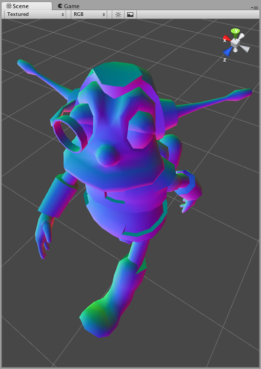

# 着色器：顶点和片元程序


本教程将教您如何在 Unity 着色器中编写[顶点和片元程序](SL-ShaderPrograms.html)的基础知识。有关 ShaderLab 的基本介绍，请参阅[入门教程](ShaderTut1.html)。如果要编写与光照交互的着色器，请阅读[表面着色器](SL-SurfaceShaders.html)。

让我们先简单回顾一下着色器的一般结构：


```
Shader "MyShaderName"
{
    Properties
    {
        // 此处为材质属性
    }
    SubShader // 图形硬件 A 的子着色器
    {
        Pass
        {
            // 通道命令 ...
        }
        // 更多通道（如果需要）
    }
    // 更多子着色器（如果需要）
    FallBack "VertexLit" // 可选回退
}

```

最后我们介绍一个新命令：__FallBack "VertexLit"__。[Fallback](SL-Fallback.html) 命令可以在着色器的末尾使用；如果当前着色器中没有__子着色器__可以在用户的图形硬件上运行，该命令会告诉应该使用哪个着色器。效果等同于在结尾包含回退着色器中的所有子着色器。例如，如果您要编写一个花哨的法线贴图着色器，那么您可以回退到内置的 __VertexLit__ 着色器，而不必为旧显卡编写一个非常基本的非法线贴图子着色器。

[第一个着色器教程](ShaderTut1.html)中介绍了着色器的基本构建块，同时也提供了关于[属性](SL-Properties.html)、[子着色器](SL-SubShader.html)和[通道](SL-Pass.html)的完整文档。

构建子着色器的一种快速方法是使用在其他着色器中定义的通道。命令 [UsePass](SL-UsePass.html) 就能执行此操作，因此您可以通过简洁的方式重用着色器代码。例如，以下命令使用内置 __Specular__ 着色器中名为“FORWARD”的通道：
__UsePass "Specular/FORWARD"__。

要让 __UsePass__ 运行，必须为要使用的通道提供一个名称。通道中的 [Name](SL-Name.html) 命令将为其提供名称：__Name "MyPassName"__。


## 顶点和片元程序


我们在[第一个教程](ShaderTut1.html)中描述了仅使用单个纹理组合指令的通道。现在演示如何在通道中使用顶点和片元程序。

使用顶点和片元程序（所谓的“可编程管线”）时，图形硬件中的大多数硬编码功能（“固定函数管线”）将被关闭。例如，使用顶点程序会完全关闭标准 3D 变换、光照和纹理坐标生成。同样，使用片元程序会取代将在 SetTexture 命令中定义的任何纹理组合模式；因此不需要 SetTexture 命令。

编写顶点/片元程序需要精通 3D 变换、光照和坐标空间，因为您必须自己重写 OpenGL等 API 中内置的固定功能。另一方面，您不仅仅可以使用内置功能！


## 在 ShaderLab 中使用 Cg/HLSL


ShaderLab 中的着色器通常是用 [Cg](http://developer.nvidia.com/page/cg_main.html)/[HLSL](http://msdn.microsoft.com/en-us/library/bb509561%28VS.85%29.aspx) 编程语言编写的。Cg 和 DX9 风格的 HLSL 实际上是同一种语言，所以我们将互换使用 Cg 和 HLSL（有关详细信息，请参阅[本页](SL-ShadingLanguage.html)）。

着色器代码是通过在着色器文本中嵌入“Cg/HLSL 代码片段”来编写的。Unity Editor 将代码片段编译为低级着色器程序集，游戏数据文件中包含的最终着色器仅包含此低级程序集或字节码（根据平台而定）。在 __Project 视图__中选择着色器时，检视面板有一个按钮可显示已编译的着色器代码，这可以作为调试助手。Unity 自动编译所有相关平台（Direct3D 9、OpenGL、Direct3D 11、OpenGL ES 等）的 Cg 代码片段。请注意，由于 Cg/HLSL 代码是由 Editor 编译的，因此无法在运行时从脚本创建着色器。

通常，代码片段放在 Pass 代码块内。如下所示：

```
Pass {
    // ...常规通道状态设置 ...

    CGPROGRAM
    // 此代码片段的编译指令，例如：
    #pragma vertex vert
    #pragma fragment frag

    // Cg/HLSL 代码本身

    ENDCG
    // ...通道设置的剩余部分 ...
}
```

以下示例演示了一个完整的着色器，它将对象法线渲染为彩色：


```
Shader "Tutorial/Display Normals" {
    SubShader {
        Pass {

			CGPROGRAM

			#pragma vertex vert
			#pragma fragment frag
			#include "UnityCG.cginc"

			struct v2f {
				float4 pos : SV_POSITION;
				fixed3 color : COLOR0;
			};

			v2f vert (appdata_base v)
			{
				v2f o;
				o.pos = UnityObjectToClipPos(v.vertex);
				o.color = v.normal * 0.5 + 0.5;
				return o;
			}

			fixed4 frag (v2f i) : SV_Target
			{
				return fixed4 (i.color, 1);
			}
			ENDCG

        }
    }
}

```


当应用于对象时，它将生成如下图像：


 

我们的“Display Normals”着色器没有任何属性，包含一个子着色器，子着色器只有一个通道，通道中除了 Cg/HLSL 代码外无任何其他内容。让我们逐个剖析代码：

```
CGPROGRAM
# pragma vertex vert
# pragma fragment frag
// ...
ENDCG
```

整个代码片段写在 __CGPROGRAM__ 与 __ENDCG__ 关键字之间。在开头，编译指令以 __#pragma__ 语句形式给出：

* __#pragma vertex name__ 表示代码包含给定函数中的顶点程序（此处为 __vert__）。
* __#pragma fragment name__ 表示代码包含给定函数中的片元程序（此处为 __frag__）。

编译之后的指令只是普通的 Cg/HLSL 代码。我们首先包含一个[内置 include 文件](SL-BuiltinIncludes.html)：

```
# include "UnityCG.cginc"
```

__UnityCG.cginc__ 文件包含常用的声明和函数，以便着色器可以保持较小（有关详细信息，请参阅[着色器 include 文件](SL-BuiltinIncludes.html)页面）。这里我们将使用该文件中的 __appdata_base__ 结构。我们可以直接在着色器中定义它们，当然不包括文件。

接下来我们定义一个“顶点到片元”结构（这里名为 __v2f__）：从顶点传递给片元程序的信息。我们将传递位置和颜色参数。颜色将在顶点程序中计算，并在片元程序中输出。

我们继续定义顶点程序，即 __vert__ 函数。在这里，我们将位置和输出输入法线计算为颜色：
    o.color = v.normal * 0.5 + 0.5;

法线分量在 -1 到 1 范围内，而颜色在 0 到 1 范围内，因此我们在上面的代码中缩放和偏置法线。接下来我们定义一个片元程序，即 __frag__ 函数，该函数只输出计算所得颜色，以 1 为 Alpha 分量：

```
fixed4 frag (v2f i) : SV_Target
{
    return fixed4 (i.color, 1);
}
```

就是这样，我们的着色器完成了！即使这个简单的着色器对于可视化网格法线也非常有用。

当然，这个着色器根本不会对光源做出响应，这就是事情变得有趣的地方；有关详细信息，请参阅[表面着色器](SL-SurfaceShaders.html)。


## 在 Cg/HLSL 代码中使用着色器属性


在着色器中定义属性时，您将为它们指定一个名称，如 __\_Color__ 或 __\_MainTex__。要在 Cg/HLSL 中使用它们，只需定义匹配名称和类型的变量。有关详细信息，请参阅[着色器程序中的属性](SL-PropertiesInPrograms.html)页面。

下面是一个完整的着色器，显示由颜色调制的纹理。当然，您也可以在纹理组合器调用中轻松进行相同操作，但这里的重点只是展示如何在 Cg 中使用属性：

```
Shader "Tutorial/Textured Colored" {
	Properties {
		_Color ("Main Color", Color) = (1,1,1,0.5)
		_MainTex ("Texture", 2D) = "white" { }
	}
	SubShader {
		Pass {

		CGPROGRAM
		#pragma vertex vert
		#pragma fragment frag

		#include "UnityCG.cginc"

		fixed4 _Color;
		sampler2D _MainTex;

		struct v2f {
			float4 pos : SV_POSITION;
			float2 uv : TEXCOORD0;
		};

		float4 _MainTex_ST;

		v2f vert (appdata_base v)
		{
			v2f o;
			o.pos = UnityObjectToClipPos(v.vertex);
			o.uv = TRANSFORM_TEX (v.texcoord, _MainTex);
			return o;
		}

		fixed4 frag (v2f i) : SV_Target
		{
			fixed4 texcol = tex2D (_MainTex, i.uv);
			return texcol * _Color;
		}
		ENDCG

		}
	}
}

```


此着色器的结构与前一个示例中的相同。这里我们定义两个属性，即 __\_Color__ 和 __\_MainTex__。在 Cg/HLSL 代码中，我们定义了相应的变量：

```
fixed4 _Color;
sampler2D _MainTex;
```

有关更多信息，请参阅[使用 Cg/HLSL 访问着色器属性](SL-PropertiesInPrograms.html)。

这里的顶点和片元程序没有任何花哨的东西；顶点程序使用 UnityCG.cginc 中的 __TRANSFORM_TEX__ 宏来确保正确应用纹理比例和偏移，片元程序只是对纹理进行采样并乘以颜色属性。


## 总结


我们已经展示了如何通过几个简单的步骤编写自定义着色器程序。虽然这里显示的示例非常简单，但您可以编写复杂的任意着色器程序！这可以帮助您充分利用 Unity 并获得最佳渲染效果。

[此处](SL-Reference.html)是完整的 ShaderLab 参考手册，[顶点和片元着色器程序示例](SL-VertexFragmentShaderExamples.html)页面中提供了更多示例。我们还在 [forum.unity3d.com](http://forum.unity3d.com) 上有一个着色器论坛，请访问这个论坛以获取与着色器相关的帮助！快乐编程，享受 Unity 和 ShaderLab 的强大功能。
