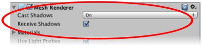
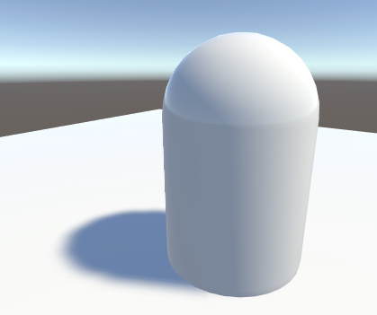
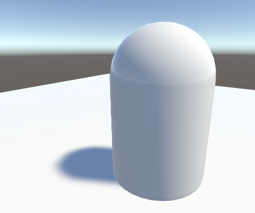
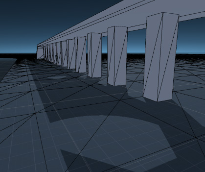

#阴影

Unity 的光源可将游戏对象的__阴影__投射到其自身的其他部分或其他附近的游戏对象上。阴影为场景添加了一定程度的深度和真实感，因为它们可以显示游戏对象的比例和位置，否则游戏对象看起来显得扁平。

##阴影的工作原理

考虑只有一个光源的简单场景。光线从该光源发出后以直线传播，最终可能会照射到场景中的游戏对象。一旦光线照射到某个游戏对象，它就无法再进一步照亮其他任何对象（也就是说，光线会从第一个游戏对象“反弹”而不是直接通过）。游戏对象投射的阴影就是未被照亮的区域，因为光线无法到达这些区域。

 

另一种看待阴影的方式是设想将摄像机置于与光源相同的位置。场景中阴影区域恰好是摄像机无法看到的区域。

事实上，这正是 Unity 从光源位置确定阴影位置的方法。光源使用与摄像机相同的原理在内部从其视角“渲染”场景。场景摄像机使用的深度缓冲系统可跟踪最接近光的表面；位于直接视线中的表面将接受光照，而所有其他表面都处于阴影中。在这种情况下，深度贴图称为__阴影贴图__（可参阅 [Wikipedia 页面](http://en.wikipedia.org/wiki/Shadow_mapping)了解有关阴影贴图的更多有用信息）。

##启用阴影

使用 Inspector 中的 __Shadow Type__ 属性可为单个光源启用和定义阴影。

 

|**_属性：_** |**_功能：_** |
|:---|:---|
|__Shadow Type__| __Hard Shadows__ 设置会产生锐边的阴影。与 __Soft Shadows__ 相比，生硬阴影 (Hard Shadows) 不是特别逼真，但涉及的处理工作较少，并且在许多使用场合中是可接受的。此外，柔和阴影 (Soft Shadows) 往往还会减少阴影贴图中的“块状”锯齿效果。 |
|__Strength__ | 此设置决定了阴影的暗度。通常，一些光会被大气散射并在其他游戏对象上发生反射，因此通常不希望将阴影设置为最大强度。 |
|__Resolution__ | 此设置将设置上述阴影贴图的“摄像机”的渲染分辨率。如果阴影具有非常明显的边缘，则可能需要增大此值。 |
|__Bias__ | 使用此设置可微调阴影的位置和定义。请参阅下面的[阴影贴图和 Bias 属性](#LightBias)以了解更多信息。 |
|__Normal Bias__ | 使用此设置可微调阴影的位置和定义。请参阅下面的[阴影贴图和 Bias 属性](#LightBias)以了解更多信息。 |
|__Shadow Near Plane__ | 通过此设置可以在渲染阴影时选择近平面的值。如果游戏对象与光源之间的距离小于此值，则不会投射任何阴影。 |

场景中的每个[网格渲染器 (Mesh Renderer)](class-MeshRenderer.html) 还具有 __Cast Shadows__ 和 __Receive Shadows__ 属性，必须根据需要启用它们。

 

通过从下拉菜单中选择 __On__ 启用 __Cast Shadows__，即可启用或禁用网格的阴影投射。或者，选择 __Two Sided__ 以允许表面的任一面投射阴影（因此在进行阴影投射时会忽略背面剔除），或选择 __Shadows Only__ 以允许不可见的游戏对象投射阴影。

 
##阴影贴图和 Bias 属性

给定光源的阴影是在最终场景渲染期间确定的。当场景渲染到主摄像机视图时，视图中的每个像素位置都将转换为光源的坐标系。然后，像素与光源的距离将与阴影贴图中的对应像素进行比较。如果像素比阴影贴图像素更远，那么它很可能被另一个游戏对象遮挡住光线，因此不会获得光照。

直接获得光照的表面有时看起来部分处于阴影中。之所以出现这种情况，是因为应该精确位于阴影贴图中指定距离处的像素有时被计算为更远距离（这是对阴影贴图使用阴影过滤或低分辨率图像的结果）。造成的结果是阴影中出现任意像素图案（这些像素其实应当获得光照），带来称为“阴影暗斑”(shadow acne) 的视觉效果。

为了防止阴影暗斑，可在阴影贴图中的距离上添加 __Bias__ 值，从而确保边线上的像素确实符合比较预期，或者确保在渲染到阴影贴图时游戏对象可以沿着自身法线插入一点点。启用阴影后，这些值由 [Light](class-Light.html) Inspector 窗口中的 __Bias__ 和 __Normal Bias__ 属性设定。

不要将 __Bias__ 值设置得太高，因为游戏对象附近的阴影周围区域有时会被错误地照亮。这会导致阴影脱离游戏对象，使游戏对象看起来好像飘在地面上方。

同样，将 __Normal Bias__ 值设置得太高会使阴影对于游戏对象来说太窄：

在某些情况下，__Normal Bias__ 会导致称为“光渗”(light bleeding) 的不良效果，这种情况下，光线从附近的几何体渗透到应该产生阴影的区域。一种可能的解决方案是打开游戏对象的[网格渲染器](class-MeshRenderer.html)，并将 __Cast Shadows__ 属性更改为 __Two Sided__。这种做法有时会有所帮助，但可能会占用更多资源，并在渲染场景时增加性能开销。

光源的 Bias 值可能需要适当调整以免产生不想要的效果。通常用眼睛衡量正确值会更简单，而不是试图计算该值。

为了进一步防止阴影暗斑，我们采用一种称为**阴影平坠** (Shadow pancaking) 的技术（请参阅[方向光阴影：阴影平坠](DirLightShadows.html)）。这种技术通常很有效，但对于非常大的三角形可能带来视觉瑕疵。

调整 __Shadow Near Plane Offset__ 属性可解决此问题。将此值设置得太高会引入阴影暗斑。

