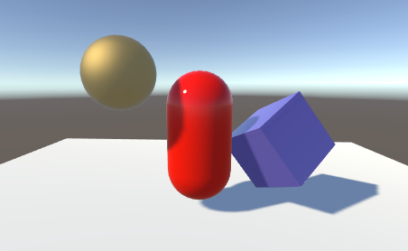

#阴影

Unity 的光源可将对象的阴影投射到其自身的其他部分或其他附近的对象上。阴影为场景添加了一定程度的深度和真实感，因为它们可以显示对象的比例和位置，否则游戏对象看起来显得“扁平”。

##阴影的工作原理

考虑只有一个光源的最简单场景的情况。光线从该光源发出后以直线传播，最终可能会照射到场景中的对象。一旦光线照射到某个对象，它就无法再进一步照亮其他任何对象（也就是说，光线会从第一个对象“反弹”而不是直接通过）。对象投射的阴影就是未被照亮的区域，因为光线无法到达这些区域。

 

另一种看待阴影的方式是设想将摄像机置于与光源相同的位置。场景中阴影区域恰好是摄像机无法看到的区域。

事实上，这正是 Unity 从光源位置确定阴影位置的方法。光源使用与摄像机相同的原理在内部从其视角“渲染”场景。场景摄像机使用的深度缓冲系统可跟踪最接近光的表面；位于直接视线中的表面将接受光照，而所有其他表面都处于阴影中。在这种情况下，深度贴图称为**阴影贴图**（可参阅 [Wikipedia 页面](http://en.wikipedia.org/wiki/Shadow_mapping)了解有关阴影贴图的更多有用信息）。

以下部分将详细介绍从 Unity 的 Light 对象投射阴影。
