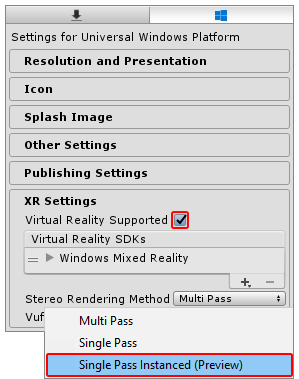

# 单通道实例化渲染

使用__单通道实例化 (Single Pass Instanced)__ 渲染（也称为立体实例化）的情况下，由 GPU 执行单个渲染通道，将每个绘制调用替换为实例化绘制调用。由于两个绘制调用之间的[缓存一致性](https://en.wikipedia.org/wiki/Cache_coherence)，因此可大大降低 CPU 的使用，并略微减少 GPU 的使用。这样可以大幅降低应用程序的功耗。

要启用此功能，请打开 __Player Settings__（选择 __Edit__ > __Project Settings__ > __Player__）。在 __Player Settings__ 中，导航到底部的 __XR Settings__，选中 __Virtual Reality Supported__ 复选框，然后从 __Stereo Rendering Method__ 下拉菜单中选择 __Single Pass Instanced (Preview)__。



默认的 __Stereo Rendering Method__ 为 __Multi Pass__。此设置较慢，但通常更适合于自定义着色器。如果有自定义着色器，则可能需要更改这些着色器，使之与 __Single Pass Instanced__ 渲染兼容。

## 自定义着色器

Before you follow the instructions below, update your custom shaders to use instancing (see [GPU Instancing](GPUInstancing.html)).

接下来，对于所有自定义着色器，您需要在片元着色器（顶点/外壳/域/几何体）之前使用的最后一个着色器阶段中进行两项额外的更改。

对于要支持单通道实例化的每个自定义着色器，请执行以下步骤：

__步骤 1：__将 `UNITY_VERTEX_INPUT_INSTANCE_ID` 添加到 `appdata struct`。

示例：

```
struct appdata
{
    float4 vertex : POSITION;
    float2 uv : TEXCOORD0;

    UNITY_VERTEX_INPUT_INSTANCE_ID //插入
};
```

__步骤 2：__将 `UNITY_VERTEX_OUTPUT_STEREO` 添加到 `v2f output struct`。

示例：

```
struct v2f
{
    float2 uv : TEXCOORD0;
    float4 vertex : SV_POSITION;

    UNITY_VERTEX_OUTPUT_STEREO //插入
};
```

__步骤 3：__在主 `vert` 方法的开头添加 `UNITY_SETUP_INSTANCE_ID()` 宏，然后调用 `UNITY_INITIALIZE_OUTPUT(v2f, o)` 和 `UNITY_INITIALIZE_VERTEX_OUTPUT_STEREO()`。
 
`UNITY_SETUP_INSTANCE_ID()` 根据 GPU 当前渲染的眼睛来计算内置的 `unity_StereoEyeIndex` 和 `unity_InstanceID` Unity 着色器变量并设置为正确值。

`UNITY_INITIALIZE_VERTEX_OUTPUT_STEREO` 根据 `unity_StereoEyeIndex` 的值告诉 GPU 应该渲染到纹理数组中的哪只眼睛。此宏还从顶点着色器传输 `unity_StereoEyeIndex` 的值，确保仅当在片元着色器 `frag` 方法中调用 `UNITY_SETUP_STEREO_EYE_INDEX_POST_VERTEX` 时才能在片元着色器中访问该值。

`UNITY_INITALIZE_OUTPUT(v2f,o)` 将所有 `v2f` 值初始化为 0。

示例：

```
v2f vert (appdata v)
{
    v2f o;

    UNITY_SETUP_INSTANCE_ID(v); //插入
    UNITY_INITIALIZE_OUTPUT(v2f, o); //插入
    UNITY_INITIALIZE_VERTEX_OUTPUT_STEREO(o); //插入

    o.vertex = UnityObjectToClipPos(v.vertex);

    o.uv = v.uv;

    return o;
}
```

## 后期处理着色器

If you want your Post-Processing shaders to support Single Pass Instancing, follow the steps in Custom shaders as well as the steps below . You can download all Unity base shader scripts from the [Unity website](https://unity3d.com/get-unity/download/archive).

对于要支持单通道实例化的每个后期处理着色器，请执行以下步骤：

__步骤 1：__在着色器脚本中的 frag 方法之外添加 UNITY_DECLARE_SCREENSPACE_TEXTURE(tex) 宏（请参阅下面的放置位置示例），这样当您使用特定的立体渲染方法时，GPU 会使用适当的纹理采样器。例如，如果使用多通道渲染，则 GPU 会使用 2D 纹理采样器。对于单通道实例化或多视图渲染，纹理采样器为纹理数组。

__步骤 2：__在片元着色器 frag 方法的开头添加 `UNITY_SETUP_STEREO_EYE_INDEX_POST_VERTEX(i)`（请参阅下面的放置位置示例）。仅当希望使用 `unity_StereoEyeIndex` 内置着色器变量来找出 GPU 正在渲染到的眼睛时，才需要添加该宏。这在测试后期处理效果时很有用。

__步骤 3：__采样 2D 纹理时使用 `UNITY_SAMPLE_SCREENSPACE_TEXTURE()` 宏（请参阅下面的放置位置示例）。标准着色器使用基于 2D 纹理的后缓冲区来对纹理进行采样。单通道立体实例化技术不使用此类型的后缓冲区，因此如果没有指定其他的 2D 纹理采样方法，着色器将无法正确渲染。为防止渲染问题，`UNITY_SAMPLE_SCREENSPACE_TEXTURE()` 宏会检测正在使用的立体渲染路径，然后以正确的方式自动采样纹理。请参阅 Unity 文档关于 [HLSLSupport.cginc](SL-BuiltinIncludes.html) 的说明，进一步了解用于深度纹理和屏幕空间阴影贴图的类似宏。

示例：

```
UNITY_DECLARE_SCREENSPACE_TEXTURE(_MainTex); //插入

fixed4 frag (v2f i) : SV_Target
{
    UNITY_SETUP_STEREO_EYE_INDEX_POST_VERTEX(i); //插入
    
    fixed4 col = UNITY_SAMPLE_SCREENSPACE_TEXTURE(_MainTex, i.uv); //插入
    
    // 仅插入颜色
    
    col = 1 - col;
    
    return col;
}
```

## 完整的示例着色器代码

下面是模板图像效果着色器的一个简单示例，其中应用了所有前面提到的更改来实现单通道实例化支持。着色器代码的添加位置标记了注释 (`//Insert`)。

```
struct appdata
{
    float4 vertex : POSITION;
    float2 uv : TEXCOORD0;
    
    UNITY_VERTEX_INPUT_INSTANCE_ID //插入
};

//v2f 输出结构

struct v2f
{

    float2 uv : TEXCOORD0;
    float4 vertex : SV_POSITION;
    
    UNITY_VERTEX_OUTPUT_STEREO //插入
};

v2f vert (appdata v)
{
    v2f o;
    
    UNITY_SETUP_INSTANCE_ID(v); //插入
    UNITY_INITIALIZE_OUTPUT(v2f, o); //插入
    UNITY_INITIALIZE_VERTEX_OUTPUT_STEREO(o); //插入
    
    o.vertex = UnityObjectToClipPos(v.vertex);
    o.uv = v.uv;
    return o;
}

UNITY_DECLARE_SCREENSPACE_TEXTURE(_MainTex); //插入

fixed4 frag (v2f i) : SV_Target
{
    UNITY_SETUP_STEREO_EYE_INDEX_POST_VERTEX(i); //插入
    
    fixed4 col = UNITY_SAMPLE_SCREENSPACE_TEXTURE(_MainTex, i.uv); //插入
    
    // 插入颜色
    
    col = 1 - col;
    
    return col;
}
```
## 程序化几何体

使用 [Graphics.DrawProceduralIndirect()](../ScriptReference/Graphics.DrawProcedural.html) 和 [CommandBuffer.DrawProceduralIndirect()](../ScriptReference/Graphics.DrawProceduralIndirect.html) 方法在 GPU 上绘制完全程序化的几何体时，必须注意这两个方法都从计算缓冲区接收参数。这意味着在运行时很难增加实例计数。要增加实例计数，必须手动使计算缓冲区中包含的实例计数加倍。

请参阅[顶点和片元着色器示例](SL-VertexFragmentShaderExamples.html)以了解有关如何编写着色器代码的更多信息。

## 调试着色器

以下着色器代码将游戏对象渲染为绿色（用户左眼）和红色（右眼）。此着色器对于调试立体渲染非常有用，因为它可用于验证所有立体图形是否正常工作。

```
Shader "XR/StereoEyeIndexColor"
{
   Properties
   {
       _LeftEyeColor("Left Eye Color", COLOR) = (0,1,0,1)
       _RightEyeColor("Right Eye Color", COLOR) = (1,0,0,1)
   }

   SubShader
   {
      Tags { "RenderType" = "Opaque" }

      Pass
      {
         CGPROGRAM

         #pragma vertex vert
         #pragma fragment frag

         float4 _LeftEyeColor;
         float4 _RightEyeColor;

         #include "UnityCG.cginc"

         struct appdata
         {
            float4 vertex : POSITION;

            UNITY_VERTEX_INPUT_INSTANCE_ID
         };

         struct v2f
         {
            float4 vertex : SV_POSITION;

            UNITY_VERTEX_INPUT_INSTANCE_ID 
            UNITY_VERTEX_OUTPUT_STEREO
         };

         v2f vert (appdata v)
         {
            v2f o;

            UNITY_SETUP_INSTANCE_ID(v);
            UNITY_INITIALIZE_OUTPUT(v2f, o);
            UNITY_INITIALIZE_VERTEX_OUTPUT_STEREO(o);

            o.vertex = UnityObjectToClipPos(v.vertex);

            return o;
         }

         fixed4 frag (v2f i) : SV_Target
         {
            UNITY_SETUP_STEREO_EYE_INDEX_POST_VERTEX(i);

            return lerp(_LeftEyeColor, _RightEyeColor, unity_StereoEyeIndex);
         }
         ENDCG
      }
   }
}
```
---

<span class="page-history">在 2017.3 的 [2017.3](https://docs.unity3d.com/2017.3/Documentation/Manual/30_search.html?q=newin20173) 版中新增了“单通道实例化”<span class="search-words">NewIn20173</span></span>

<span class="page-edit"> 2018-05-15 Page published with [editorial review](DocumentationEditorialReview.html)
</span>
