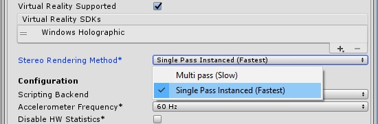

#HoloLens 单通道立体渲染

Windows Holographic 设备 (HoloLens) 有两种立体渲染方法：多通道和单通道实例化。

##多通道

多通道渲染运行 2 个完整的渲染通道（每只眼睛对应一个）。因此，与单通道实例化渲染方法相比，多通道方法会产生几乎两倍的 CPU 工作负载。但是，此方法具有最高的向后兼容性，不需要对着色器进行任何更改。

##单通道实例化

实例化渲染执行单个渲染通道，其中的每个绘制调用都将替换为实例化绘制调用。这大大降低了 CPU 利用率。此外，由于两个绘制调用之间的缓存一致性，因此还可略微降低 GPU 利用率。进而，应用程序的功耗会低得多。

要启用此功能，请打开 __PlayerSettings__（菜单：__Edit __> __Project Settings __> __Player__）。在 __PlayerSettings__ 中，导航到 __Other Settings__，选中 __Virtual Reality Supported__ 复选框，然后从 __Stereo Rendering Method__ 下拉选单中选择 __Single Pass Instanced (Fastest)__。

 

Unity 默认采用较慢的 __Multi pass (Slow)__ 设置，因为您可能有一些自定义着色器在脚本中没有所需的代码来支持该功能。

##着色器脚本要求

任何非内置着色器都需要经过更新才能使用实例化。请阅读此文档了解如何完成此操作：[GPU 实例化](GPUInstancing.html)。此外，还需要在片元着色器（顶点/外壳/域/几何体）之前使用的最后一个着色器阶段中进行两项额外的更改。首先，需要将 `UNITY_VERTEX_OUTPUT_STEREO` 添加到输出结构。其次，在调用 `UNITY_SETUP_INSTANCE_ID()` 之后，需要在该阶段的主函数中添加 `UNITY_INITIALIZE_VERTEX_OUTPUT_STEREO()`。

__后期处理着色器__

为了确保正确声明 2D 纹理数组，需要在输入纹理声明的周围添加 `UNITY_DECLARE_SCREENSPACE_TEXTURE(tex)` 宏。接下来，必须在片元着色器的开头添加对 `UNITY_SETUP_INSTANCE_ID()` 的调用。最后，在采样这些纹理时，需要使用 `UNITY_SAMPLE_SCREENSPACE_TEXTURE()` 宏。请参阅 [HLSLSupport.cginc](SL-BuiltinIncludes.html) 进一步了解用于深度纹理和屏幕空间阴影贴图的其他类似宏。

下面是一个简单的示例，其中将所有前面提到的更改应用于模板图像效果：

```
struct appdata
{
    float4 vertex : POSITION;
    float2 uv : TEXCOORD0;
    UNITY_INSTANCE_ID
};
struct v2f
{
    float2 uv : TEXCOORD0;
    float4 vertex : SV_POSITION;
    UNITY_INSTANCE_ID
    UNITY_VERTEX_OUTPUT_STEREO
};
v2f vert (appdata v)
{
    v2f o;
    UNITY_SETUP_INSTANCE_ID(v);
    UNITY_TRANSFER_INSTANCE_ID(v, o);
    UNITY_INITIALIZE_VERTEX_OUTPUT_STEREO(o);
    o.vertex = UnityObjectToClipPos(v.vertex);
    o.uv = v.uv;
    return o;
}

UNITY_DECLARE_SCREENSPACE_TEXTURE(_MainTex);

fixed4 frag (v2f i) : SV_Target
{
    UNITY_SETUP_INSTANCE_ID(i);
    fixed4 col = UNITY_SAMPLE_SCREENSPACE_TEXTURE(_MainTex, i.uv);
    // 仅插入颜色
    col = 1 - col;
    return col;
}
```

#DrawProceduralIndirect

`Graphics.DrawProceduralIndirect()` 和 `CommandBuffer.DrawProceduralIndirect()` 从计算缓冲区中获取所有参数，因此我们无法轻松增加实例计数。所以，必须手动使计算缓冲区中包含的实例计数加倍。

请参阅[顶点和片元着色器示例](SL-VertexFragmentShaderExamples.html)页面以了解有关着色器代码的更多信息。

---

* <span class="page-edit">2017-09-01  Page amended with limited [editorial review](DocumentationEditorialReview.html)
</span>
* <span class="page-history">5.5 中的新功能</span>
* <span class="page-history">更正了 HoloLens 单通道立体渲染的示例代码</span>


