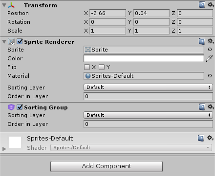
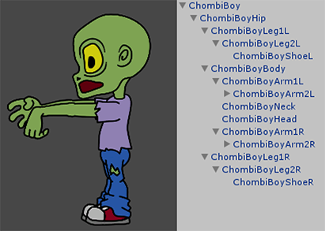
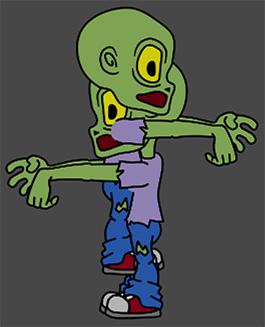
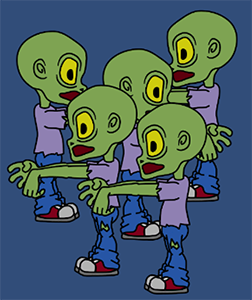

## 排序组

排序组是一个可改变[精灵渲染器](class-SpriteRenderer.html)渲染执行顺序的组件。该组件允许将具有共同根的一组渲染器排序到一起。Unity 中的渲染器按几个条件排序，这些条件包括渲染器在图层中的顺序以及与摄像机的距离。

### 设置排序组

要使用排序组 (Sorting Group) 组件，请将该组件添加到[游戏对象](class-GameObject.html)的根（要应用组排序的所有游戏对象的父游戏对象）。选择游戏对象的根，然后在主菜单中选择 __Component__ > __Rendering__ > __Sorting Group__。

排序组在 Scene 视图中没有任何可视表示。该组可添加到空游戏对象；如果要将组排序一次性应用于大量游戏对象，此方法可能很有用。

排序组不依赖于任何其他渲染器，而且附加到该游戏对象及其后代的所有渲染器都将一起渲染。

| **属性** | **功能** |
|:---|:---| 
| __Sorting Layer__ | 使用下拉选单选择图层；该图层用于定义此精灵在渲染过程中的覆盖优先级。 |
| __Order in Layer__ | 设置该精灵在其图层中的覆盖优先级。较小数字的精灵先渲染，后续数字的精灵覆盖先前数字的精灵。 |

### 对排序组排序

Unity 使用排序图层的概念，允许您将精灵划分为多个组来确定覆盖优先级。__排序图层__顺序较低的排序组将被__排序图层__顺序较高的排序组覆盖。

有时，同一__排序图层__中的两个或更多个对象也可重叠（例如，横向卷轴游戏中的两个玩家角色，如以下示例中所示）。可使用 __Order In Layer__ 属性向同一层中的排序组应用一致的优先级。与__排序图层__一样，较小数字的排序组先渲染，并被后续渲染的具有较大图层数字的排序组遮挡。请参阅有关[标签和图层 (Tags and Layers)](class-TagManager.html) 的文档以了解关于编辑__排序图层__的详细信息。

排序组的子代将根据最近或下一个排序组（取决于按距离还是按 Order in Layer 排序）的其他子代进行排序。换言之，排序组仅为其子代创建局部排序空间。因此可以使用 __Sorting Layer__ 和 __Order in Layer__ 对组内的每个渲染器排序，但是在所在排序组的局部进行排序。

### 嵌套的排序组

嵌套的排序组将针对同一组中的其他渲染器进行排序。

然而，层级视图中不带排序组的游戏对象将一起渲染为单个图层，并且渲染器仍然基于 __Sorting Layer__ 和 __Order in Layer__ 进行排序。

**排序组使用方法示例**

排序组通常用于具有复杂角色（由几个精灵组成）的 2D 游戏。此示例的 2D 角色配套使用层级视图中的多个渲染器。

此角色位于单个排序图层中，并使用多个 __Order in Layer__ 对角色身体部位进行排序。随后，Unity 将此角色保存为[预制件](Prefabs.html)，然后在游戏中将其多次克隆。

克隆后，由于身体部位在同一层上，因此这些部位彼此重叠，如下所示。

我们期望的结果是让一个角色的所有渲染器一起渲染，然后再渲染下一个角色。这样会产生彼此通过的视觉效果，使其中一个角色看起来比另一个角色更靠近摄像机，而不是两者看起来混合在一起。

添加到角色根部的排序组组件可确保身体部位不再重叠和混合在一起。

