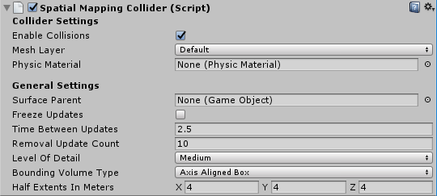

# 空间映射碰撞体 (Spatial Mapping Collider)

__空间映射碰撞体__组件允许全息内容与真实世界的物理表面进行交互。该组件负责在场景中创建、更新和销毁表面游戏对象碰撞体。

该组件定期向系统查询物理世界中的表面更改。当系统报告有表面更改时，__空间映射碰撞体__组件会确定 Unity 对每个报告的表面进行烘焙的先后时间。系统每次烘焙表面时，Unity 都会生成一个新的游戏对象，使其包含[网格过滤器 (Mesh Filter)](class-MeshFilter.html) 和[网格碰撞体 (Mesh Collider)](class-MeshCollider.html) 组件。与 Unity 中的任何其他网格一样，具有网格碰撞体的表面允许与射线投射进行碰撞。请参阅[摄像机射线投射](CameraRays.html)文档以了解更多信息。

__注意：__此组件仅更新表面游戏对象的网格碰撞体组件，而不更新网格渲染器 (Mesh Renderer)。

__注意：空间映射碰撞体__的更新延迟比__空间映射网格渲染器 (Spatial Mapping Mesh Renderer)__ 更短。这意味着碰撞体的更新速度比渲染器快。



## Collider Settings

| __设置__|__描述__|
|:---|:---| 
|__Enable Collisions__| 选中此框可启用表面[网格碰撞体](class-MeshCollider.html)。这意味着全息内容可与表面发生碰撞。|
|__Mesh Layer__| 设置所有表面网格碰撞体上的[层 (Layer)](Layers.html) 属性。请注意，需要为射线投射设置层 (Layers)。执行射线投射时，必须指明要根据哪些层来测试射线交点。请参阅[摄像机射线投射](CameraRays.html)文档以了解更多信息，并参阅下面的[示例脚本：SpatialSurface 射线投射](#ExampleScript)。<br/><br/>默认情况下，Unity 将所有游戏对象分配到__默认 (Default)__ 层。但是，最好将游戏对象分配给特定的层。我们建议专门为空间映射表面创建一个新层，并将此层分配给 Mesh Layer 属性。|
|__Physic Material__| 指定要分配给每个表面游戏对象的网格碰撞体的__物理材质 (Physic Material)__。默认设置为 __None (Physic Material)__。<br/><br/>__物理材质__指定其他刚体组件应如何与其交互。例如，您可能希望创建一个表面来模拟冰面，因此对该表面上移动的游戏对象施加较小的摩擦力。<br/><br/>空间映射碰撞体组件将其__物理材质__应用于其表面游戏对象上的所有网格碰撞体。请参阅有关[物理材质](class-PhysicMaterial.html)的文档以了解更多信息|

## General Settings

The settings below are common to both __Spatial Mapping Renderer__ and __Spatial Mapping Collider__ components.

| __设置__| __描述__ |
|:---|:---| 
| __Surface Parent__| Select the __Surface Parent__ GameObject that you want Surface GameObjects generated by Spatial Mapping components to inherit from. Leave this as __None(Game Object)__, to automatically generate a Surface Parent GameObject. |
| __Freeze Updates__| Check this box to stop the component querying the system for Surface changes. <br/><br/>__Note:__ Each Spatial Mapping component periodically queries the Spatial Mapping data for Surface changes in physical space. Querying and baking Surfaces costs memory, performance, and power. For environments that you expect to be mostly static, we recommend that you allow users to look around the environment for a duration of time without updating the Surface GameObjects. <br/><br/>If you expect the environment in your simulation to be mostly static and unchanging (like a board game), you can scan as much Surface data as you need when your application starts, and then set the __Freeze Updates__ property to __true__ to prevent further updates. This increases performance slightly and consumes less power.|
| __Time Between Updates__| The time in decimal format seconds (for example,  3.7 or 4.6) between queries for Surface changes in physical space. The default is 2.5 seconds. Note that the more regular the queries, the higher the cost in memory, performance, and power. |
| __Removal Update Count__| The number of updates before a Surface GameObject is removed by the system. You can think of an update as a frame in this case. The default is 10 updates.<br/><br/>__Note__: The removal update countdown begins when Spatial Mapping notifies the component that a Surface GameObject is no longer in the SurfaceObserver’s bounding volume (in that it is no longer within the defined area that the system reports on). This setting allows you to specify the number of updates that should happen after this event before Spatial Mapping removes the Surface GameObject. |
| __Level of Detail__| The quality of the Mesh that the component generates (__Low__, __Medium__, or __High__). The default quality is __Medium__. The higher the quality, the more refined and accurate the generated Collider or rendered Mesh. Using lower quality settings results in a lower cost in performance and power consumption. See the image below this table for an example of the three __Level Of Detail__ modes. |
| __Bounding Volume Type__| The component’s bounding volume area shape, in which the application receives Spatial Mapping data. This can be either a __Sphere__ or __Axis Aligned Box__. The default is __Axis Aligned Box__.<br/><br/>__Note: __The bounding volume is the defined area about which the system reports physical Surface changes and limits the extents of the Spatial Mapping Mesh.|
| __Size In Meters__| The size of the bounding volume used by component (in meters). Configure __Sphere__ by radius; the default radius is 2 meters. Configure __Axis Aligned Box__ by its extents; the default is a Vector3 (4,4,4). <br/><br/>__Note:__ The observer’s bounding volume is the defined area about which Spatial Mapping reports physical Surface changes. |

###Level of Detail

Both Spatial Mapping components allow you to specify one of three Levels of Detail for each component's generated spatial meshes (Low, Medium, or High) as depicted in the image below.


When possible, set the Level of Detail setting for __Spatial Mapping Colliders__ to Low. This increases performance and reduces power usage when calculating collision intersections. However, setting __Level of Detail__ to __Low__ can negatively affect the visual effect of your application, 
 

## 使用空间映射碰撞体

### 表面游戏对象

将__空间映射碰撞体__组件添加到场景中的游戏对象时，该组件会在运行时生成自己独立的一组表面游戏对象。这些游戏对象出现在场景中作为一个表面父游戏对象的子项。

__空间映射碰撞体__生成的表面游戏对象包含以下组件：

* [网格过滤器 (Mesh Filter)](class-MeshFilter.html)

* [世界锚点 (World Anchor)](wmr_input_types.html)

* [网格碰撞体 (Mesh Collider)](class-MeshCollider.html)


如果将多个__空间映射碰撞体__组件添加到场景，则每个组件都会生成自己的一组表面游戏对象。例如，如果场景中的两个游戏对象包含__空间映射碰撞体__，则场景将包含两组表面游戏对象：每个组件在运行时生成一组。为了优化目的，请务必牢记这一点。

__注意：__所有__表面游戏对象__首次由空间映射系统生成时都会分配给__默认层 (Default Layer)__。但是，最好将游戏对象分配给特定层，因为射线投射是一项高成本的计算。通过使用层，可以过滤要进行射线投射计算的游戏对象，从而可以优化性能。如果__默认__层上没有很多复杂的网格，那么对碰撞进行射线投射测试不会产生很大的性能成本。但是，为了在进行碰撞时降低射线投射测试的复杂性，最好将游戏对象按层进行组织。通过更改 __Collider Settings__ > __Mesh Layer__ 属性，即可更改分配给特定__空间映射碰撞体__组件生成的所有表面游戏对象的层。

<a name="ExampleScript"></a> 

### 示例脚本：发生点击手势事件时的 SpatialSurface 射线投射

以下示例展示了在检测到点击手势事件时，如何在 __SpatialSurface__ 层上对游戏对象进行射线投射，并使用 GestureRecognizer 启动此射线投射。

```

using UnityEngine;
using System.Collections; 

//这是 Gesture Recognizer 所必需的
using UnityEngine.XR.WSA.Input;


public class CustomLayerCollision : MonoBehaviour
{

    //用于捕捉手势事件

    private GestureRecognizer GR_recognizer;

    void Start()
    {
        //初始化 GestureRecognizer

	    GR_recognizer = new GestureRecognizer();

        //启动手势捕捉

        GR_recognizer.StartCapturingGestures();

        //告知 GestureRecognizer 需要监听的事件

        GR_recognizer.SetRecognizableGestures(GestureSettings.Tap);

        //将 Tapped 事件订阅到 DetectCollisions 方法

        //这样可确保在 GestureRecognizer 检测到点击事件时立即调用此方法

        GR_recognizer.Tapped += DetectCollisions;

        //当用户发出点击手势时，Tapped 事件委托

        //会调用 DetectCollisions 方法来使用射线投射进行碰撞测试

        //请参阅 [GestureRecognizer API 参考](../ScriptReference/XR.WSA.Input.GestureRecognizer.html)了解更多详细信息
    }
    //发生点击事件时用于触发射线投射的方法
    public void DetectCollisions(TappedEventArgs tapEvent)
    {
        // 对空间表面或 UI 层上的所有游戏对象
        // 进行射线投射。

        int layerMask = 1 << LayerMask.NameToLayer("SpatialSurface");

        //使用用户头部的位置和前进方向构造 Ray
        Ray GazeRay = new Ray(tapEvent.headPose.position, tapEvent.headPose.forward);

        //使用 Gaze 中构造的 Ray 进行射线投射并将碰撞存储在阵列命中内

        RaycastHit[] hits = Physics.RaycastAll(GazeRay, float.MaxValue, layerMask);

        if (hits.Length > 0)
        {
            foreach (RaycastHit hit in hits)
            {
                Debug.Log(string.Format("Hit Object **\"**{0}**\"** at position **\"**{1}**\"**", hit.collider.gameObject, hit.point));
            }
        }
        else
        {
            Debug.Log("Nothing was hit.");
        }
    }
}

```

请参阅有关[层](Layers.html)和[摄像机射线投射](CameraRays.html)的文档以了解更多信息。

--

* <span class="page-edit">2018-05-01 Page published with [editorial review](DocumentationEditorialReview.html)
</span>

* <span class="page-history">在 2017.3 版中更新了 Hololens 空间映射文档</span>
