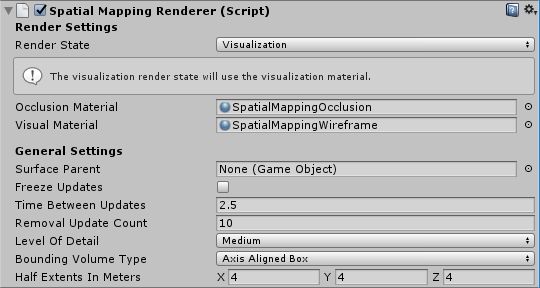
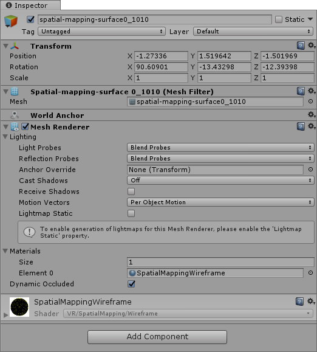

# 空间映射渲染器 (Spatial Mapping Renderer)

__空间映射渲染器__组件提供空间映射表面的可视化表示。这对于通过可视化方式调试表面并向环境添加视觉效果非常有用。

系统定期向__空间映射渲染器__组件发送有关物理空间变化的数据。每次由空间映射系统向该组件通知这些变化时，该组件都会将返回的表面数据烘焙到包含[网格过滤器 (Mesh Filter)](class-MeshFilter.html) 和[网格渲染器 (Mesh Renderer)](class-MeshRenderer.html) 组件的游戏对象中。空间映射渲染器组件会管理这些表面游戏对象的生命周期。也就是说，该组件负责在场景中创建、更新和销毁表面游戏对象网格渲染器。



## Render Settings

下表列出了__空间映射渲染器__组件可用的所有唯一渲染设置 (Render Settings)。

|__设置__||__描述__|
|:---|:---|:---| 
|__Render State__||所有表面游戏对象都从 __Render State__ 设置中获取材质。更改 __Render State__ 设置（例如，在运行时通过脚本进行更改）时，所有表面游戏对象的渲染材质都将更改为所选 __Render State__ 设置的材质。这样可减少绘制调用次数，进而提高渲染性能。使用共享材质还可以减少应用程序在渲染期间使用的内存量。请从三个选项之中选择一项来渲染表面。<br/><br/>请参阅下面的 [Render State](#RenderState) 以了解更多信息。|
| |__Occlusion__| 应用 __Occlusion Material__ 中定义的材质。这是一种透明材质，可将游戏对象隐藏在真实世界表面的背后。请参阅下面的 [Visual Material 和 Occlusion Material](#VisualOcclusionMaterials) 以了解更多信息。<br/><br/>__注意：__此设置将启用表面的所有网格渲染器，并覆盖所有其他设置。|
| |__Visualisation__| 应用 __Visualization Material__ 中定义的材质来可视化环境中的空间映射表面（通常是线框材质）。请参阅下面的 [Visual Material 和 Occlusion Material](#VisualOcclusionMaterials) 以了解更多信息。<br/><br/>__注意__：此设置将启用表面的所有网格渲染器，并覆盖所有其他设置。 |
| |__None__| 选择此选项可禁用分配给空间映射表面的所有网格渲染器。|
|__Occlusion Material__||此处选择的材质是空间映射渲染器的 __Render State__ 设置为 __Occlusion__ 时应用的材质。默认设置为内置的 __SpatialMappingOcclusion__ 材质。|
|__Visual Material__|| 此处选择的材质是空间映射渲染器的 __Render State__ 设置为 __Visualization__ 时应用的可视材质 (Visual Material)。默认设置为内置的 __SpatialMappingWireframe__ 材质。  |

## General Settings

The settings below are common to both __Spatial Mapping Renderer__ and __Spatial Mapping Collider__ components.

| __设置__| __描述__ |
|:---|:---| 
| __Surface Parent__| Select the __Surface Parent__ GameObject that you want Surface GameObjects generated by Spatial Mapping components to inherit from. Leave this as __None(Game Object)__, to automatically generate a Surface Parent GameObject. |
| __Freeze Updates__| Check this box to stop the component querying the system for Surface changes. <br/><br/>__Note:__ Each Spatial Mapping component periodically queries the Spatial Mapping data for Surface changes in physical space. Querying and baking Surfaces costs memory, performance, and power. For environments that you expect to be mostly static, we recommend that you allow users to look around the environment for a duration of time without updating the Surface GameObjects. <br/><br/>If you expect the environment in your simulation to be mostly static and unchanging (like a board game), you can scan as much Surface data as you need when your application starts, and then set the __Freeze Updates__ property to __true__ to prevent further updates. This increases performance slightly and consumes less power.|
| __Time Between Updates__| The time in decimal format seconds (for example,  3.7 or 4.6) between queries for Surface changes in physical space. The default is 2.5 seconds. Note that the more regular the queries, the higher the cost in memory, performance, and power. |
| __Removal Update Count__| The number of updates before a Surface GameObject is removed by the system. You can think of an update as a frame in this case. The default is 10 updates.<br/><br/>__Note__: The removal update countdown begins when Spatial Mapping notifies the component that a Surface GameObject is no longer in the SurfaceObserver’s bounding volume (in that it is no longer within the defined area that the system reports on). This setting allows you to specify the number of updates that should happen after this event before Spatial Mapping removes the Surface GameObject. |
| __Level of Detail__| The quality of the Mesh that the component generates (__Low__, __Medium__, or __High__). The default quality is __Medium__. The higher the quality, the more refined and accurate the generated Collider or rendered Mesh. Using lower quality settings results in a lower cost in performance and power consumption. See the image below this table for an example of the three __Level Of Detail__ modes. |
| __Bounding Volume Type__| The component’s bounding volume area shape, in which the application receives Spatial Mapping data. This can be either a __Sphere__ or __Axis Aligned Box__. The default is __Axis Aligned Box__.<br/><br/>__Note: __The bounding volume is the defined area about which the system reports physical Surface changes and limits the extents of the Spatial Mapping Mesh.|
| __Size In Meters__| The size of the bounding volume used by component (in meters). Configure __Sphere__ by radius; the default radius is 2 meters. Configure __Axis Aligned Box__ by its extents; the default is a Vector3 (4,4,4). <br/><br/>__Note:__ The observer’s bounding volume is the defined area about which Spatial Mapping reports physical Surface changes. |

###Level of Detail

Both Spatial Mapping components allow you to specify one of three Levels of Detail for each component's generated spatial meshes (Low, Medium, or High) as depicted in the image below.


When possible, set the Level of Detail setting for __Spatial Mapping Colliders__ to Low. This increases performance and reduces power usage when calculating collision intersections. However, setting __Level of Detail__ to __Low__ can negatively affect the visual effect of your application, 
 

## 使用空间映射渲染器

<a name="RenderState"></a> 

### Render State

此组件提供了一种动态更改所有生成的表面上的材质的简便方法。Unity 提供了两种预先构建的材质类型供您使用：

__Occlusion Material__

此材质使游戏对象看起来透明，但通过游戏对象看不到全息图。例如，如果需要一个真实的桌子来隐藏位于其下方的游戏内全息对象，这可能会很有用。

__Visual Material__

这是 Unity 应用于空间映射渲染器组件中所有表面的线框材质。使用默认的线框着色器时，线框的颜色代表真实世界的距离。这通常是进行调试时最有用的选项，但也可以将其用于呈现视觉效果。该着色器使用颜色映射来指示距离；下表显示了这种颜色映射：

| __与 HoloLens 的距离__| __颜色__ |
|:---|:---| 
| 0 到 1 米| 黑色 |
| 1 到 2 米| 红色 |
| 2 到 3 米| 绿色 |
| 3 到 4 米| 蓝色 |
| 4 到 5 米| 黄色 |
| 5 到 6 米| 青色 |
| 6 到 7 米| 洋红色 |
| 7 到 8 米| 栗色 |
| 8 到 9 米| 蓝绿色 |
| 9 到 10 米| 橙色 |
| 10 米或以上| 白色 |


将新材质指定给 __Visual Material__ 或 __Occlusion Material__ 时，表面游戏对象的材质不会自动更改。要将新材质应用于所有表面，必须将 __Render State__ 设置为已更改的材质（__Visual Material__ 或 __Occlusion Material__）。

如果仅从 Unity Editor 中（直接在场景中的游戏对象上）分配 __Render State__ 中的 __Occlusion Material__ 或 __Visual Material__ 属性，则空间映射会与__空间映射渲染器__组件同时销毁它们。但是，空间映射不会销毁通过脚本随组件分配或更改的任何 __Occlusion Material__ 或 __Visual Material__，因此需要手动销毁它们。

下面的代码片段会更改空间映射在运行时动态应用于所有表面游戏对象的材质。

```

SpatialMappingRenderer renderer = spatialMappingGameObject.AddComponent<SpatialMappingRenderer>();
renderer.visualMaterial = new Material(Shader.Find("VR/SpatialMapping/Wireframe"));
renderer.renderState = SpatialMappingRenderer.RenderState.Visualization;

```

### 表面游戏对象

__空间映射渲染器__组件会在运行时创建自己独立的一组表面游戏对象。这些游戏对象出现在场景中作为一个表面父游戏对象的子项：


__空间映射渲染器__生成的表面游戏对象包含以下组件

* [网格过滤器 (Mesh Filter)](class-MeshFilter.html)

* [世界锚点 (World Anchor)](wmr_input_types.html)

* [网格渲染器 (Mesh Renderer)](class-MeshRenderer.html)

* 共享的[材质](class-Material.html)（此材质为 Visualization 或 Occlusion Material，具体取决于 Render State 设置）



如果将多个__空间映射渲染器__组件添加到场景，则每个组件都会生成自己的一组表面游戏对象。例如，如果有两个游戏对象包含__空间映射渲染器__组件，则场景将包含两组表面游戏对象：每个组件在运行时生成一组。为了优化目的，请务必牢记这一点。

---

* <span class="page-edit">2018-05-01 Page published with [editorial review](DocumentationEditorialReview.html)
</span>

* <span class="page-history">在 2017.3 版中更新了 Hololens 空间映射文档</span>
