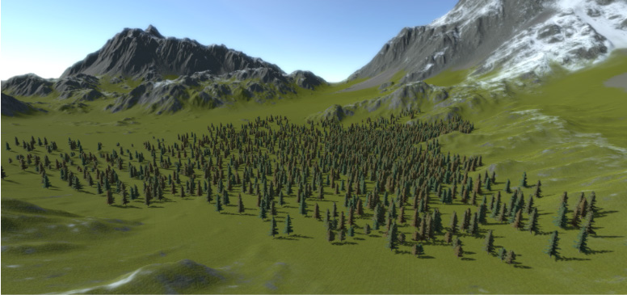
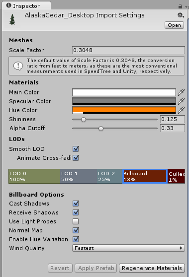
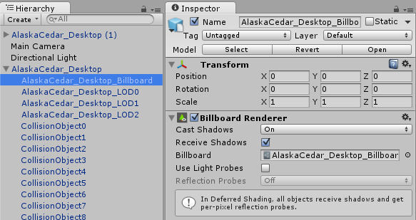

#SpeedTree

 

就像其他资源一样，SpeedTree 资源（由 Unity 版本的 SpeedTree Modeler 保存的 .spm 文件）可由 Unity 识别和导入。确保 Project 文件夹中的纹理为可访问状态，并自动生成每个 [LOD](LevelOfDetail.html) 的材质。选择 .spm 资源时会有一些导入设置，您可以使用这些设置来调整生成的游戏对象和附加的材质。重新导入时，除非您按下 __Generate Materials__ 或 __Apply & Generate Materials__ 按钮，否则不会重新生成材质。因此会保留对材质所进行的任何自定义。

最后，SpeedTree 导入器生成一个配置了 [LODGroup 组件](class-LODGroup.html)的预制件。此预制件既可以在场景中实例化为普通的预制件实例，也可以选择作为树原型并在地形上进行“绘制”。此外，地形接受任何带有 LODGroup 组件的游戏对象作为树原型，并且对网格大小或所使用的材质数量没有限制（与[树创建器 (Tree Creator)](class-Tree.html) 树相反）。但是，请注意 SpeedTree 树通常使用 3-4 种不同的材质，这会导致每帧都会发出一些绘制调用，因此您应该尽量避免在对绘制调用数量敏感的平台上大量使用 LOD 树。

##投射和接受实时阴影

为了使公告牌正确投射阴影，在阴影投射物 pass 期间，公告牌会被旋转以面向光线方向（在点光源的情况下为光源位置）而不是面向摄像机。

要启用这些选项，请在 .spm 资源的 Inspector 中选择 __Billboard LOD__ 级别，在 __Billboard Options__ 中勾选 __Cast Shadows__ 或 __Receive Shadows__，然后单击 __Apply Prefab__。

 

要更改实例化的 SpeedTree 游戏对象的公告牌阴影选项，请在 Hierarchy 窗口中选择公告牌游戏对象，然后在公告牌渲染器 (Billboard Renderer) 的 Inspector 中调整这些选项，就像使用普通网格渲染器一样。

 

在地形上绘制的树继承来自预制件的公告牌阴影选项。

您可以使用 `BillboardRenderer.shadowCastingMode` 和 `BillboardRenderer.receiveShadows` 在运行时更改这些选项。

**已知问题：**与任何其他渲染器一样，__Receive Shadows__ 选项在使用延迟渲染时无效。公告牌始终在延迟路径中接受阴影。

