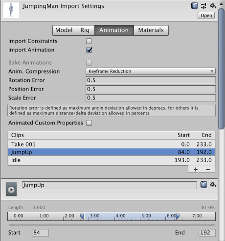
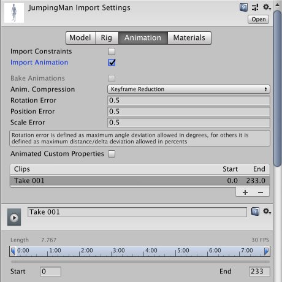

# 提取动画剪辑

动画角色通常具有许多不同的动作，这些动作在游戏中的不同情况下激活，也称为[动画剪辑 (Animation Clips)](class-AnimationClip.html)。例如，我们可能有单独用于行走、奔跑、跳跃、投掷和死亡的动画剪辑。根据美术师在 3D 建模应用程序中设置动画的方式，这些单独的动作可以作为不同的动画剪辑导入，也可以作为单个剪辑导入（每个动作紧跟前一个动作）。如果只有一个长剪辑，可以在 Unity 中提取组件动画剪辑，为此需要在工作流程中增加一些额外的步骤。

如果模型有多段已定义为单个剪辑的动画，则 [Animations 选项卡](class-AnimationClip.html)如下所示：

可以预览列表中显示的任何剪辑。如果需要，可编辑剪辑的时间范围。

如果模型将多段动画作为一个连续片段提供，则 __Animation__ 选项卡如下所示：

在这种情况下，可以定义与每个单独动画序列（行走、跳跃、奔跑和空闲）相对应的时间范围（帧数或秒数）。可按以下步骤创建新的动画剪辑：

1.单击添加 (`+`) 按钮。
2.选择剪辑包含的帧数或秒数范围。
3.还可更改剪辑的名称。

例如，可定义：

* 介于 0 - 83 帧之间的空闲动画
* 介于 84 - 192 帧之间的跳跃动画
* 介于 193 - 233 帧之间的轻微摆臂动画

有关更多信息，请参阅 [Animation 选项卡](class-AnimationClip.html)。

## 使用多个模型文件来导入动画

导入动画的另一种方法是遵循 Unity 支持的动画文件命名方案。可以创建多个单独的模型文件，并以 `modelName@animationName.fbx` 命名约定为文件命名。例如，如果一个模型名为 `goober`，则可使用名为 `goober@idle.fbx`、`goober@walk.fbx`、`goober@jump.fbx` 和 `goober@walljump.fbx` 的文件导入单独的 idle、walk、jump 和 walljump 动画。导出此类动画时，不必在这些文件中包含网格，但这种情况下应启用 [Preserve Hierarchy Model 导入选项](FBXImporter-Model.html)。

Unity 会自动导入所有四个文件，并将所有动画汇集到不含 @ 符号的文件。在上面的示例中，Unity 将自动导入引用 `idle`、`jump`、`walk` 和 `wallJump` 动画的 `goober.mb` 文件。

对于 FBX 文件，可将网格导出到不含动画的模型文件中。然后，通过导出每个剪辑的所需关键帧（在 FBX 对话框中启用动画），将四个剪辑导出为 `goober@_animname_.fbx`。

---

*  2018-04-25  Page amended with limited [editorial review](DocumentationEditorialReview.html)

