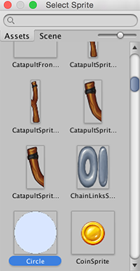

#Sprite Creator

使用此工具可以创建临时占位__精灵__ (2D) 图形。可在开发期间在项目中使用这些图形，然后再将其替换为要使用的图形。

##访问 Sprite Creator

选择 __Assets>Create>Sprites__，然后选择要创建的占位精灵（正方形、三角形、菱形、六边形或多边形）。

##使用精灵

新的占位精灵在当前打开的资源文件夹中显示为白色形状。新精灵的名称默认为其形状名称，但可以选择在首次创建精灵后对其重命名。如果不确定要使用的名称，请将其保留为默认值；可以稍后通过单击更改名称。

可将占位精灵拖放到 __Scene 视图__或 __Hierarchy__ 中，然后即可在项目中开始使用该精灵。

##替换占位精灵

要更改占位精灵，请在 __Scene 视图__中单击该精灵，然后通过 __Inspector__ 中的__精灵渲染器 (Sprite Renderer) 组件__进行编辑。

编辑 __Sprite__ 字段：可单击输入字段右侧的小圆圈以显示 __Sprite Selector__，然后可在其中浏览并从可用 2D 图形资源菜单中进行选择。

##详细信息

* Sprite Creator 创建 4x4 白色 PNG 轮廓纹理。
* 占位精灵是由算法生成的完美原始多边形（例如，三角形、六边形、n 边多边形）。
* **注意：**占位精灵不像 3D 图元：精灵是一种资源，并作为多边的多边形，可表示许多不同的形状，因此占位精灵不像 3D 图元那样进行构建。

