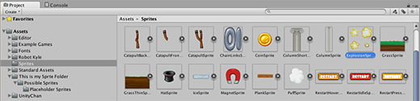
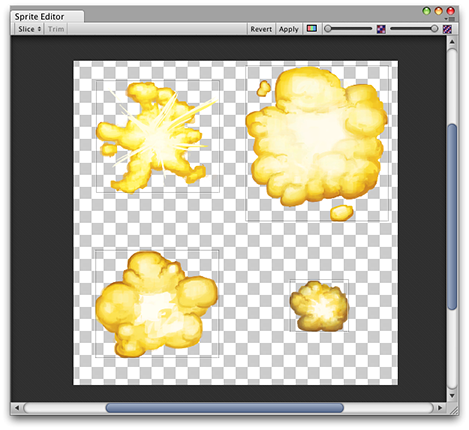

#Sprite Editor

有时精灵纹理只包含一个图形元素，但将几个相关图形组合成单个图像通常更方便。例如，图像可以包含单个角色的组成部分，就像汽车的车轮独立于车身移动一样。Unity 为此提供了一个 __Sprite Editor__ 来轻松地从合成图像中提取元素。

**注意：**

确保要编辑的图形已将其 __Texture Type__ 设置为 __Sprite (2D and UI)__。有关导入和设置精灵的信息，请参阅[精灵](Sprites.html)。

具有多个元素的精灵纹理需要在 Inpsector 中将 __Sprite Mode__ 设置为 __Multiple__。（请参阅下面的*图 2：Texture Import Inspector...*。）

##打开 Sprite Editor

要打开 __Sprite Editor__，请执行以下操作：

1.从 __Project 视图__*（图 1：Project 视图）*中选择要编辑的 2D 图像。
    
    请注意，无法编辑位于 __Scene 视图__中的精灵。

2.单击 __Texture Import Inspector__*（图 2：Texture Import Inspector）*中的 __Sprite Editor__ 按钮，随后将显示 __Sprite Editor__*（图 3：Sprite Editor）*。

**注意：**仅当所选图像上的 __Texture Type__ 设置为 __Sprite (2D and UI)__ 时，才能看到 __Sprite Editor__ 按钮。

**注意：**如果图像具有多个元素，应在 __Texture Import Inspector__ 中将 __Sprite Mode__ 设置为 __Multiple__ 。

随合成图像一起还会在窗口顶栏中显示大量控件。右上角的滑动条控制缩放，而其左侧的颜色条按钮用于选择是查看图像本身还是其 Alpha 级别。最右边的滑动条控制纹理的像素化 (Mipmap)。向左移动滑动条会降低精灵纹理的分辨率。最重要的控件是左上角的 __Slice__ 菜单，此控件提供了自动分离图像元素的选项。最后，__Apply__ 和 __Revert__ 按钮用于保存或放弃所做的任何更改。

##使用编辑器

使用编辑器的最直接方式是手动识别元素。如果单击图像，则会一个矩形选择区域，该区域的四个角有控制柄。通过拖动矩形的控制柄或边缘可以围绕特定元素调整矩形大小。在隔离一个元素后，可通过在图像的单独部分中拖拽出一个新矩形来添加另一个元素。您会注意到，当选择了一个矩形时，窗口右下角会出现一个面板：

 

该面板中的控件可用于选择精灵图形的名称，并通过坐标设置矩形的位置和大小。上下左右的边框宽度可采用像素为单位指定。此外还有精灵轴心的设置，Unity 将其用作坐标原点和图形的主要“锚点”。可从多个默认的矩形相对位置（例如，Center、Top Right 等）中进行选择，或使用自定义坐标。

Slice 菜单项旁边的 __Trim__ 按钮用于调整矩形的大小，使矩形基于透明度紧紧围绕着图形边缘。

**注意：**仅 UI 系统支持边框，而 2D SpriteRenderer 不支持边框。

##自动切片

手动隔离精灵矩形的做法效果很好，但在很多情况下，Unity 可检测图形元素并自动进行提取，因此节省手动工作。如果单击控制栏中的 __Slice__ 菜单，则会显示以下面板：

 

切片类型设置为 __Automatic__ 时，编辑器将尝试根据透明度猜测精灵元素的边界。可为每个已识别的精灵设置默认轴心。__Method__ 菜单允许选择如何处理窗口中的现有选定对象。__Delete existing__ 选项将简单地替换已经选择的任何矩形，__Smart__ 将尝试在创建新矩形的同时保留或调整现有矩形，__Safe__ 将添加新的矩形而不更改任何已经存在的矩形。

切片类型也可使用 __Grid by Cell Size__ 或 __Grid by Cell Count__ 选项。当精灵在创建过程中已经以常规模式布局时，这非常有用：

 

__Pixel Size__ 值可确定瓦片的高度和宽度（以像素为单位）。如果选择了 Grid by Cell Count，则 __Column & Row__ 将确定用于切片的列数和行数。还可使用 __Offset__ 值从图像的左上角移动网格位置，并使用 __Padding__ 值从网格稍微内嵌精灵矩形。此外，可使用九个预设位置之一设置 __Pivot__，也可设置 __Custom Pivot__ 位置。

请注意，在使用任何自动切片方法后，仍可手动编辑生成的矩形。您可以让 Unity 处理精灵边界和轴心的粗略定义，然后自己进行任何必要的微调。

##多边形大小调整
打开多边形的 __Sprite Editor__，其中提供了更改多边形的形状、大小和轴心位置的选项。

**形状**

在 __Sides__ 字段中输入所需的多边形边数，然后单击 __Change__。

**大小和轴心**

大小：要更改多边形的大小，请单击精灵以显示绿色边框线和 Sprite 信息框。单击并拖动绿线即可创建所需的边框，__Border__ 字段中的值将变化。
（注意，不能直接编辑 __Border__ 字段。）

轴心：要更改多边形的轴心点（这是多边形移动时所围绕的轴点），请单击图像以显示 Sprite 信息框。单击 __Pivot__ 下拉菜单，然后选择一个选项。随即会在多边形上显示蓝色的轴心圆；具体显示位置取决于所选的轴心选项。如果要进一步更改，请选择 __Custom Pivot__，然后单击并拖动蓝色轴心圆来对其进行定位。
（注意，不能直接编辑 __Pivot__ 字段。）

