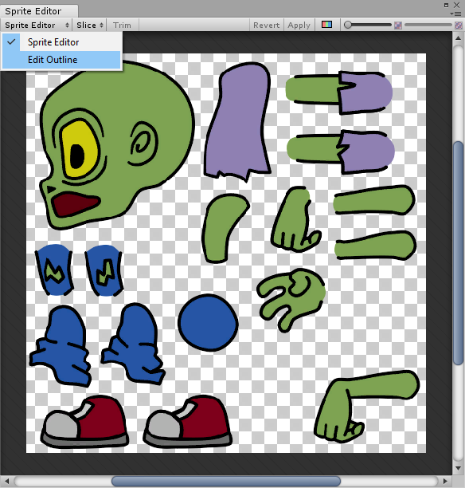
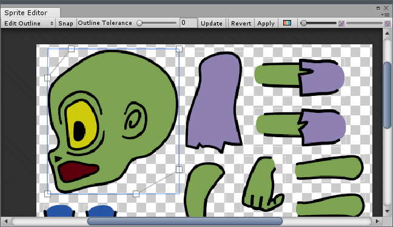
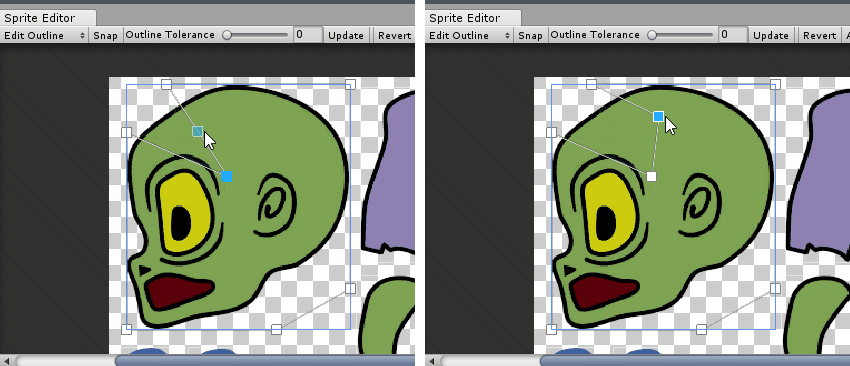
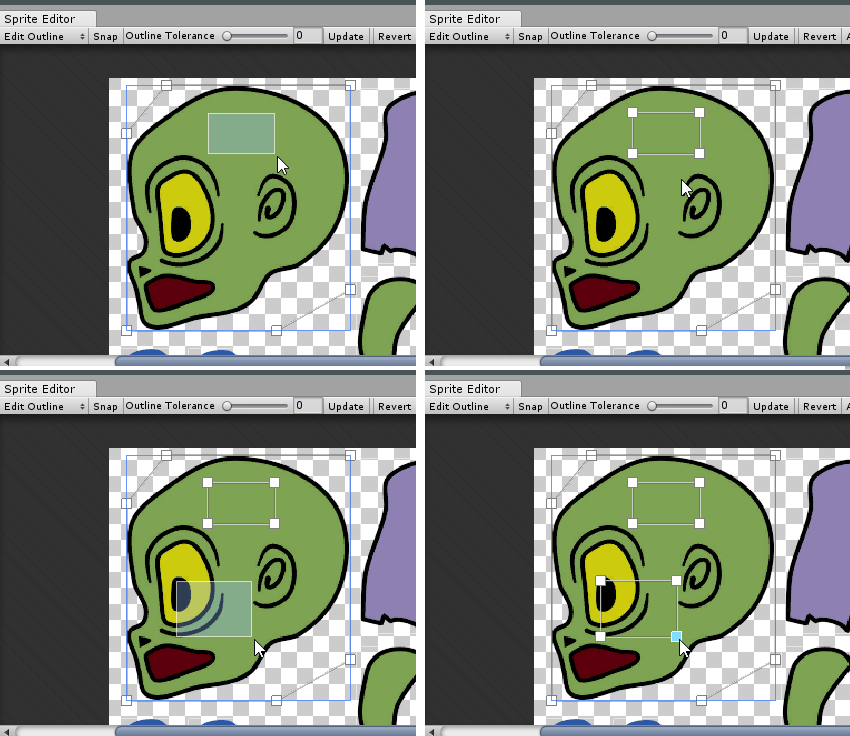
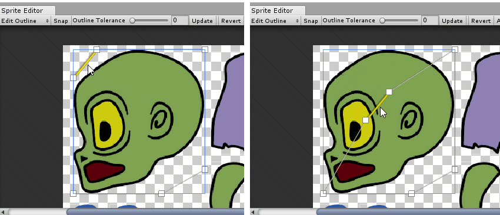
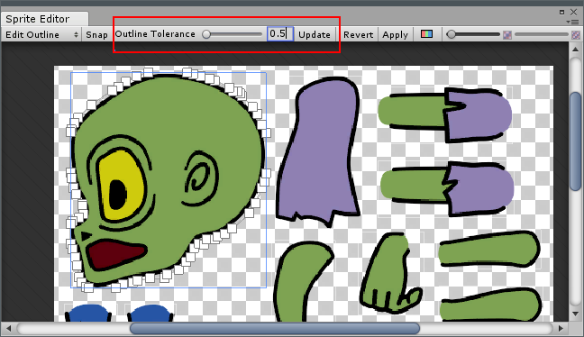
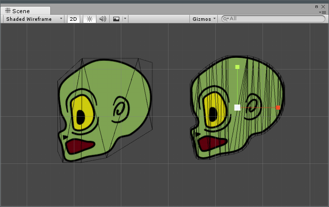

# Sprite Editor：Edit Outline

使用 [Sprite Editor](SpriteEditor.html) 的 __Edit Outline__ 选项可编辑[精灵](Sprites.html)生成的[网格](class-Mesh.html)，从而有效编辑其轮廓。

精灵中的透明区域会对项目的性能产生负面影响。此功能对于微调精灵的边界非常有用，可确保形状中的透明区域减少。
 
要访问此选项，请选择精灵，然后打开 [Sprite Editor](SpriteEditor.html)（单击 Inspector 窗口中的 __Sprite Editor__）。单击左上角的 __Sprite Editor__ 下拉选单，然后选择 __Edit Outline__。

选择 __Edit Outline__ 后，单击某个精灵。Sprite Editor 将显示精灵的轮廓和控制点。轮廓用白线表示。控制点是可用于移动和操纵轮廓的区域。控制点用小方块表示。单击并拖动白色方块轮廓控制点即可更改其位置。

将鼠标悬停在白色方块轮廓控制点上时，轮廓上会出现蓝色方块。拖动此方块可重新定位控制点，蓝色方块将成为新的白色方块轮廓控制点，如下所示

要创建新轮廓，请在精灵内的空白区域中拖动。这样就会创建带有四个控制点的新矩形轮廓。多次执行此过程即可在一个精灵上创建多个轮廓（例如，在轮廓内部有间隙的圆环精灵）。

要移动轮廓而不是控制点，请在单击并拖动轮廓时按住 __Ctrl__。

## Outline Tolerance
使用 __Outline Tolerance__ 滑动条可增加和减少可用的轮廓控制点数，范围介于 __0__（最小控制点数）和 __1__（最大控制点数）之间。较高的 __Outline Tolerance__ 值会创建更多的轮廓控制点，而较低的 __Outline Tolerance__ 会创建更紧密的网格（即，在精灵和网格边缘之间具有较小透明像素边框的网格）。单击 __Update__ 可应用所做的更改。

