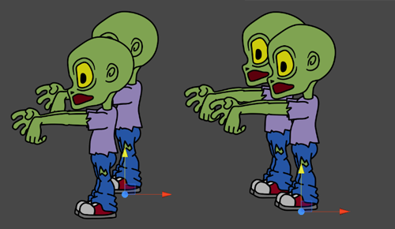
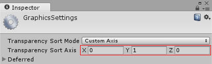

# 精灵

__精灵__是 2D 图形对象。如果习惯于在 3D 空间中工作，__精灵__本质上只是标准纹理，但可通过一些特殊技巧在开发过程中组合和管理精灵纹理以提高效率和方便性。


Unity 提供一个占位的 [Sprite Creator](SpriteCreator.html)、一个内置的 [Sprite Editor](SpriteEditor.html)、一个 [Sprite Renderer](class-SpriteRenderer.html) 和一个 [Sprite Packer](SpritePacker.html)

请参阅下面的**导入和设置精灵**，了解有关在 Unity 项目中将资源设置为__精灵__的信息。

## 精灵工具

### Sprite Creator

使用 [Sprite Creator](SpriteCreator.html) 可在项目中创建占位精灵，这样就可以继续开发而无需获取或等待图形。

### Sprite Editor

[Sprite Editor](SpriteEditor.html) 允许从较大的图像中提取精灵图形，并在图像编辑器中编辑单个纹理内的多个分量图像。例如，可以使用此工具将角色的手臂、腿和身体保持为一个图像中的单独元素。
 
### Sprite Renderer

应使用 [Sprite Renderer](class-SpriteRenderer.html) 组件而不是用于 3D 对象的 [Mesh Renderer](class-MeshRenderer.html) 来渲染精灵。使用该组件可将图像显示为__精灵__，以便在 2D 和 3D 场景中均可使用。

### Sprite Packer

使用 [Sprite Packer](SpritePacker.html) 可根据项目来优化视频内存的使用和性能。

## 导入和设置精灵
__精灵__是 Unity 项目中的一种__资源__。可通过 __Project__ 视图查看精灵，并可立即使用。

可通过两种方式将__精灵__引入项目：

1.在计算机的 Finder (Mac OS X) 或文件资源管理器 (Windows) 中，直接将图像放入 Unity 项目的 __Assets__ 文件夹中。

    Unity 会检测到此图像并将其显示在项目的 __Project__ 视图中。
    
2.在 Unity 中，选择 __Assets__ &gt; __Import New Asset__ 以显示计算机的 Finder (Mac OS X) 或文件资源管理器 (Windows)。

    从该位置中选择所需的图像，Unity 会将其放在 __Project__ 视图中。

请参阅[导入](ImportingAssets.html)，了解与此相关的更多详细信息以及有关组织 __Assets__ 文件夹的重要信息。

### 将图像设置为精灵

如果项目模式设置为 2D，则导入的图像将自动设置为__精灵 (Sprite)__。有关将项目模式设置为 2D 的详细信息，请参阅 [2D 还是 3D 项目](2Dor3D.html)。

但是，如果项目模式设置为 3D，则图像将设置为__纹理 (Texture)__，因此需要更改资源的__纹理类型 (Texture Type)__：

1.单击该资源以查看其 __Import Inspector__。
2.将 __Texture Type__ 设置为 __Sprite (2D and UI)__：


有关精灵 __Texture Type__ 设置的详细信息，请参阅 [Texture type: Sprite (2D and UI)](https://docs.unity3d.com/Manual/TextureTypes.html#Sprite)。

## 对精灵排序

Unity 中的渲染器按几个条件排序，例如图层顺序或与摄像机的距离。Unity 的 GraphicsSettings（菜单：__Edit__ > __Project Settings__ > __Graphics__）提供了一项名为 __Transparency Sort Mode__ 的设置，此设置可根据精灵相对于摄像机的位置来控制精灵的排序方式。更具体地说，此设置使用精灵在轴上的位置来确定哪些精灵相对于其他精灵透明，而哪些不透明。

例如，若要沿 Y 轴对精灵进行排序，可使用此设置。这种情况在 2D 游戏中很常见，通常需要将较高的精灵排在较低的精灵之后，这样会看起来更远。

 

__Transparency Sort Mode__ 有四个可用选项：

 

* __Default__ - 根据摄像机的 __Projection__ 模式设置为 __Perspective__ 还是 __Orthographic__ 来进行排序

* __Perspective__ - 根据透视图进行排序。透视图根据从摄像机位置到精灵中心的距离对精灵进行排序。

* __Orthographic__ - 根据正交视图进行排序。正交视图根据沿视图方向的距离对精灵进行排序。

* __Custom Axis__ - 根据 Transparency Sort Axis 中设置的指定轴进行排序

如果已将 __Transparency Sort Mode__ 设置为 __Custom__，则需要设置 __Transparency Sort Axis__：

 

如果 __Transparency Sort Mode__ 设置为 __Custom Axis__，则 Scene 视图中的渲染器将根据此轴与摄像机之间的距离进行排序。应使用介于 -1 和 1 之间的值来定义此轴。例如：X=0、Y=1、Z=0 将此轴方向设置为向上。X=1、Y=1、Z=0 将此轴方向设置为 X 和 Y 之间的对角线方向。

例如，如果希望精灵的行为类似于上图中的精灵（在 y 轴值较高的精灵将站在 y 轴值较低的精灵的后面），请将 __Transparency Sort Mode__ 设置为 __Custom Axis__，并将 __Transparency Sort Axis__ 的 __Y__ 值设置为大于 0 的值。

## 使用脚本对精灵排序

还可以使用脚本通过修改每个摄像机的以下属性来按照每个摄像机对精灵排序：

* [TransparencySortMode](../ScriptReference/Camera-transparencySortMode.html)（对应于 __Transparency Sort Mode__）

* [TransparencySortAxis](../ScriptReference/Camera-transparencySortAxis.html)（对应于 __Transparency Sort Axis__）

例如：

```
var camera = GetComponent<Camera>();

camera.transparencySortMode = TransparencySortMode.CustomAxis;

camera.transparencySortAxis = new Vector3(0.0f, 1.0f, 0.0f);
```

----

* <span class="page-edit"> 2018-04-25  Page amended with limited [editorial review](DocumentationEditorialReview.html)
</span>

*  <span class="page-edit">2017-05-24  Page amended with no [editorial review](DocumentationEditorialReview.html)
</span>

* <span class="page-history">在 5.6 版中添加了 Transparancy Sort Mode</span>


