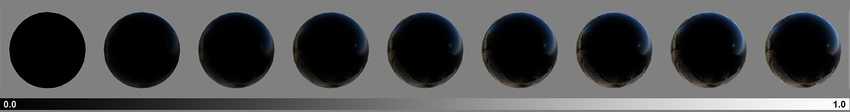

#菲涅耳效应

现实世界中物体的一个重要视觉提示与它们在掠射角下如何变得更具反射性有关（如下图所示）。这就是所谓的菲涅耳效应。

在此示例中有两点需要注意：首先，这些反射仅出现在球体的边缘周围（即当其表面处于掠射角时），其次，随着材质的光滑度上升，这些反射变得更加明显和清晰。

在标准着色器中，不能直接控制菲涅耳效应。实际上，它是通过材质的光滑度间接控制的。光滑的表面将呈现出更强的菲涅耳效应，而完全粗糙的表面将没有菲涅耳效应。
