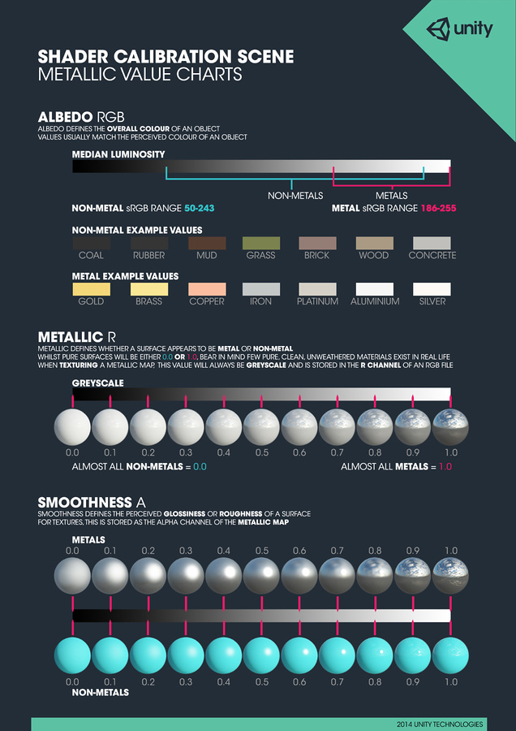
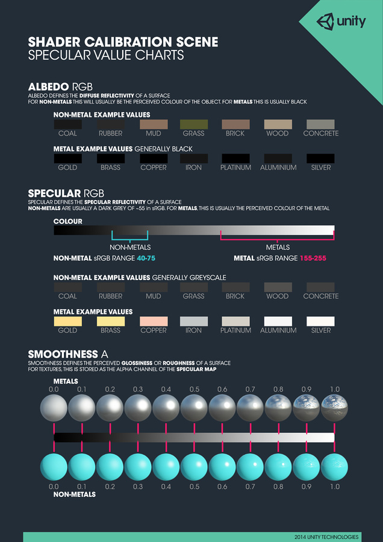

#材质图表

##使用以下图表作为实际设置的参考：

此外还有关于如何制作这些图表中的逼真材质的提示信息。本质上，此过程关系到选择工作流程（默认或金属性）并获取贴图或拾色器的相关值。例如，如果我们想制作闪亮的白色塑料，我们需要白色反照率 (Albedo)。由于不是金属，我们需要深色镜面反射 (Specular) 或非常低的金属性 (Metallic) 值，最后需要非常高的平滑度 (Smoothness)。
