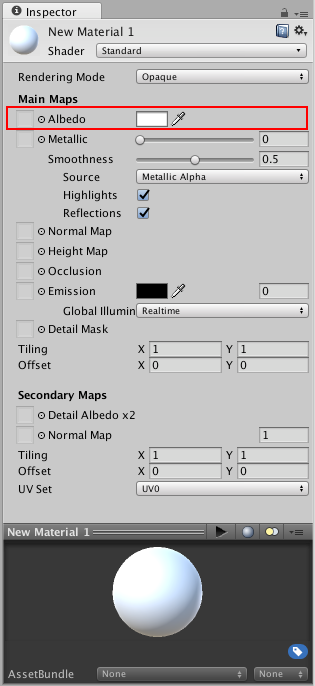
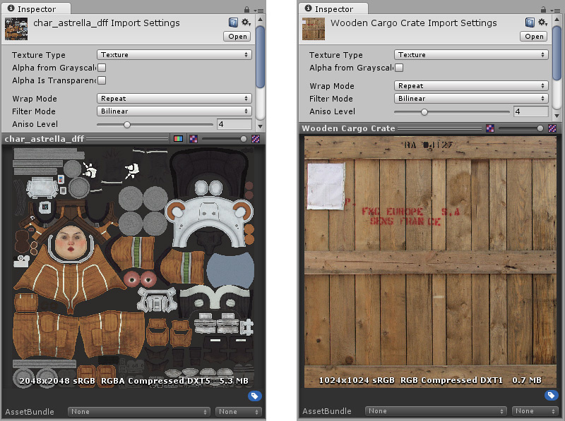
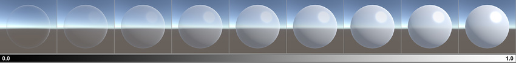
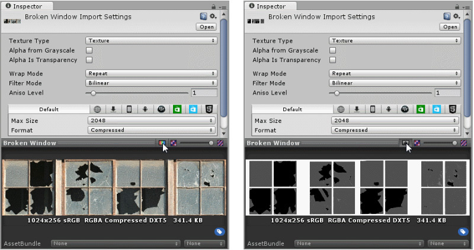
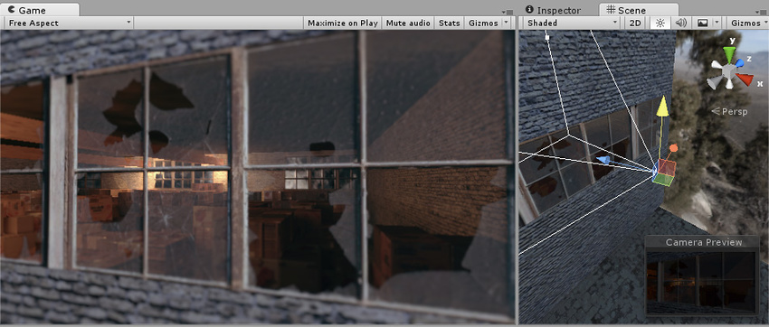

#反照率颜色和透明度

Albedo 参数控制着表面的基色。

为 Albedo 值指定单一颜色有时很有用，但为 Albedo 参数指定纹理贴图的做法更为常见。纹理贴图应表示对象表面的颜色。必须注意的是，反照率纹理**不**应包含任何光照，因为光照将根据看到对象的上下文添加到纹理中。

##透明度
反照率颜色的 Alpha 值控制着材质的透明度级别。仅当材质的 Rendering Mode（渲染模式）设置为 **Opaque** 之外的 Transparent 模式之一时，此设置才有效。如上所述，选择正确的透明度模式非常重要，因为此模式可确定您是否仍然会看到处于全值状态的反射和镜面高光，或它们是否也会根据透明度值淡出。

使用为 Albedo 参数指定的纹理时，可通过确保反照率纹理图像具有 **Alpha 通道**来控制材质的透明度。Alpha 通道值映射到透明度级别，其中以白色表示完全不透明，黑色表示完全透明。这将使材质可具有透明度不同的区域。

