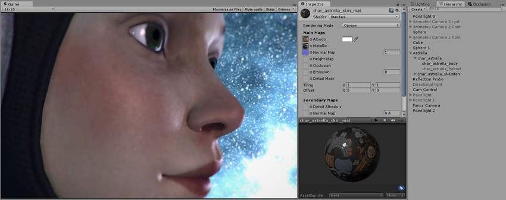
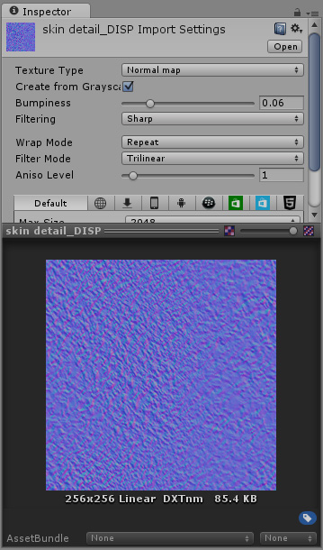
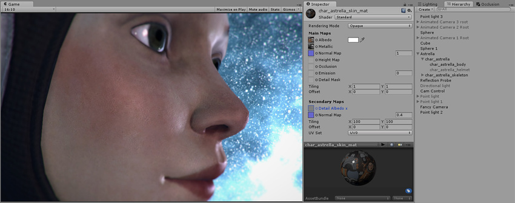
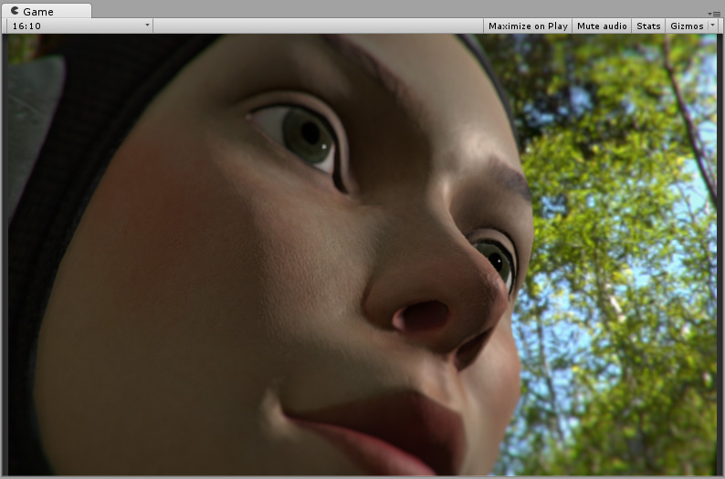

#辅助贴图（细节贴图）和细节遮罩

辅助贴图（或细节贴图）允许您在上面列出的主纹理上覆盖第二组纹理。您可以应用第二个反照率颜色贴图和第二个法线贴图。通常，与主要的反照率贴图和细节贴图相比，这些辅助贴图将映射到对象表面上重复多次且小得多的范围。

这样做的原因是允许材质在近距离观察时具有清晰的细节，同时在从更远处观察时具有正常的细节级别，而不必使用单个极高的纹理贴图来实现两个目标。

细节纹理的典型用途为：
- 为角色的皮肤添加皮肤细节，如毛孔和毛发
- 在砖墙上添加微小的裂缝和地衣生长效果
- 为大型金属容器添加小划痕和磨损

如果使用单个法线贴图，请务必将其插入主通道。辅助法线贴图通道比主通道的成本更高，但具有完全相同的效果。

### 细节遮罩
细节遮罩纹理允许您在模型的某些区域禁止应用细节纹理。这意味着可在某些区域显示细节纹理，而在其他区域隐藏细节纹理。在上面的皮肤毛孔示例中，您可能希望创建遮罩，使毛孔不会显示在嘴唇和眉毛上。
