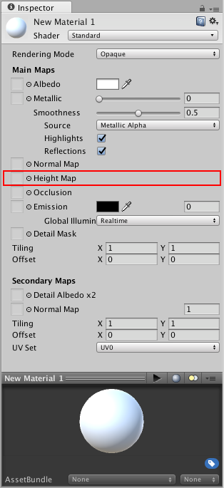
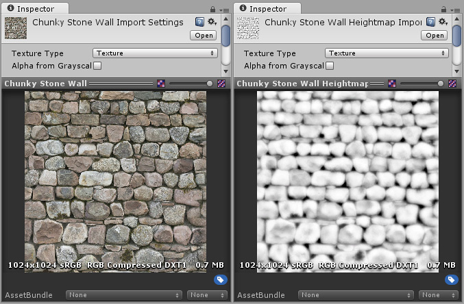
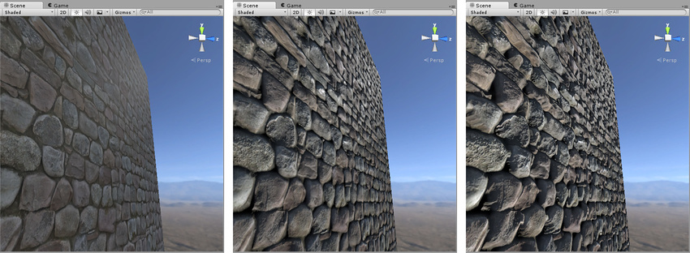

#高度贴图

 

高度贴图（也称为视差贴图）是与法线贴图类似的概念，但是这种技术更复杂，因此性能成本也更高。高度贴图往往与法线贴图结合使用，通常情况下，当纹理贴图负责渲染表面的大型凸起时，高度贴图用于为表面提供额外的定义。

虽然法线贴图可修改纹理表面上的光照，但视差高度贴图更进一步并实际上可移动可见表面纹理的区域，从而实现一种表面级遮挡效果。这意味着，对于明显的凸起，它们的近侧（面向摄像机）将膨胀和扩大，而它们的远侧（背离摄像机）将减小并且看起来被遮挡。

这种效果尽管可以产生非常令人信服的 3D 几何体表示，但仍然受限于对象网格的平面多边形的表面。也就是说，虽然表面凸起看起来会突出和相互遮挡，但模型的“轮廓”绝不会被修改，因为最终效果将绘制到模型的表面上，不会修改实际的几何体。

高度贴图应为灰度图像，其中以白色区域表示纹理的高区域，以黑色表示低区域。以下是典型的反照率贴图和要匹配的高度贴图。

 

上图从左到右为：
	1.分配了反照率贴图但未分配法线贴图和高度贴图的岩石墙壁材质。
	2.分配了法线贴图。表面上的光照经过修改，但岩石不会相互遮挡。
	3.分配了法线贴图和高度贴图的最终效果。岩石看起来从表面突出，较近的岩石似乎遮挡了它们后面的岩石。

通常情况下（但非总是如此），用于高度贴图的灰度图像也适合用于遮挡贴图。有关遮挡贴图的信息，请参阅下一部分。
	
---
