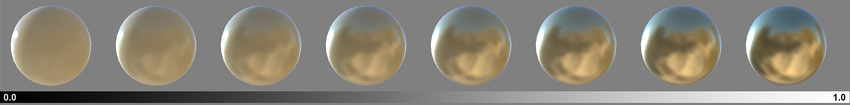
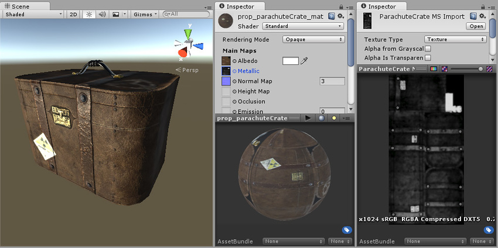

#Metallic 模式：Metallic 参数
 

在**金属性 (Metallic) 工作流程**（与镜面反射 (Specular) 工作流程相反）中工作时，表面的反射率和光响应将由 Metallic 级别和 [Smoothness](StandardShaderMaterialParameterSmoothness.html) 级别进行修改。

 

使用此工作流程时仍会生成镜面反射，但它们是自然产生的，具体取决于您为 Metallic 和 Smoothness 级别提供的设置，而不是进行显式定义。

**Metallic 模式不仅适用于看起来具有金属性的材质！**此模式之所以称为金属性 (Metallic) 模式，是因为您可以控制表面的金属性或非金属性。

###Metallic 参数
材质的金属性 (Metallic) 参数决定了表面有多么“像金属”。当表面具有较高的金属性时，它会在更大程度上反射环境，并且反照率颜色将变得不那么明显。在最高金属性级别下，表面颜色完全由来自环境的反射驱动。当表面的金属性较低时，其反照率颜色会更清晰，并且所有表面反射均在表面颜色的基础之上可见，而不是遮挡住表面颜色。

默认情况下，如果未分配纹理，则 Metallic 和 Smoothness 参数均由滑动条控制。对于某些材质来说，这已足够了。但是，如果模型表面某些区域在反照率纹理中具有混合表面类型，则可以使用纹理贴图来控制金属性和平滑度级别在材质表面上的变化。例如，如果纹理包含角色的服装，其中包括一些金属搭扣和拉链，您会希望搭扣和拉链的金属性值高于服装面料的金属性值。为实现此目的，我们不使用单个滑动条值，而是可以分配一个纹理贴图，在贴图中为搭扣和拉链区域提供较亮的像素颜色，而为布料提供较暗的值。

为 Metallic 参数分配纹理后，Metallic 和 Smoothness 滑动条都将消失。取而代之的是，材质的 Metallic 级别由纹理的红色通道中的值控制，而材质的 [Smoothness](StandardShaderMaterialParameterSmoothness.html) 级别由纹理的 Alpha 通道控制。（这意味着忽略绿色和蓝色通道）。也就是说，使用单个纹理即可将区域定义为粗糙或平滑以及金属性或非金属性；在使用纹理贴图来覆盖模型中许多具有不同要求的区域时（例如，单个角色纹理贴图通常包含多种表面要求：皮鞋、布料、手和脸的皮肤以及金属搭扣），这将非常有用。

在上面的示例中，手提箱具有反照率贴图，但没有可用于金属性的纹理。这意味着整个对象具有单一的金属性和平滑度值，这是不理想的。皮革带、金属搭扣、贴纸和手柄都应具有不同的表面属性。

此示例中已分配金属/平滑度纹理贴图。搭扣现在具有较高的金属性值并相应地响应光照。皮革带比箱体的皮革本身更亮，但它们具有较低的“Metallic”值，因此看起来是闪亮的非金属表面。最右边的黑白贴图显示了金属为较亮区域，而皮革为中低灰色。
