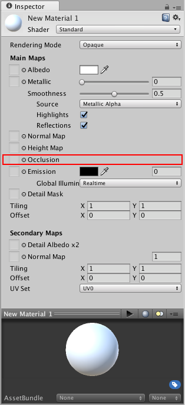
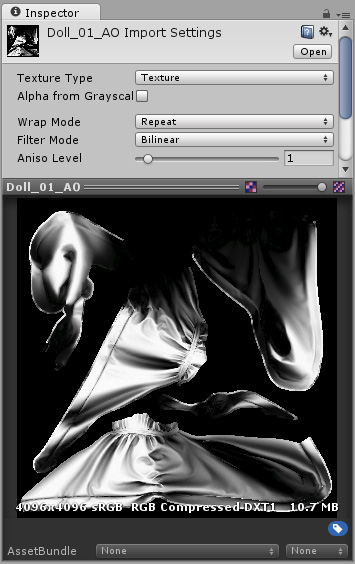
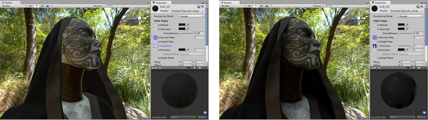

#遮挡贴图

 

遮挡贴图用于提供关于模型哪些区域应接受高或低间接光照的信息。间接光照来自环境光照和反射，因此模型的深度凹陷部分（例如裂缝或折叠位置）实际上不会接收到太多的间接光照。

遮挡纹理贴图通常由 3D 应用程序使用建模器或第三方软件直接从 3D 模型进行计算。

遮挡贴图是灰度图像，其中以白色表示应接受完全间接光照的区域，以黑色表示没有间接光照。有时，对于简单的表面而言，这就像灰度高度贴图一样简单（例如前面高度贴图示例中显示的凸起石墙纹理）。

在其他情况下，生成正确的遮挡纹理稍微复杂一些。例如，如果场景中的角色穿着罩袍，则罩袍的内边缘应设置为非常低的间接光照，或者完全没有光照。在这些情况下，遮挡贴图通常将由美术师制作，使用 3D 应用程序基于模型自动生成遮挡贴图。

