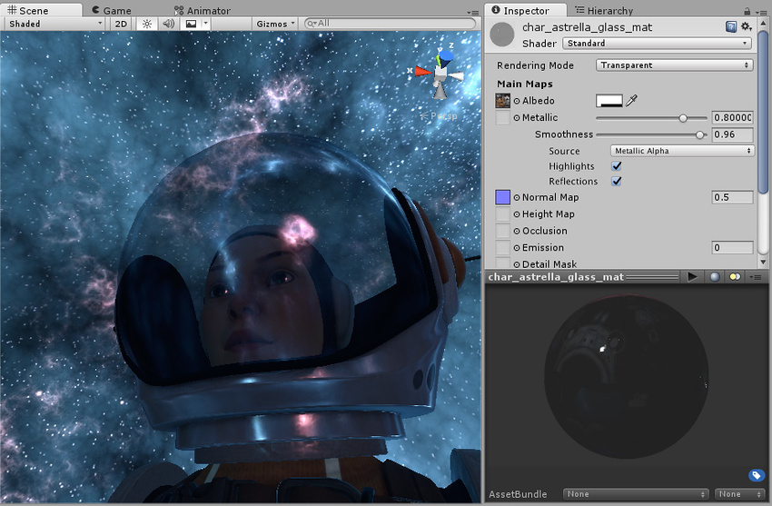
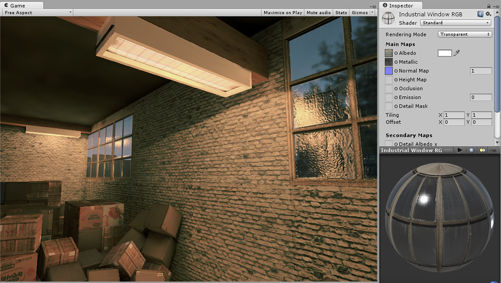
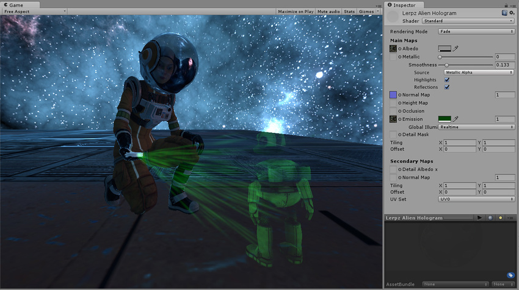
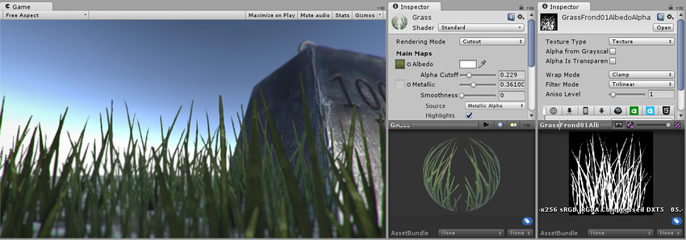

#渲染模式 (Rendering Mode)

标准着色器中的第一个材质参数为 **Rendering Mode**。此参数允许您选择对象是否使用透明度，如果是，使用哪种类型的混合模式。

- **Opaque** - 此项为默认设置，适用于没有透明区域的普通固体对象。

- **Cutout** - 用于创建在不透明区域和透明区域之间具有硬边的透明效果。在这种模式下，没有半透明区域，纹理为 100% 不透明或不可见。使用透明度来创建材质的形状时（如树叶或者有孔洞和碎布条的布料），这非常有用。

- **Transparent** - 适用于渲染逼真的透明材质，如透明塑料或玻璃。在此模式下，材质本身将采用透明度值（基于纹理的 Alpha 通道和色调颜色的 Alpha），但与真实透明材质的情况一样，反射和光照高光将保持完全清晰可见。

- **Fade** - 允许透明度值完全淡出对象，包括对象可能具有的任何镜面高光或反射。如果要对淡入或淡出的对象进行动画化，此模式将非常有用。它不适合渲染逼真的透明材质，如透明塑料或玻璃，因为反射和高光也会淡出。

 

