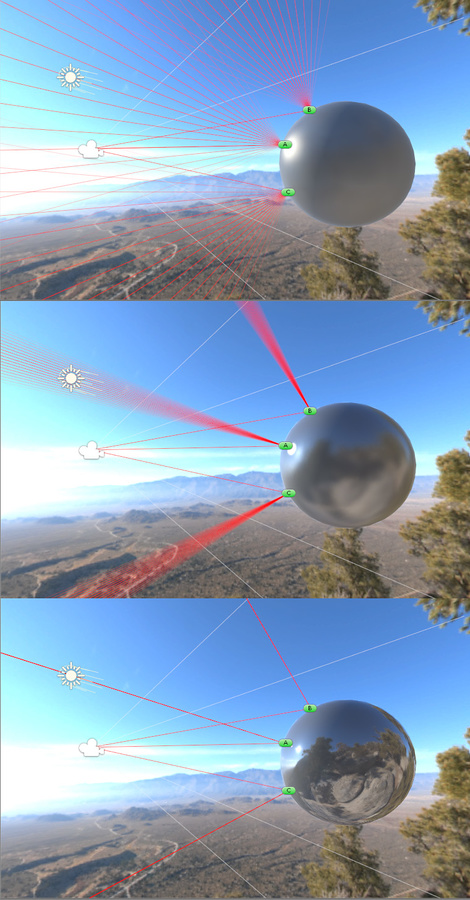

#平滑度

平滑度的概念同时适用于镜面反射 (Specular) 工作流程和金属性 (Metallic) 工作流程，并且在两者中的工作方式非常相同。默认情况下，如果未分配 [Metallic](StandardShaderMaterialParameterMetallic.html) 或 [Specular](StandardShaderMaterialParameterSpecular.html) 纹理映射，则材质的平滑度由滑动条控制。此滑动条可用于控制表面上的“微表面细节”或平滑度。

上面同时显示了两种着色器模式，因为如果您选择使用 **Metallic** 或 **Specular** 参数的纹理贴图，则会从该贴图中获取平滑度值。本页面后面将对此进一步详细说明。

在 Unity 中，“微表面细节”不是直接可见的。它是光照计算中使用的概念。但是，您可以看到这个微表面细节的效果，它表示当光线从对象反弹时散射的光量。在光滑的表面上，所有光线都倾向于以可预测和一致的角度反弹。在极端的情况下，一个完美光滑表面的光反射就像镜子一样。较不光滑的表面会在较宽的角度范围内反光（当光照射到微表面的凸起时），因此反射具有较少的细节并以更倾向于漫射的方式在表面上扩散。

光滑的表面具有非常低的微表面细节，或者根本没有，因此光线以均匀的方式反弹，形成清晰的反射。粗糙的表面在其微表面细节中具有高峰和低谷，因此光线在很宽的角度范围内反弹，平均下来将产生漫射颜色，看不到清晰的反射。

在低平滑度级别下，表面上每个点的反射光来自较宽的区域，因为微表面细节凹凸不平并散射光。在高平滑度值下，每个点的光线来自狭窄的聚焦区域，因此能更清晰地反射对象的环境。

##使用平滑度纹理贴图

与许多其他参数类似，您可以分配纹理贴图，而不使用单个滑动条值。这样可以更好地控制材质表面上的镜面光反射的强度和颜色。

使用贴图而不使用滑动条意味着，可创建包含表面上各种平滑度级别的材质（通常设计为与反照率纹理中显示的值匹配）。

|**_属性：_** |**_功能：_** |
|:---|:---|
|**Smoothness source** |选择存储了平滑度值的纹理通道。 |
|&amp;#160;&amp;#160;&amp;#160;&amp;#160;&amp;#160;&amp;#160;&amp;#160;&amp;#160;_Specular/Metallic Alpha_ |由于表面上每个点的平滑度是单个值，因此数据只需要图像纹理的单个通道。所以，通常认为平滑度数据存储在用于金属性或镜面反射纹理贴图的相同图像纹理的 Alpha 通道中（具体取决于使用的是这两种模式中的哪一种）。|
|&amp;#160;&amp;#160;&amp;#160;&amp;#160;&amp;#160;&amp;#160;&amp;#160;&amp;#160;_Albedo Alpha_ | 此选项可减少纹理总数，或者对 Smoothness 和 Specular/Metallic 使用不同分辨率的纹理。|
|**Highlights**| 选中此框可禁用高光。这是针对移动端的可选性能优化选项。它会从标准着色器中移除高光计算。此设置对外观的影响主要取决于 Specular/Metallic 值和 Smoothness。 |
|**Reflections**| 选中此框可禁用环境反射。这是针对移动端的可选性能优化选项。它会从标准着色器中移除高光计算。此情况下不对环境贴图进行采样，而是使用近似值。此设置对外观的影响取决于平滑度。 |

更光滑的表面更具反光性，并具有更小、更紧密聚焦的镜面高光。不太光滑的表面的反射率不太高，因此镜面高光不太明显，并会在表面上扩散得更广。通过将镜面反射和平滑度贴图与反照率贴图中的内容进行匹配，即可开始创建非常逼真的纹理。

