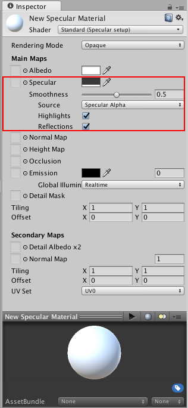
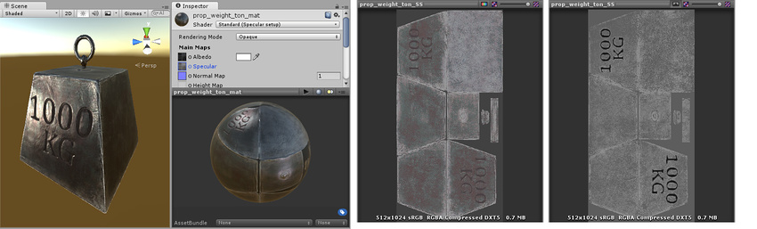

#Specular 模式：Specular 参数

 

###Specular 参数
__Specular__ 参数仅在使用 __Specular setup__ 时可见，如上图的 __Shader__ 字段中所示。镜面反射 (Specular) 效果本质上是场景中光源的直接反射，通常会在对象表面上显示为明亮的高光和反光（尽管镜面高光也可能是微妙或漫射的）。

 

__Specular setup__ 和 __Metallic setup__ 都会产生镜面高光，因此选择使用哪个选项更多取决于设置和您的艺术偏好。在 __Specular setup__ 中，可直接控制镜面高光的亮度和色调，而在 __Metallic setup__ 中，可控制其他参数，镜面高光的强度和颜色会作为其他参数设置的自然结果而出现。

在 Specular 模式下工作时，__Specular__ 参数中的 RGB 颜色将控制镜面反射率的强度和色调。这包括来自光源的光泽和来自环境的反射。[Smoothness](StandardShaderMaterialParameterSmoothness.html) 参数控制着镜面反射效果的清晰度。在平滑度值较低的情况下，即使强烈的镜面反射也会出现模糊和漫射。在平滑度值较高的情况下，镜面反射更明显、更清晰。

有时，可能希望改变材质表面上的 __Specular__ 值；例如，如果纹理包含角色的外套，而外套上有一些闪亮的按钮，您会希望按钮的镜面反射值高于服装面料的镜面反射值。要实现此目的，请分配纹理贴图，而不使用单个滑动条值。这样可以根据镜面反射贴图的像素颜色更好地控制材质表面上的镜面光反射的强度和颜色。

为 __Specular__ 参数分配纹理后，__Specular__ 参数和 __Smoothness__ 滑动条都将消失。取而代之的是，材质的 Specular 级别由纹理本身的__红色__、__绿色__和__蓝色__通道中的值控制，而材质的 [Smoothness](StandardShaderMaterialParameterSmoothness.html) 级别由同一纹理的 Alpha 通道控制。因此，通过提供单个纹理，即可将区域定义为粗糙或平滑，并具有不同的镜面反射级别和颜色。在使用纹理贴图来覆盖模型中许多具有不同要求的区域时（例如，单个角色纹理贴图通常包含多种表面要求，如皮鞋、布料、手和脸的皮肤以及金属搭扣），这将非常有用。

此处，镜面反射和平滑度由颜色和 __Smoothness__ 滑动条定义。由于未分配纹理，因此镜面反射和平滑度在整个表面上保持不变。这种状态并非总是令人满意，特别是在反照率纹理映射到模型上各种不同区域（也称为纹理图集）的情况下。

此处，纹理贴图控制着镜面反射和平滑度。这种情况下允许镜面反射在模型的表面上变化。请注意，边缘具有比中心位置更高的镜面反射效果，表面对光线有一些微妙的颜色响应，并且字母内部的区域不再有镜面高光。右图是用于控制镜面反射颜色和强度的 RGB 通道以及用于控制平滑度的 Alpha 通道。

**注意**：黑色镜面反射颜色 (0,0,0) 将使镜面反射效果无效。
