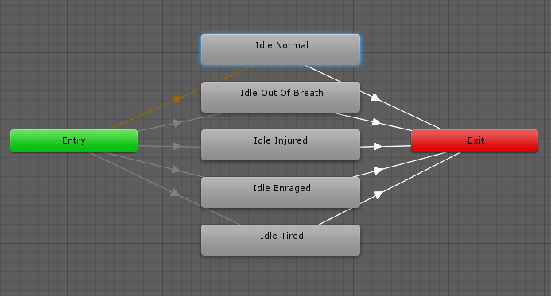

状态机过渡
=======================

状态机过渡可帮助您简化大型或复杂的状态机。允许对状态机逻辑进行更高级的抽象化。

Animator 窗口中的每个视图都有一个进入 (Entry) 和退出 (Exit) 节点。在状态机过渡期间使用这些节点。

过渡到状态机时使用进入节点。进入节点将接受评估，并根据设置的条件分支到目标状态。通过此方式，进入节点可以通过在状态机启动时评估参数的状态来控制状态机的初始状态。

因为状态机始终具有默认状态，所以始终会有从进入节点分支到默认状态的默认过渡。

随后可添加从进入节点到其他状态的其他过渡来控制状态机是否应以其他状态开始。

退出节点用于指示状态机应退出。

状态机中的每个子状态都被视为一个独立且完整的状态机，因此通过使用这些进入和退出节点，可以更简练地控制从顶级状态机到其子状态机的流程。

可将状态机过渡与常规状态过渡混合，因此可在状态之间过渡、从状态过渡到状态机以及从一个状态机直接过渡到另一个状态机。

