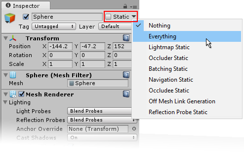

#静态游戏对象

许多优化需要知道对象是否可在游戏过程中移动。有关**静态**（即非移动）对象的信息通常可在 Editor 中预先计算，因为此类对象不会因对象位置的变化而无效。例如，可以通过将多个静态对象组合成称为_批次_的单个大对象来优化渲染。

游戏对象的 Inspector 在右上角有一个 _Static_ 复选框和菜单，用于向 Unity 中的各种不同系统告知该对象不会移动。对于每个系统，可以单独将对象标记为静态，因此可以选择在不能带来优势的情况下不计算对象的静态优化。

##静态设置

_Everything_ 和 _Nothing_ 针对使用该游戏对象的所有系统同时启用或禁用静态状态。这些系统包括：

* [光照贴图 (Lightmapping)](GIIntro.html)：场景的高级光照；
* [遮挡物和被遮挡物 (Occluder and Occludee)](OcclusionCulling.html)：基于特定摄像机位置的对象可见性进行渲染优化；
* [批处理 (Batching)](DrawCallBatching.html)：通过将多个对象组合成一个更大的对象来进行渲染优化；
* [导航 (Navigation)](Navigation.html)：使角色能够在场景中协商障碍物的系统；
* [网格外链接 (Off-mesh Links)](class-OffMeshLink.html)：导航系统在场景的不连续区域之间建立的连接。
* [反射探针 (Reflection Probe)](class-ReflectionProbe.html)：捕捉周围各个方向的球形视图。

有关静态设置如何影响性能的更多详细信息，请参阅有关这些主题的页面。
