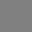
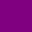

#富文本

UI 元素和文本网格的文本可以包含多种字体样式和大小。UI 系统和旧版 GUI 系统都支持富文本。Text、GUIStyle、GUIText 和 TextMesh 类都具有 __Rich Text__ 设置，此设置会指示 Unity 在文本中查找标记标签。[Debug.Log](../ScriptReference/Debug.Log.html) 函数也可使用这些标记标签来增强代码中的错误报告。标签不会显示，但会指示要应用于文本的样式更改。

##标记格式

该标记系统受 HTML 的启发，但并不打算与标准 HTML 严格兼容。基本思想是可以将文本的一部分包含在一对匹配标签内：

&#160;&#160;&#160;We are &lt;b&gt;not&lt;/b&gt; amused

如示例所示，标签就是“尖括号”字符 &lt; 和 &gt; 内的文本片段。标签内的文本表示标签的名称（在本示例中就是 **b**）。请注意，该部分末尾的标签与开头的标签具有相同名称，但添加了斜杠 / 字符。标签不会直接显示给用户，而是用于说明其包裹的文本的样式。上例中使用的 b 标签将粗体应用于单词“not”，因此文本将在屏幕上显示为：

&amp;#160;&amp;#160;&amp;#160;We are **not** amused

标记的文本部分（包括将其包裹的标签）称为**元素**。


###嵌套的元素

通过将一个元素“嵌套”在另一个元素中，可以将多个样式应用于文本的一部分

&#160;&#160;&#160;We are &lt;b&gt;&lt;i&gt;definitely not&lt;/i&gt;&lt;/b&gt; amused

i 标签表示应用斜体样式，因此将在屏幕上显示为

&amp;#160;&amp;#160;&amp;#160;We are **_definitely not_** amused

请注意结束标签的顺序与起始标签的顺序相反。为了更清楚说明原因，现在让内部标签不必跨越最外层元素的整个文本

&#160;&#160;&#160;We are &lt;b&gt;absolutely &lt;i&gt;definitely&lt;/i&gt; not&lt;/b&gt; amused

得到的结果为

&amp;#160;&amp;#160;&amp;#160;We are **absolutely _definitely_ not** amused


###标签参数

有些标签对文本具有简单的“全有或全无”(all-or-nothing) 效果，但其他标签可能允许变化。例如，**color** 标签需要知道要应用的颜色。应使用**参数**将此类信息添加到标签中：

&#160;&#160;&#160;We are &lt;color=green&gt;green&lt;/color&gt; with envy

请注意，结束标签不包含参数值。可选择将值用引号引起来，但这不是必需的。


##支持的标签

以下列表描述了 Unity 支持的所有样式标签。

|**_Tag_** |**_Description_** |**_Example_** |**_Notes_** |
|:---|:---|:---|
| **b**| Renders the text in boldface.| &#160;&#160;&#160;We are &lt;b&gt;not&lt;/b&gt; amused.| | 
| **i**| Renders the text in italics.| &#160;&#160;&#160;We are &lt;i&gt;usually&lt;/i&gt; not amused.| | 
| **size**| Sets the size of the text according to the parameter value, given in pixels.| &#160;&#160;&#160;We are &lt;size=50&gt;largely&lt;/size&gt; unaffected.| Although this tag is available for Debug.Log, you will find that the line spacing in the window bar and Console looks strange if the size is set too large.| 
| **color**| Sets the color of the text according to the parameter value. The color can be specified in the traditional HTML format. _&#160;&#160;&#160;\#rrggbbaa_ ...where the letters correspond to pairs of hexadecimal digits denoting the red, green, blue and alpha (transparency) values for the color. For example, cyan at full opacity would be specified by | _&#160;&#160;&#160;&lt;color=\#00ffffff&gt;..._ | Another option is to use the name of the color. This is easier to understand but naturally, the range of colors is limited and full opacity is always assumed. _&#160;&#160;&#160;&lt;color=cyan&gt;..._  The available color names are given in the table below.| 

|**_颜色名称_** |**_十六进制值_** |**_样本_** |
|:---|:---|:--|
|aqua（等同于 cyan）|`#00ffffff`| |
|black|`#000000ff`| |
|blue|`#0000ffff`| |
|brown|`#a52a2aff`| |
|cyan（等同于 aqua）|`#00ffffff`| |
|darkblue|`#0000a0ff`| |
|fuchsia（等同于 magenta）|`#ff00ffff`| |
|green|`#008000ff`| |
|grey|`#808080ff`| |
|lightblue|`#add8e6ff`| |
|lime|`#00ff00ff`| |
|magenta（等同于 fuchsia）|`#ff00ffff`| |
|maroon|`#800000ff`| |
|navy|`#000080ff`| |
|olive|`#808000ff`| |
|orange|`#ffa500ff`| |
|purple|`#800080ff`| |
|red|`#ff0000ff`| |
|silver|`#c0c0c0ff`| |
|teal|`#008080ff`| |
|white|`#ffffffff`| |
|yellow|`#ffff00ff`| |


**material**

这仅对文本网格有用，使用参数指定的材质渲染文本部分。值为 Inspector 显示的文本网格材质数组的索引。

&#160;&#160;&#160;We are &lt;material=2&gt;texturally&lt;/material&gt; amused


**quad**

这仅对文本网格有用，渲染与文本内联的图像。采用指定图像材质的参数、图像高度参数（以像素为单位）以及另外四个表示待显示图像的矩形区域的参数。与其他标签不同，quad 不会包裹一段文本，因此没有结束标签；斜杠字符放在初始标签的末尾，表示“自动关闭”。

&#160;&#160;&#160;&lt;quad material=1 size=20 x=0.1 y=0.1 width=0.5 height=0.5 /&gt;

这将选择渲染器材质数组中位置的材质，并将图像的高度设置为 20 像素。图像的矩形区域由 x、y、宽度和高度值决定，这些值全部表示为纹理的未缩放宽度和高度的一定比例。


##Editor GUI

默认情况下，Editor GUI 系统中已禁用富文本，但可以使用自定义 GUIStyle 显式启用富文本。应将 richText 属性设置为 true，并将样式传递给相关的 GUI 函数：

````
GUIStyle style = new GUIStyle ();
style.richText = true;
GUILayout.Label("<size=30>Some <color=yellow>RICH</color> text</size>",style);
````
