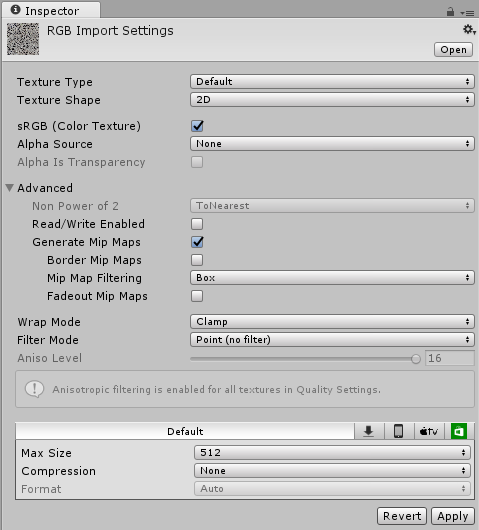
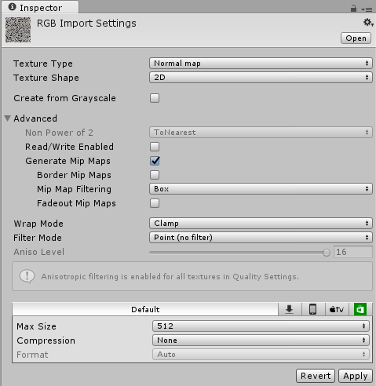
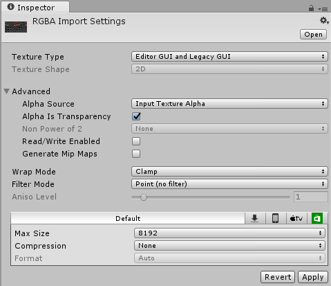
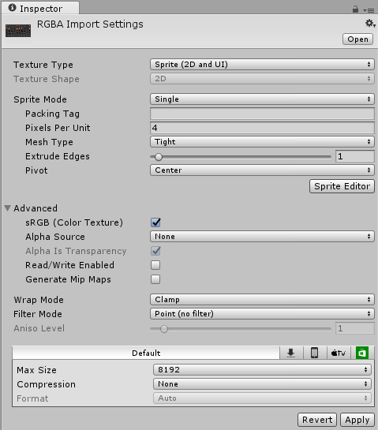

#纹理类型

通过[纹理导入器 (Texture Importer)](class-TextureImporter.html) 可将不同类型的[纹理](Textures.html)导入 Unity Editor。

以下是纹理检视面板 (Texture Inspector) 窗口中可用于在 Unity 中配置各种纹理类型的属性。请向下滚动页面或从以下列表中选择，查看所需了解的纹理类型的详细信息。

* [Default](#Default)
* [Normal Map](#NormalMap)
* [Editor GUI and Legacy](#Editor)
* [Sprite (2D and UI)](#Sprite)
* [Cursor](#Cursor)
* [Cookie](#Cookie)
* [Lightmap](#Lightmap)
* [Single Channel](#SingleChannel)

 
## Texture type: Default

| **属性：**| **功能：** |
|:---|:---| 
| __Texture Type__| __Default__ 是用于所有纹理的最常用设置。此选项可用于访问大多数纹理导入属性。 |
| __Texture Shape__| 使用此属性可定义纹理的形状。请参阅有关[纹理导入器](class-TextureImporter.html)的文档以了解所有纹理形状的相关信息。  |
| __sRGB (Color Texture)__| 选中此复选框可指定将纹理存储在伽马空间中。对于非 HDR 颜色纹理（例如反照率和镜面反射颜色），应始终选中此复选框。如果纹理存储了有特定含义的信息，并且您需要着色器中的确切值（例如，平滑度或金属度），请取消选中此复选框。默认情况下会选中此框。 |
| __Alpha Source__| 使用此属性可指定如何生成纹理的 Alpha 通道。默认情况下，此设置为 __None__。 |
|&nbsp;&nbsp;&nbsp;&nbsp;None| 无论输入纹理是否有 Alpha 通道，导入的纹理都没有 Alpha 通道。 |
|&nbsp;&nbsp;&nbsp;&nbsp;Input Texture Alpha| 如果提供了纹理，则使用输入纹理中的 Alpha。 |
|&nbsp;&nbsp;&nbsp;&nbsp;From Gray Scale| 从输入纹理 RGB 值的平均值生成 Alpha。 |
| __Alpha is Transparency__| 如果指定的 Alpha 通道为透明度 (Transparency)，则启用 __Alpha is Transparency__ 可扩充颜色并避免边缘上的过滤瑕疵。 |
| __Advanced__||
| __Non Power of 2__| 如果纹理具有“非 2 的幂”(NPOT) 尺寸大小，此属性将定义导入时的缩放行为。请参阅[导入纹理](ImportingTextures.html)相关文档以了解有关 NPOT 大小的更多信息。默认情况下，此设置为 __None__。 |
|&nbsp;&nbsp;&nbsp;&nbsp;None| 纹理尺寸大小保持不变。 |
|&nbsp;&nbsp;&nbsp;&nbsp;To nearest| 纹理在导入时缩放到最接近的“2 的幂”尺寸大小。例如，257x511 像素的纹理将缩放为 256x512 像素。请注意，PVRTC 格式要求纹理为正方形（即宽度等于高度），因此最终尺寸大小将升级为 512x512 像素。 |
|&nbsp;&nbsp;&nbsp;&nbsp;To larger| 纹理在导入时缩放到最大尺寸大小值的“2 的幂”尺寸大小。例如，257x511 像素的纹理将缩放为 512x512 像素。 |
|&nbsp;&nbsp;&nbsp;&nbsp;To smaller| 纹理在导入时缩放到最小尺寸大小值的“2 的幂”尺寸大小。例如，257x511 像素的纹理将缩放为 256x256 像素。 |
| __Read/Write Enabled__| 选中此框允许从脚本函数（例如 [Texture2D.SetPixels](../ScriptReference/Texture2D.SetPixels.html)、[Texture2D.GetPixels](../ScriptReference/Texture2D.GetPixels.html) 和其他 [Texture2D](../ScriptReference/Texture2D.html) 函数）访问纹理数据。请注意，此情况下会生成纹理数据的副本，使纹理资源所需的内存量增加一倍，因此只有在绝对必要时才应使用此属性。此属性仅适用于未压缩纹理和 DXT 压缩纹理；无法读取其他类型的压缩纹理。默认情况下会禁用此属性。 |
| __Generate Mip Maps__| 选中此框可禁止生成 Mipmap。Mipmap 是纹理的一系列较小版本，适合纹理在屏幕上非常小时使用。有关 Mipmap 的更多信息，请参阅[导入纹理](ImportingTextures.html)文档。 |
|&nbsp;&nbsp;&nbsp;&nbsp;Border Mip Maps| 选中此复选框可避免颜色向外渗透到较低 MIP 级别的边缘。该功能用于光照剪影（见下文）。默认情况下会取消选中此框。 |
|&nbsp;&nbsp;&nbsp;&nbsp;Mip Map Filtering| 有两种 Mipmap 过滤方法可用于优化图像质量。默认选项为 __Box__。 |
|&nbsp;&nbsp;&nbsp;&nbsp;&nbsp;&nbsp;&nbsp;&nbsp;_Box_| 这是淡出 Mipmap 的最简单方法。随着尺寸减小，MIP 级别将变得更加平滑。 |
|&nbsp;&nbsp;&nbsp;&nbsp;&nbsp;&nbsp;&nbsp;&nbsp;_Kaiser_| 这是一种随着 Mipmap 的尺寸大小下降而对其应用的锐化算法。如果纹理在远处太模糊，可尝试此选项。（这是一种 Kaiser 窗 (Kaiser Window) 算法，请参阅 [Wikipedia]( https://en.wikipedia.org/wiki/Kaiser_window) 以了解更多信息。） |
|&nbsp;&nbsp;&nbsp;&nbsp;Fadeout Mip Maps| 启用此属性可在 MIP 级别递进时使 Mipmap 淡化为灰色。此属性用于细节贴图。最左边的滚动项是第一个开始淡出的 MIP 级别。最右侧的滚动项定义了纹理完全变灰的 MIP 级别。 |
| __Wrap Mode__| 选择纹理平铺时的行为方式。默认选项为 __Clamp__。 |
|&nbsp;&nbsp;&nbsp;&nbsp;Repeat| 纹理在区块中重复自身。 |
|&nbsp;&nbsp;&nbsp;&nbsp;Clamp| 纹理的边缘被拉伸。  |
| __Filter Mode__| 选择纹理在通过 3D 变换拉伸时如何进行过滤。默认选项为 __Point (no filter)__。 |
|&nbsp;&nbsp;&nbsp;&nbsp;Point (no filter)| 纹理在靠近时变为块状。 |
|&nbsp;&nbsp;&nbsp;&nbsp;Bilinear| 纹理在靠近时变得模糊。 |
|&nbsp;&nbsp;&nbsp;&nbsp;Trilinear| 与 Bilinear 类似，但纹理也在不同的 MIP 级别之间模糊。 |
| __Aniso Level__| 以大角度查看纹理时提高纹理质量。适用于地板和地面纹理。有关各向异性过滤的更多信息，请参阅[导入纹理](ImportingTextures.html)文档。 |

 
## Texture type: Normal Map

| **属性：**| **功能：** |
|:---|:---| 
| __Texture Type__| 选择 __Normal map__ 可将颜色通道转换为适合实时法线贴图的格式。 |
| __Texture Shape__| 使用此属性可定义纹理的形状。请参阅有关[纹理导入器](class-TextureImporter.html)的文档以了解所有纹理形状的相关信息。  |
| __Create from Greyscale__| 表示从灰度高度贴图创建法线贴图。选中此复选框可启用该选项，启用后即可查看 __Bumpiness__ 和 __Filtering__。默认情况下会取消选中此选项。 |
|&nbsp;&nbsp;&nbsp;&nbsp;Bumpiness| 控制凹凸的程度。较低的凹凸值意味着，即使高度贴图中的鲜明对比度也会转换为平缓的角度和凹凸。较高的值会产生夸张的凹凸和对凹凸的高对比度光照响应。仅当选中 Create from Greyscale 时才显示此选项。  |
|&nbsp;&nbsp;&nbsp;&nbsp;Filtering| 确定如何计算凹凸： |
|&nbsp;&nbsp;&nbsp;&nbsp;&nbsp;&nbsp;&nbsp;&nbsp;_Smooth_| 使用标准（前向差异）算法生成法线贴图。 |
|&nbsp;&nbsp;&nbsp;&nbsp;&nbsp;&nbsp;&nbsp;&nbsp;_Sharp_| 也称为 Sobel 过滤器，生成比标准模式更锐利的法线贴图。 |
| __Advanced__||
| __Non Power of 2__| 如果纹理具有“非 2 的幂”(NPOT) 尺寸大小，此属性将定义导入时的缩放行为。请参阅[导入纹理](ImportingTextures.html)相关文档以了解有关 NPOT 尺寸大小的更多信息。默认情况下，此设置为 __None__。 |
|&nbsp;&nbsp;&nbsp;&nbsp;None| 纹理尺寸大小保持不变。 |
|&nbsp;&nbsp;&nbsp;&nbsp;To nearest| 纹理在导入时缩放到最接近的“2 的幂”尺寸大小。例如，257x511 像素的纹理将缩放为 256x512 像素。请注意，PVRTC 格式要求纹理为正方形（宽度等于高度），因此最终尺寸大小将升级为 512x512 像素。 |
|&nbsp;&nbsp;&nbsp;&nbsp;To larger| 纹理在导入时缩放到最大尺寸大小值的“2 的幂”尺寸大小。例如，257x511 像素的纹理将缩放为 512x512 像素。 |
|&nbsp;&nbsp;&nbsp;&nbsp;To smaller| 纹理在导入时缩放到最小尺寸大小值的“2 的幂”尺寸大小。例如，257x511 像素的纹理将缩放为 256x256 像素。 |
| __Read/Write Enabled__| 选中此框允许从脚本函数（例如 [Texture2D.SetPixels](../ScriptReference/Texture2D.SetPixels.html)、[Texture2D.GetPixels](../ScriptReference/Texture2D.GetPixels.html) 和其他 [Texture2D](../ScriptReference/Texture2D.html) 函数）访问纹理数据。请注意，此情况下会生成纹理数据的副本，使纹理资源所需的内存量增加一倍，因此只有在绝对必要时才应使用此属性。此属性仅适用于未压缩纹理和 DXT 压缩纹理；无法读取其他类型的压缩纹理。默认情况下会禁用此属性。 |
| __Generate Mip Maps__| 选中此框可禁止生成 Mipmap。Mipmap 是纹理的一系列较小版本，适合纹理在屏幕上非常小时使用。有关 Mipmap 的更多信息，请参阅[导入纹理](ImportingTextures.html)文档。 |
|&nbsp;&nbsp;&nbsp;&nbsp;Border Mip Maps| 选中此复选框可避免颜色向外渗透到较低 MIP 级别的边缘。该功能用于光照剪影（见下文）。默认情况下会取消选中此框。 |
|&nbsp;&nbsp;&nbsp;&nbsp;Mip Map Filtering| 有两种 Mipmap 过滤方法可用于优化图像质量。默认选项为 __Box__。 |
|&nbsp;&nbsp;&nbsp;&nbsp;&nbsp;&nbsp;&nbsp;&nbsp;_Box_| 这是淡出 Mipmap 的最简单方法。随着尺寸减小，MIP 级别将变得更加平滑。 |
|&nbsp;&nbsp;&nbsp;&nbsp;&nbsp;&nbsp;&nbsp;&nbsp;_Kaiser_| 这是一种随着 Mipmap 的尺寸大小下降而对其应用的锐化算法。如果纹理在远处太模糊，可尝试此选项。（这是一种 Kaiser 窗 (Kaiser Window) 算法，请参阅 [Wikipedia]( https://en.wikipedia.org/wiki/Kaiser_window) 以了解更多信息。） |
|&nbsp;&nbsp;&nbsp;&nbsp;Fadeout Mip Maps| 启用此属性可在 MIP 级别递进时使 Mipmap 淡化为灰色。此属性用于细节贴图。最左边的滚动项是第一个开始淡出的 MIP 级别。最右侧的滚动项定义了纹理完全变灰的 MIP 级别。 |
| __Wrap Mode__| 选择纹理平铺时的行为方式。默认选项为 __Clamp__。 |
|&nbsp;&nbsp;&nbsp;&nbsp;Repeat| 纹理在区块中重复自身。 |
|&nbsp;&nbsp;&nbsp;&nbsp;Clamp| 纹理的边缘被拉伸。  |
| __Filter Mode__| 选择纹理在通过 3D 变换拉伸时如何进行过滤。默认选项为 __Point (no filter)__。 |
|&nbsp;&nbsp;&nbsp;&nbsp;Point (no filter)| 纹理在靠近时变为块状。 |
|&nbsp;&nbsp;&nbsp;&nbsp;Bilinear| 纹理在靠近时变得模糊。 |
|&nbsp;&nbsp;&nbsp;&nbsp;Trilinear| 与 Bilinear 类似，但纹理也在不同的 MIP 级别之间模糊。 |
| __Aniso Level__| 以大角度查看纹理时提高纹理质量。适用于地板和地面纹理。有关各向异性过滤的更多信息，请参阅[导入纹理](ImportingTextures.html)文档。 |

 
## Texture type: Editor GUI and Legacy GUI

| 属性：| 功能： |
|:---|:---| 
| __Texture Type__| 如果要在任何 HUD 或 GUI 控件上使用纹理，请选择 __Editor GUI and Legacy GUI__。 |
| __Texture Shape__| 使用此属性可定义纹理的形状。请参阅有关[纹理导入器](class-TextureImporter.html)的文档以了解所有纹理形状的相关信息。  |
| __Advanced__||
| __Alpha Source__| 使用此属性可指定如何生成纹理的 Alpha 通道。默认情况下，此设置为 None。 |
|&nbsp;&nbsp;&nbsp;&nbsp;None| 无论输入纹理是否有 Alpha 通道，导入的纹理都没有 Alpha 通道。 |
|&nbsp;&nbsp;&nbsp;&nbsp;Input Texture Alpha| 如果提供了纹理，则使用输入纹理中的 Alpha。 |
|&nbsp;&nbsp;&nbsp;&nbsp;From Gray Scale| 从输入纹理 RGB 值的平均值生成 Alpha。 |
| __Alpha is Transparency__| 如果指定的 Alpha 通道为透明度 (Transparency)，则启用 __Alpha is Transparency__ 可扩充颜色并避免边缘上的过滤瑕疵。 |
| __Non Power of 2__| 如果纹理具有“非 2 的幂”(NPOT) 尺寸大小，此属性将定义导入时的缩放行为。请参阅[导入纹理](ImportingTextures.html)相关文档以了解有关 NPOT 大小的更多信息。默认情况下，此设置为 __None__。 |
|&nbsp;&nbsp;&nbsp;&nbsp;None| 纹理尺寸大小保持不变。 |
|&nbsp;&nbsp;&nbsp;&nbsp;To nearest| 纹理在导入时缩放到最接近的“2 的幂”尺寸大小。例如，257x511 像素的纹理将缩放为 256x512 像素。请注意，PVRTC 格式要求纹理为正方形（宽度等于高度），因此最终尺寸大小将升级为 512x512 像素。 |
|&nbsp;&nbsp;&nbsp;&nbsp;To larger| 纹理在导入时缩放到最大尺寸大小值的“2 的幂”尺寸大小。例如，257x511 像素的纹理将缩放为 512x512 像素。 |
|&nbsp;&nbsp;&nbsp;&nbsp;To smaller| 纹理在导入时缩放到最小尺寸大小值的“2 的幂”尺寸大小。例如，257x511 像素的纹理将缩放为 256x256。 |
| __Read/Write Enabled__| 选中此框允许从脚本函数（例如 [Texture2D.SetPixels](../ScriptReference/Texture2D.SetPixels.html)、[Texture2D.GetPixels](../ScriptReference/Texture2D.GetPixels.html) 和其他 [Texture2D](../ScriptReference/Texture2D.html) 函数）访问纹理数据。请注意，此情况下会生成纹理数据的副本，使纹理资源所需的内存量增加一倍，因此只有在绝对必要时才应使用此属性。此属性仅适用于未压缩纹理和 DXT 压缩纹理；无法读取其他类型的压缩纹理。默认情况下会禁用此属性。 |
| __Generate Mip Maps__| 选中此框可禁止生成 Mipmap。Mipmap 是纹理的一系列较小版本，适合纹理在屏幕上非常小时使用。有关 Mipmap 的更多信息，请参阅[导入纹理](ImportingTextures.html)文档。 |
|&nbsp;&nbsp;&nbsp;&nbsp;Border Mip Maps| 选中此复选框可避免颜色向外渗透到较低 MIP 级别的边缘。该功能用于光照剪影（见下文）。默认情况下会取消选中此框。 |
|&nbsp;&nbsp;&nbsp;&nbsp;Mip Map Filtering| 有两种 Mipmap 过滤方法可用于优化图像质量。默认选项为 __Box__。 |
|&nbsp;&nbsp;&nbsp;&nbsp;&nbsp;&nbsp;&nbsp;&nbsp;_Box_| 这是淡出 Mipmap 的最简单方法。随着尺寸减小，MIP 级别将变得更加平滑。 |
|&nbsp;&nbsp;&nbsp;&nbsp;&nbsp;&nbsp;&nbsp;&nbsp;_Kaiser_| 这是一种随着 Mipmap 的尺寸大小下降而对其应用的锐化算法。如果纹理在远处太模糊，可尝试此选项。（这是一种 Kaiser 窗 (Kaiser Window) 算法，请参阅 [Wikipedia]( https://en.wikipedia.org/wiki/Kaiser_window) 以了解更多信息。） |
|&nbsp;&nbsp;&nbsp;&nbsp;Fadeout Mip Maps| 启用此属性可在 MIP 级别递进时使 Mipmap 淡化为灰色。此属性用于细节贴图。最左边的滚动项是第一个开始淡出的 MIP 级别。最右侧的滚动项定义了纹理完全变灰的 MIP 级别。 |
| __Wrap Mode__| 选择纹理平铺时的行为方式。默认选项为 __Clamp__。 |
|&nbsp;&nbsp;&nbsp;&nbsp;Repeat| 纹理在区块中重复自身。 |
|&nbsp;&nbsp;&nbsp;&nbsp;Clamp| 纹理的边缘被拉伸。  |
| __Filter Mode__| 选择纹理在通过 3D 变换拉伸时如何进行过滤。默认选项为 __Point (no filter)__。 |
|&nbsp;&nbsp;&nbsp;&nbsp;Point (no filter)| 纹理在靠近时变为块状。 |
|&nbsp;&nbsp;&nbsp;&nbsp;Bilinear| 纹理在靠近时变得模糊。 |
|&nbsp;&nbsp;&nbsp;&nbsp;Trilinear| 与 Bilinear 类似，但纹理也在不同的 MIP 级别之间模糊。 |
| __Aniso Level__| 以大角度查看纹理时提高纹理质量。适用于地板和地面纹理。有关各向异性过滤的更多信息，请参阅[导入纹理](ImportingTextures.html)文档。 |

 
## Texture type: Sprite (2D and UI)

| 属性：| 功能： |
|:---|:---| 
| __Texture Type__| 如果要在 2D 游戏中使用该纹理作为[精灵](Sprites.html)，请选择 __Sprite (2D and UI)__。 |
| __Texture Shape__| 使用此属性可定义纹理的形状。请参阅有关[纹理导入器](class-TextureImporter.html)的文档以了解所有纹理形状的相关信息。  |
| __Sprite mode__| 使用此设置可指定从图像中提取精灵图形的方式。此选项的默认设置为 __Single__。 |
|&nbsp;&nbsp;&nbsp;&nbsp;Single| 单独使用精灵图像。 |
|&nbsp;&nbsp;&nbsp;&nbsp;Multiple| 将多个相关的精灵保存在同一图像中（例如，动画帧或属于单个游戏角色的单独精灵元素）。 |
| __Packing Tag__| 按名称指定要将此纹理打包到的精灵图集。 |
| __Pixels Per Unit__| 精灵图像中对应于世界空间一个距离单位的宽度/高度像素数。 |
| __Mesh Type__| 定义针对精灵生成的网格类型。此选项的默认设置为 __Tight__。请参阅下面的示例图像来比较两种网格类型。|
|&nbsp;&nbsp;&nbsp;&nbsp;Full Rect| 创建一个四边形以将精灵映射到四边形上。 |
|&nbsp;&nbsp;&nbsp;&nbsp;Tight| 生成基于像素 Alpha 值的网格。生成的网格通常遵循精灵的形状。 **注意：**任何小于 32x32 的精灵都使用 __Full Rect__，即使指定了 __Tight__ 也是如此。 |
| __Extrude Edges__| 使用滑动条确定在生成的网格中的精灵周围留出的区域大小。请参阅下面的示例图像来比较两个 __Extrude Edges__ 值。 |
| __Pivot__| 精灵局部坐标系所在的图像中的位置。选择一个预设选项，或选择 __Custom__ 设置您自己的 Pivot 位置。 |
|&nbsp;&nbsp;&nbsp;&nbsp;Custom| 定义 X 和 Y 以在图像中设置自定义 Pivot 位置。 |
|**Advanced**||
| __sRGB (Color Texture)__| 使用此属性可指定是否将纹理存储在伽马空间中。对于所有非 HDR 颜色纹理（例如反照率和镜面反射颜色），应选中此复选框。如果纹理存储了有特定含义的信息，并且您需要着色器中的确切值（例如，平滑度或金属度），请取消选中此复选框。 |
| __Alpha Source__| 使用此属性可指定如何生成纹理的 Alpha 通道。 |
|&nbsp;&nbsp;&nbsp;&nbsp;None| 无论输入纹理是否有 Alpha 通道，导入的纹理都没有 Alpha 通道。 |
|&nbsp;&nbsp;&nbsp;&nbsp;Input Texture Alpha| 使用输入纹理中的 Alpha。如果导入的纹理中没有 Alpha，则此选项不会出现在菜单中。 |
|&nbsp;&nbsp;&nbsp;&nbsp;From Gray Scale| 从输入纹理 RGB 值的平均值生成 Alpha。 |
| __Alpha is Transparency__| 如果提供的 Alpha 通道为透明度 (Transparency)，则启用 Alpha is Transparency 可扩充颜色并避免边缘上的过滤瑕疵。 |
| __Read/Write Enabled__| 选中此框允许从脚本函数（例如 [Texture2D.SetPixels](../ScriptReference/Texture2D.SetPixels.html)、[Texture2D.GetPixels](../ScriptReference/Texture2D.GetPixels.html) 和其他 [Texture2D](../ScriptReference/Texture2D.html) 函数）访问纹理数据。但是请注意，此情况下会生成纹理数据的副本，使纹理资源所需的内存量增加一倍，因此只有在绝对必要时才应使用此属性。此属性仅适用于未压缩纹理和 DXT 压缩纹理；无法读取其他类型的压缩纹理。默认情况下会禁用此属性。 | 
| __Generate Mip Maps__| 选中此框可禁止生成 Mipmap。Mipmap 是纹理的一系列较小版本，适合纹理在屏幕上非常小时使用。请参阅本页面末尾的“详细信息”部分。 |
|&nbsp;&nbsp;&nbsp;&nbsp;Border Mip Maps| 选中此框可避免颜色向外渗透到较低 MIP 级别的边缘。该功能用于光照剪影（见下文）。 |
|&nbsp;&nbsp;&nbsp;&nbsp;Mip Map Filtering| 有两种 Mipmap 过滤方法可用于优化图像质量： |
|&nbsp;&nbsp;&nbsp;&nbsp;&nbsp;&nbsp;&nbsp;&nbsp;_Box_| 这是淡出 Mipmap 的最简单方法。随着尺寸减小，MIP 级别将变得更加平滑。 |
|&nbsp;&nbsp;&nbsp;&nbsp;&nbsp;&nbsp;&nbsp;&nbsp;_Kaiser_| 这是一种随着 Mipmap 的尺寸大小下降而对其应用的锐化算法。如果纹理在远处太模糊，可尝试此选项。（这是一种 Kaiser 窗 (Kaiser Window) 算法，请参阅 [Wikipedia]( https://en.wikipedia.org/wiki/Kaiser_window) 以了解更多信息。） |
|&nbsp;&nbsp;&nbsp;&nbsp;Fadeout Mip Maps| 启用此属性可在 MIP 级别递进时使 Mipmap 淡化为灰色。此属性用于细节贴图。最左边的滚动项是第一个开始淡出的 MIP 级别。最右侧的滚动项定义了纹理完全变灰的 MIP 级别。 |
| Wrap Mode| 选择纹理平铺时的行为方式： |
|&nbsp;&nbsp;&nbsp;&nbsp;Repeat| 纹理在区块中重复自身。 |
|&nbsp;&nbsp;&nbsp;&nbsp;Clamp| 纹理的边缘被拉伸。 |
| __Filter Mode__| 选择纹理在通过 3D 变换拉伸时如何进行过滤： |
|&nbsp;&nbsp;&nbsp;&nbsp;Point| 纹理在靠近时变为块状。 |
|&nbsp;&nbsp;&nbsp;&nbsp;Bilinear| 纹理在靠近时变得模糊。 |
|&nbsp;&nbsp;&nbsp;&nbsp;Trilinear| 与 Bilinear 类似，但纹理也在不同的 MIP 级别之间模糊。 |
| __Aniso Level__| 以大角度查看纹理时提高纹理质量。适用于地板和地面纹理。请参阅本页面末尾的“详细信息”部分。 |

__示例：Mesh type__

| 
Full Rect| 
Tight Mesh |
|:---|:---| 

__示例：Extrude Edges__

| 
Extrude Edges = 0| 
Extrude Edges = 32 |
|:---|:---| 

 
## Texture type: Cursor

| 属性：| 功能： |
|:---|:---| 
| __Texture Type__| 如果要将纹理用作自定义游标，请选择 __Cursor__。  |
| __Texture Shape__| 使用此属性可定义纹理的形状。请参阅有关[纹理导入器](class-TextureImporter.html)的文档以了解所有纹理形状的相关信息。  |
|**Advanced**||
| __Alpha Source__| 使用此属性可指定如何生成纹理的 Alpha 通道。默认情况下，此设置为 None。 |
|&nbsp;&nbsp;&nbsp;&nbsp;None| 无论输入纹理是否有 Alpha 通道，导入的纹理都没有 Alpha 通道。 |
|&nbsp;&nbsp;&nbsp;&nbsp;Input Texture Alpha| 如果提供了纹理，则使用输入纹理中的 Alpha。 |
|&nbsp;&nbsp;&nbsp;&nbsp;From Gray Scale| 从输入纹理 RGB 值的平均值生成 Alpha。 |
| __Alpha is Transparency__| 如果指定的 Alpha 通道为透明度 (Transparency)，则启用 __Alpha is Transparency__ 可扩充颜色并避免边缘上的过滤瑕疵。 |
| __Non Power of 2__| 如果纹理具有“非 2 的幂”(NPOT) 尺寸大小，此属性将定义导入时的缩放行为。请参阅[导入纹理](ImportingTextures.html)相关文档以了解有关 NPOT 尺寸大小的更多信息。默认情况下，此设置为 __None__。 |
|&nbsp;&nbsp;&nbsp;&nbsp;None| 纹理尺寸大小保持不变。 |
|&nbsp;&nbsp;&nbsp;&nbsp;To nearest| 纹理在导入时缩放到最接近的“2 的幂”尺寸大小。例如，257x511 像素的纹理将缩放为 256x512 像素。请注意，PVRTC 格式要求纹理为正方形（宽度等于高度），因此最终尺寸大小将升级为 512x512 像素。 |
|&nbsp;&nbsp;&nbsp;&nbsp;To larger| 纹理在导入时缩放到最大尺寸大小值的“2 的幂”尺寸大小。例如，257x511 像素的纹理将缩放为 512x512 像素。 |
|&nbsp;&nbsp;&nbsp;&nbsp;To smaller| 纹理在导入时缩放到最小尺寸大小值的“2 的幂”尺寸大小。例如，257x511 像素的纹理将缩放为 256x256。 |
| __Read/Write Enabled__| 选中此框允许从脚本函数（例如 [Texture2D.SetPixels](../ScriptReference/Texture2D.SetPixels.html)、[Texture2D.GetPixels](../ScriptReference/Texture2D.GetPixels.html) 和其他 [Texture2D](../ScriptReference/Texture2D.html) 函数）访问纹理数据。请注意，此情况下会生成纹理数据的副本，使纹理资源所需的内存量增加一倍，因此只有在绝对必要时才应使用此属性。此属性仅适用于未压缩纹理和 DXT 压缩纹理；无法读取其他类型的压缩纹理。默认情况下会禁用此属性。 |
| __Generate Mip Maps__| 选中此框可禁止生成 Mipmap。Mipmap 是纹理的一系列较小版本，适合纹理在屏幕上非常小时使用。有关 Mipmap 的更多信息，请参阅[导入纹理](ImportingTextures.html)文档。 |
|&nbsp;&nbsp;&nbsp;&nbsp;Border Mip Maps| 选中此复选框可避免颜色向外渗透到较低 MIP 级别的边缘。该功能用于光照剪影（见下文）。默认情况下会取消选中此框。 |
|&nbsp;&nbsp;&nbsp;&nbsp;Mip Map Filtering| 有两种 Mipmap 过滤方法可用于优化图像质量。默认选项为 __Box__。 |
|&nbsp;&nbsp;&nbsp;&nbsp;&nbsp;&nbsp;&nbsp;&nbsp;_Box_| 这是淡出 Mipmap 的最简单方法。随着尺寸减小，MIP 级别将变得更加平滑。 |
|&nbsp;&nbsp;&nbsp;&nbsp;&nbsp;&nbsp;&nbsp;&nbsp;_Kaiser_| 这是一种随着 Mipmap 的尺寸大小下降而对其应用的锐化算法。如果纹理在远处太模糊，可尝试此选项。（这是一种 Kaiser 窗 (Kaiser Window) 算法，请参阅 [Wikipedia]( https://en.wikipedia.org/wiki/Kaiser_window) 以了解更多信息。） |
|&nbsp;&nbsp;&nbsp;&nbsp;Fadeout Mip Maps| 启用此属性可在 MIP 级别递进时使 Mipmap 淡化为灰色。此属性用于细节贴图。最左边的滚动项是第一个开始淡出的 MIP 级别。最右侧的滚动项定义了纹理完全变灰的 MIP 级别。 |
| __Wrap Mode__| 选择纹理平铺时的行为方式。默认选项为 __Clamp__。 |
|&nbsp;&nbsp;&nbsp;&nbsp;Repeat| 纹理在区块中重复自身。 |
|&nbsp;&nbsp;&nbsp;&nbsp;Clamp| 纹理的边缘被拉伸。  |
| __Filter Mode__| 选择纹理在通过 3D 变换拉伸时如何进行过滤。默认选项为 __Point (no filter)__。 |
|&nbsp;&nbsp;&nbsp;&nbsp;Point (no filter)| 纹理在靠近时变为块状。 |
|&nbsp;&nbsp;&nbsp;&nbsp;Bilinear| 纹理在靠近时变得模糊。 |
|&nbsp;&nbsp;&nbsp;&nbsp;Trilinear| 与 Bilinear 类似，但纹理也在不同的 MIP 级别之间模糊。 |
| __Aniso Level__| 以大角度查看纹理时提高纹理质量。适用于地板和地面纹理。有关各向异性过滤的更多信息，请参阅[导入纹理](ImportingTextures.html)文档。 |

 
## Texture type: Cookie

| 属性：| 功能： |
|:---|:---| 
| __Texture Type__| 选择 __Cookie__ 可通过基本参数来设置纹理，从而将其用于场景[光源](class-Light.html)的[剪影](Cookies.html)。 |
| __Texture Shape__| 使用此属性可定义纹理的形状。请参阅有关[纹理导入器](class-TextureImporter.html)的文档以了解所有纹理形状的相关信息。  |
| Light Type| 定义纹理应用于的光源类型。方向光和聚光灯剪影必须是 2D 纹理，点光源剪影必须是立方体贴图。系统会根据光源类型自动强制采用正确的形状。 对于方向光，此纹理将平铺，因此在 Texture Inspector 中将 __Edge Mode__ 设置为 __Repeat__。 对于聚光灯，请将剪影纹理的边缘保持为纯黑色，以便获得正确的效果。在 Texture Inspector 中，将 __Edge Mode__ 设置为 __Clamp__。|
| __Alpha is Transparency__| 如果指定的 Alpha 通道为透明度 (Transparency)，则启用 __Alpha is Transparency__ 可扩充颜色并避免边缘上的过滤瑕疵。 |
| __Advanced__||
| __Non Power of 2__| 如果纹理具有“非 2 的幂”(NPOT) 尺寸大小，此属性将定义导入时的缩放行为。请参阅[导入纹理](ImportingTextures.html)相关文档以了解有关 NPOT 大小的更多信息。默认情况下，此设置为 __None__。 |
|&nbsp;&nbsp;&nbsp;&nbsp;None| 纹理尺寸大小保持不变。 |
|&nbsp;&nbsp;&nbsp;&nbsp;To nearest| 纹理在导入时缩放到最接近的“2 的幂”尺寸大小。例如，257x511 像素的纹理将缩放为 256x512 像素。请注意，PVRTC 格式要求纹理为正方形（宽度等于高度），因此最终尺寸大小将升级为 512x512 像素。 |
|&nbsp;&nbsp;&nbsp;&nbsp;To larger| 纹理在导入时缩放到最大尺寸大小值的“2 的幂”尺寸大小。例如，257x511 像素的纹理将缩放为 512x512 像素。 |
|&nbsp;&nbsp;&nbsp;&nbsp;To smaller| 纹理在导入时缩放到最小尺寸大小值的“2 的幂”尺寸大小。例如，257x511 像素的纹理将缩放为 256x256。 |
| __Read/Write Enabled__| 选中此框允许从脚本函数（例如 [Texture2D.SetPixels](../ScriptReference/Texture2D.SetPixels.html)、[Texture2D.GetPixels](../ScriptReference/Texture2D.GetPixels.html) 和其他 [Texture2D](../ScriptReference/Texture2D.html) 函数）访问纹理数据。请注意，此情况下会生成纹理数据的副本，使纹理资源所需的内存量增加一倍，因此只有在绝对必要时才应使用此属性。此属性仅适用于未压缩纹理和 DXT 压缩纹理；无法读取其他类型的压缩纹理。默认情况下会禁用此属性。 |
| __Generate Mip Maps__| 选中此框可禁止生成 Mipmap。Mipmap 是纹理的一系列较小版本，适合纹理在屏幕上非常小时使用。有关 Mipmap 的更多信息，请参阅[导入纹理](ImportingTextures.html)文档。 |
|&nbsp;&nbsp;&nbsp;&nbsp;Border Mip Maps| 选中此复选框可避免颜色向外渗透到较低 MIP 级别的边缘。该功能用于光照剪影（见下文）。默认情况下会取消选中此框。 |
|&nbsp;&nbsp;&nbsp;&nbsp;Mip Map Filtering| 有两种 Mipmap 过滤方法可用于优化图像质量。默认选项为 __Box__。 |
|&nbsp;&nbsp;&nbsp;&nbsp;&nbsp;&nbsp;&nbsp;&nbsp;_Box_| 这是淡出 Mipmap 的最简单方法。随着尺寸减小，MIP 级别将变得更加平滑。 |
|&nbsp;&nbsp;&nbsp;&nbsp;&nbsp;&nbsp;&nbsp;&nbsp;_Kaiser_| 这是一种随着 Mipmap 的尺寸大小下降而对其应用的锐化算法。如果纹理在远处太模糊，可尝试此选项。（这是一种 Kaiser 窗 (Kaiser Window) 算法，请参阅 [Wikipedia]( https://en.wikipedia.org/wiki/Kaiser_window) 以了解更多信息。） |
|&nbsp;&nbsp;&nbsp;&nbsp;Fadeout Mip Maps| 启用此属性可在 MIP 级别递进时使 Mipmap 淡化为灰色。此属性用于细节贴图。最左边的滚动项是第一个开始淡出的 MIP 级别。最右侧的滚动项定义了纹理完全变灰的 MIP 级别。 |
| __Wrap Mode__| 选择纹理平铺时的行为方式。默认选项为 __Clamp__。 |
|&nbsp;&nbsp;&nbsp;&nbsp;Repeat| 纹理在区块中重复自身。 |
|&nbsp;&nbsp;&nbsp;&nbsp;Clamp| 纹理的边缘被拉伸。  |
| __Filter Mode__| 选择纹理在通过 3D 变换拉伸时如何进行过滤。默认选项为 __Point (no filter)__。 |
|&nbsp;&nbsp;&nbsp;&nbsp;Point (no filter)| 纹理在靠近时变为块状。 |
|&nbsp;&nbsp;&nbsp;&nbsp;Bilinear| 纹理在靠近时变得模糊。 |
|&nbsp;&nbsp;&nbsp;&nbsp;Trilinear| 与 Bilinear 类似，但纹理也在不同的 MIP 级别之间模糊。 |
| __Aniso Level__| 以大角度查看纹理时提高纹理质量。适用于地板和地面纹理。有关各向异性过滤的更多信息，请参阅[导入纹理](ImportingTextures.html)文档。 |

 
## Texture type: Lightmap

| 属性：| 功能： |
|:---|:---| 
| __Texture Type__| Select __Lightmap__ if you are using the Texture as a [Lightmap](class-LightmapParameters.html). This option enables encoding into a specific format (RGBM or dLDR, depending on the platform) and a post-processing step on Texture data (a push-pull dilation pass).|
| __Texture Shape__| 使用此属性可定义纹理的形状。请参阅有关[纹理导入器](class-TextureImporter.html)的文档以了解所有纹理形状的相关信息。  |
|**Advanced**||
| __Non Power of 2__| 如果纹理具有“非 2 的幂”(NPOT) 尺寸大小，此属性将定义导入时的缩放行为。请参阅[导入纹理](ImportingTextures.html)相关文档以了解有关 NPOT 尺寸大小的更多信息。默认情况下，此设置为 __None__。 |
|&nbsp;&nbsp;&nbsp;&nbsp;None| 纹理大小保持不变。 |
|&nbsp;&nbsp;&nbsp;&nbsp;To nearest| 纹理在导入时缩放到最接近的“2 的幂”尺寸大小。例如，257x511 像素的纹理将缩放为 256x512 像素。请注意，PVRTC 格式要求纹理为正方形（宽度等于高度），因此最终尺寸大小将升级为 512x512 像素。 |
|&nbsp;&nbsp;&nbsp;&nbsp;To larger| 纹理在导入时缩放到最大大小值的“2 的幂”尺寸大小。例如，257x511 像素的纹理将缩放为 512x512 像素。 |
|&nbsp;&nbsp;&nbsp;&nbsp;To smaller| 纹理在导入时缩放到最小尺寸大小值的“2 的幂”尺寸大小。例如，257x511 像素的纹理将缩放为 256x256 像素。 |
| __Read/Write Enabled__| 选中此框允许从脚本函数（例如 [Texture2D.SetPixels](../ScriptReference/Texture2D.SetPixels.html)、[Texture2D.GetPixels](../ScriptReference/Texture2D.GetPixels.html) 和其他 [Texture2D](../ScriptReference/Texture2D.html) 函数）访问纹理数据。请注意，此情况下会生成纹理数据的副本，使纹理资源所需的内存量增加一倍，因此只有在绝对必要时才应使用此属性。此属性仅适用于未压缩纹理和 DXT 压缩纹理；无法读取其他类型的压缩纹理。默认情况下会禁用此属性。 |
| __Generate Mip Maps__| 选中此框可禁止生成 Mipmap。Mipmap 是纹理的一系列较小版本，适合纹理在屏幕上非常小时使用。有关 Mipmap 的更多信息，请参阅[导入纹理](ImportingTextures.html)文档。 |
|&nbsp;&nbsp;&nbsp;&nbsp;Border Mip Maps| 选中此复选框可避免颜色向外渗透到较低 MIP 级别的边缘。该功能用于光照剪影（见下文）。默认情况下会取消选中此框。 |
|&nbsp;&nbsp;&nbsp;&nbsp;Mip Map Filtering| 有两种 Mipmap 过滤方法可用于优化图像质量。默认选项为 __Box__。 |
|&nbsp;&nbsp;&nbsp;&nbsp;&nbsp;&nbsp;&nbsp;&nbsp;_Box_| 这是淡出 Mipmap 的最简单方法。随着尺寸减小，MIP 级别将变得更加平滑。 |
|&nbsp;&nbsp;&nbsp;&nbsp;&nbsp;&nbsp;&nbsp;&nbsp;_Kaiser_| 这是一种随着 Mipmap 的尺寸大小下降而对其应用的锐化算法。如果纹理在远处太模糊，可尝试此选项。（这是一种 Kaiser 窗 (Kaiser Window) 算法，请参阅 [Wikipedia]( https://en.wikipedia.org/wiki/Kaiser_window) 以了解更多信息。） |
|&nbsp;&nbsp;&nbsp;&nbsp;Fadeout Mip Maps| 启用此属性可在 MIP 级别递进时使 Mipmap 淡化为灰色。此属性用于细节贴图。最左边的滚动项是第一个开始淡出的 MIP 级别。最右侧的滚动项定义了纹理完全变灰的 MIP 级别。 |
| __Wrap Mode__| 选择纹理平铺时的行为方式。默认选项为 __Clamp__。 |
|&nbsp;&nbsp;&nbsp;&nbsp;Repeat| 纹理在区块中重复自身。 |
|&nbsp;&nbsp;&nbsp;&nbsp;Clamp| 纹理的边缘被拉伸。  |
| __Filter Mode__| 选择纹理在通过 3D 变换拉伸时如何进行过滤。默认选项为 __Point (no filter)__。 |
|&nbsp;&nbsp;&nbsp;&nbsp;Point (no filter)| 纹理在靠近时变为块状。 |
|&nbsp;&nbsp;&nbsp;&nbsp;Bilinear| 纹理在靠近时变得模糊。 |
|&nbsp;&nbsp;&nbsp;&nbsp;Trilinear| 与 Bilinear 类似，但纹理也在不同的 MIP 级别之间模糊。 |
| __Aniso Level__| 以大角度查看纹理时提高纹理质量。适用于地板和地面纹理。有关各向异性过滤的更多信息，请参阅[导入纹理](ImportingTextures.html)文档。 |

 
## Texture type: Single Channel

| 属性：| 功能： |
|:---|:---| 
| __Texture Type__| 如果在纹理中只需要一个通道，请选择 __Single Channel__。 |
| __Texture Shape__| 使用此属性可定义纹理的形状。请参阅有关[纹理导入器](class-TextureImporter.html)的文档以了解所有纹理形状的相关信息。  |
| __Alpha Source__| 使用此属性可指定如何生成纹理的 Alpha 通道。默认情况下，此设置为 None。 |
|&nbsp;&nbsp;&nbsp;&nbsp;None| 无论输入纹理是否有 Alpha 通道，导入的纹理都没有 Alpha 通道。 |
|&nbsp;&nbsp;&nbsp;&nbsp;Input Texture Alpha| 如果提供了纹理，则使用输入纹理中的 Alpha。 |
|&nbsp;&nbsp;&nbsp;&nbsp;From Gray Scale| 从输入纹理 RGB 值的平均值生成 Alpha。 |
| __Alpha is Transparency__| 如果指定的 Alpha 通道为透明度 (Transparency)，则启用 __Alpha is Transparency__ 可扩充颜色并避免边缘上的过滤瑕疵。 |
| __Advanced__||
| __Non Power of 2__| 如果纹理具有“非 2 的幂”(NPOT) 尺寸大小，此属性将定义导入时的缩放行为。请参阅[导入纹理](ImportingTextures.html)相关文档以了解有关 NPOT 大小的更多信息。默认情况下，此设置为 __None__。 |
|&nbsp;&nbsp;&nbsp;&nbsp;None| 纹理尺寸大小保持不变。 |
|&nbsp;&nbsp;&nbsp;&nbsp;To nearest| 纹理在导入时缩放到最接近的“2 的幂”尺寸大小。例如，257x511 像素的纹理将缩放为 256x512 像素。请注意，PVRTC 格式要求纹理为正方形（宽度等于高度），因此最终尺寸大小将升级为 512x512 像素。 |
|&nbsp;&nbsp;&nbsp;&nbsp;To larger| 纹理在导入时缩放到最大尺寸大小值的“2 的幂”尺寸大小。例如，257x511 像素的纹理将缩放为 512x512 像素。 |
|&nbsp;&nbsp;&nbsp;&nbsp;To smaller| 纹理在导入时缩放到最小大小值的“2 的幂”尺寸大小。例如，257x511 像素的纹理将缩放为 256x256。 |
| __Read/Write Enabled__| 选中此框允许从脚本函数（例如 [Texture2D.SetPixels](../ScriptReference/Texture2D.SetPixels.html)、[Texture2D.GetPixels](../ScriptReference/Texture2D.GetPixels.html) 和其他 [Texture2D](../ScriptReference/Texture2D.html) 函数）访问纹理数据。请注意，此情况下会生成纹理数据的副本，使纹理资源所需的内存量增加一倍，因此只有在绝对必要时才应使用此属性。此属性仅适用于未压缩纹理和 DXT 压缩纹理；无法读取其他类型的压缩纹理。默认情况下会禁用此属性。 |
| __Generate Mip Maps__| 选中此框可禁止生成 Mipmap。Mipmap 是纹理的一系列较小版本，适合纹理在屏幕上非常小时使用。有关 Mipmap 的更多信息，请参阅[导入纹理](ImportingTextures.html)文档。 |
|&nbsp;&nbsp;&nbsp;&nbsp;Border Mip Maps| 选中此复选框可避免颜色向外渗透到较低 MIP 级别的边缘。该功能用于光照剪影（见下文）。默认情况下会取消选中此框。 |
|&nbsp;&nbsp;&nbsp;&nbsp;Mip Map Filtering| 有两种 Mipmap 过滤方法可用于优化图像质量。默认选项为 __Box__。 |
|&nbsp;&nbsp;&nbsp;&nbsp;&nbsp;&nbsp;&nbsp;&nbsp;_Box_| 这是淡出 Mipmap 的最简单方法。随着尺寸减小，MIP 级别将变得更加平滑。 |
|&nbsp;&nbsp;&nbsp;&nbsp;&nbsp;&nbsp;&nbsp;&nbsp;_Kaiser_| 这是一种随着 Mipmap 的尺寸大小下降而对其应用的锐化算法。如果纹理在远处太模糊，可尝试此选项。（这是一种 Kaiser 窗 (Kaiser Window) 算法，请参阅 [Wikipedia]( https://en.wikipedia.org/wiki/Kaiser_window) 以了解更多信息。） |
|&nbsp;&nbsp;&nbsp;&nbsp;Fadeout Mip Maps| 启用此属性可在 MIP 级别递进时使 Mipmap 淡化为灰色。此属性用于细节贴图。最左边的滚动项是第一个开始淡出的 MIP 级别。最右侧的滚动项定义了纹理完全变灰的 MIP 级别。 |
| __Wrap Mode__| 选择纹理平铺时的行为方式。默认选项为 __Clamp__。 |
|&nbsp;&nbsp;&nbsp;&nbsp;Repeat| 纹理在区块中重复自身。 |
|&nbsp;&nbsp;&nbsp;&nbsp;Clamp| 纹理的边缘被拉伸。  |
| __Filter Mode__| 选择纹理在通过 3D 变换拉伸时如何进行过滤。默认选项为 __Point (no filter)__。 |
|&nbsp;&nbsp;&nbsp;&nbsp;Point (no filter)| 纹理在靠近时变为块状。 |
|&nbsp;&nbsp;&nbsp;&nbsp;Bilinear| 纹理在靠近时变得模糊。 |
|&nbsp;&nbsp;&nbsp;&nbsp;Trilinear| 与 Bilinear 类似，但纹理也在不同的 MIP 级别之间模糊。 |
| __Aniso Level__| 以大角度查看纹理时提高纹理质量。适用于地板和地面纹理。有关各向异性过滤的更多信息，请参阅[导入纹理](ImportingTextures.html)文档。 |

