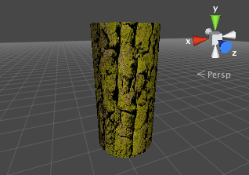
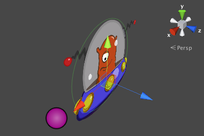
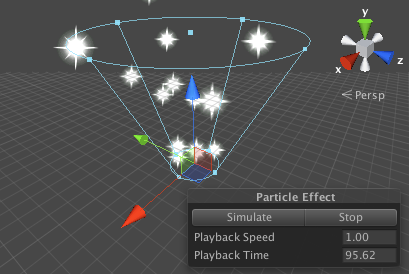

#纹理

通常情况下，对象的网格几何形状仅给出粗略的近似形状，而大多数精细的细节由__纹理__提供。纹理就是应用于网格表面上的标准位图图像。您可以看作纹理图像好像是打印在橡胶板上，然后将橡胶板拉伸并固定在网格上的适当位置。纹理的定位是通过用于创建网格的 3D 建模软件完成的。

Unity 可从最常见的图像文件格式导入纹理。

##用于 3D 模型的纹理

必须使用[材质](Materials.html)将纹理应用于对象。材质使用称为[着色器](Shaders.html)的专用图形程序在网格表面上渲染纹理。着色器可实现光照和着色效果，从而模拟许多其他事物的闪亮或凹凸表面。此外，它们还可一次使用两个或更多纹理，将这些纹理组合起来以获得更大的灵活性。

您应该使纹理的尺寸达到 2 的幂次方（例如 32x32、64x64、128x128、256x256 等）。只需将纹理放在项目的 Assets 文件夹中就足够了，它们将出现在 Project 视图中。

导入纹理后，应将其分配给[材质](class-Material.html)。随后，可将材质应用到网格、__粒子系统__或 __GUI 纹理__。通过使用__导入设置 (Import Settings)__，还可将其转换为__立方体贴图 (Cubemap)__ 或__法线贴图 (Normalmap)__，以便用于游戏中不同类型的应用。有关导入纹理的更多信息，请阅读[纹理组件页面](class-TextureImporter.html)。

##2D 图形

在 2D 游戏中，为了实现__精灵 (Sprite)__，必须将纹理应用到近似于对象形状的扁平网格。

2D 游戏中的对象可能需要一组相关的图形图像来表示动画帧或角色的不同状态。可使用特殊技术来高效设计和渲染这些图像集。请参阅有关[精灵编辑器 (Sprite Editor)](SpriteEditor.html) 的手册页以了解更多信息。

##GUI
游戏的_图形用户界面_ (GUI) 包含了一些不直接在游戏场景中使用但允许玩家进行选择和查看信息的图形。例如，分数显示和选项菜单便是游戏 GUI 的典型示例。这些图形与用于表现网格表面细节的图形明显不同，但它们仍然使用标准 Unity 纹理进行处理。请参阅 [GUI 脚本指南](GUIScriptingGuide.html)手册章节以了解有关 Unity GUI 系统的更多详细信息。

##粒子

网格非常适合表示固体对象，但不太适合表现魔法留下的火焰、烟雾和火花等对象。__粒子系统__可以更好地处理这种类型的效果。_粒子_是一个小型 2D 图形，用于表示一小部分基本为流体或气体的东西，例如烟幕云团。当许多这样的粒子一次性创建完成并开始运动（还可能有随机变化）时，它们可产生非常令人信服的效果。例如，可通过从中心点以极快的速度发出带有火焰纹理的粒子来表现爆炸。此外，可通过从场景中的高处加速落下水粒子来模拟瀑布。

Unity 的粒子系统有很多选项可用于创建各种流体效果。请参阅有关该主题的[手册章节](ParticleSystems.html)以了解更多信息。

##地形高度贴图

纹理甚至可用于根本不会查看图像（至少不能直接查看图像）的情况。在灰度图像中，每个像素值仅仅是对应于图像中该点处的灰度的数字（比如说，此数字可以是 0..1 范围内的值，其中 0 表示黑色，而 1 表示白色）。虽然可以查看这样的图像，但其实数字像素值还可用于其他用途，这正是__地形高度贴图__的作用。

_地形_是表示地面区域的网格，而地面上的每个点距离基线都有特定的高度。地形的_高度贴图_以规则的间隔将数字高度样本存储为图像中的灰度值，其中的每个像素对应于地面上的网格坐标。这些值不会在场景中显示为图像，但会转换为用于生成地形网格的坐标。

有趣的是，即使不将高度贴图直接视为图像，仍然有一些常用的图像处理技术在应用于高度数据时非常有用。例如，向高度贴图添加噪点将产生岩石地形的效果，而模糊技术将使其平滑以便产生更柔和、绵延的景观。

在手册的[本部分](script-Terrain.html)可找到有关 Unity 地形的更多信息。
