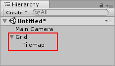
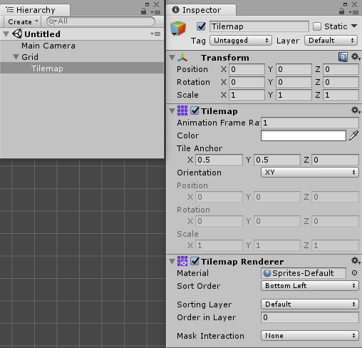
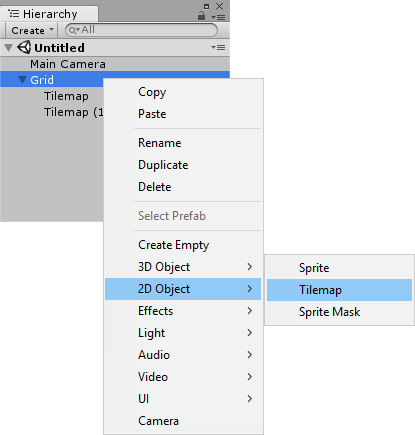
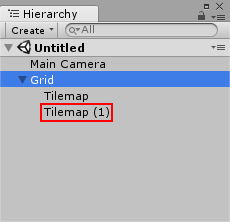
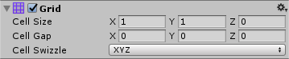

# 创建瓦片地图 (Tilemap)

从 __GameObject__ 菜单中，找到 __2D Object__，然后选择 __Tilemap__。

随即将在场景中创建一个带有子游戏对象的新游戏对象。此游戏对象的名称为 __Grid__。Grid 游戏对象决定了子 Tilemap 的布局。

 

子游戏对象的名称为 __Tilemap__。该游戏对象由 Tilemap 组件和 Tilemap Renderer 组件组成。Tilemap 游戏对象是绘制瓦片的地方。

 

要创建要用作“层”的其他 Tilemap，请选择 Grid 游戏对象或 Tilemap 游戏对象，然后在菜单中选择 __GameObject__ > __2D Object__ > __Tilemaps__，或右键单击所选的游戏对象并单击 __2D Object__ > __Tilemap__。

 

随即会将一个名为 __Tilemap (1)__ 的新游戏对象添加到所选游戏对象的层级视图中。在这个新的游戏对象上也可以绘制瓦片。

 

## 调整 Tilemap 的网格

选择 Grid 游戏对象。在 Inspector 中调整 Grid 组件中的值。

 

| 属性 | 功能 |
|:--|:--|
| __Cell Size__ |网格中每个单元格的大小|
| __Cell Gap__ |网格中各个单元格之间的间隙大小|
| __Cell Swizzle__ |将单元格位置重排到其他轴。例如：在 XZY 模式下，交换 Y 和 Z 坐标来使输入 Y 坐标映射到 Z，反之亦然。|

网格中的更改会影响所有具有瓦片地图 (Tilemap)、瓦片地图渲染器 (Tilemap Renderer) 和瓦片地图 2D 碰撞体 (Tilemap Collider 2D) 组件的子层游戏对象。

---

* 2017-09-06 Page published with limited [editorial review](DocumentationEditorialReview.html)

