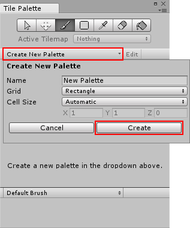

# 创建瓦片

可通过两种方法创建瓦片。第一种方法是直接创建瓦片资源。另一种方法是从一组精灵自动生成瓦片。

## 如何创建瓦片资源

要创建瓦片，请找到 __Assets__ 菜单并选择 __Create__ > __Tile__。然后，选择要保存新瓦片资源的位置。

## 如何生成多个瓦片资源

自动创建瓦片或创建多个瓦片需要在 Tile Palette 中加载面板。如果未加载面板，则需要创建一个新面板。

要创建新面板，请从 __Window__ > __Tile Palette__ 中打开 Tile Palette。

单击 Tile Palette 中的 __Create New Palette__ 按钮。提供面板名称，然后单击 __Create__ 按钮。选择一个文件夹来保存面板。创建的面板会自动加载。

 

将 _Assets_ 文件夹中的纹理或精灵拖放到 Tile Palette 上。选择要保存新瓦片资源的位置。在所选文件夹中将生成新的瓦片资源，并会将瓦片放置在 Tile Palette 上。请记住保存项目以便保存面板。

 

---

* 2018-04-12 Page published with limited [editorial review](DocumentationEditorialReview.html)

