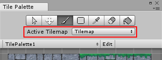
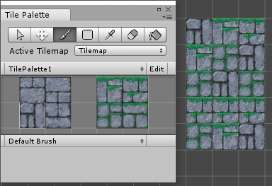
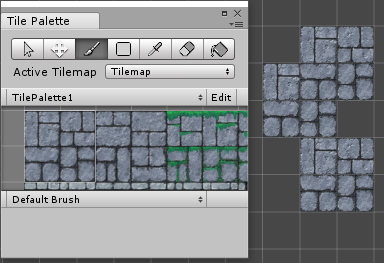
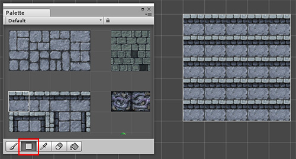
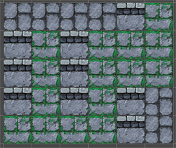

# 绘制瓦片地图

要在瓦片地图上进行绘制，其必须是 Tile Palette 中选定的有效瓦片地图。场景中的瓦片地图会自动添加到列表中。

 

Tilemap Palette 上提供了瓦片绘制工具

 

单击__绘画工具 (Paint Tool)__ 图标，从 Tilemap Palette 中选择一个瓦片，然后在 Scene 视图中单击瓦片地图以开始对瓦片布局。

使用绘画工具可以绘制选择的多个瓦片。在 Tilemap Palette 中单击鼠标左键并拖动即可进行选择。

 

使用绘画工具开关时按住 Shift 可切换擦除工具 (Erase Tool)。

 

__矩形工具 (Rectangle Tool)__ 在瓦片地图上绘制一个矩形形状，并用选定的瓦片对其进行填充。

__选取器工具 (Picker Tool)__ 用于从瓦片地图中选取用于绘制的瓦片。单击鼠标左键并拖动可选择多个瓦片。在__绘画工具__模式下按住 __Ctrl__ 键（或 macOS 上的 __Cmd__）可切换__选取器工具__。

__填充工具 (Fill Tool)__ 用于在瓦片区域中填充所选的瓦片。

 

__选择工具 (Select Tool)__ 用于选择要检查的瓦片区域。

__移动工具 (Move Tool)__ 用于将所选的瓦片区域移动到另一个位置。单击并拖动所选区域可移动瓦片。

## 瓦片地图焦点模式

如果有多个瓦片地图层，但希望仅在特定层上工作，则可以聚焦于该特定层，并从视图中屏蔽所有其他游戏对象。

 

从 Palette 窗口或 Hierarchy 窗口的 Active Target 下拉选单中选择目标 Tilemap 游戏对象。在 SceneView 的右下角，有一个 Tilemap 覆盖窗口。

在下拉选单中更改 __Focus On__ 目标：

* __None__ - 不聚焦游戏对象。
* __Tilemap__ - 聚焦于目标 Tilemap 游戏对象。所有其他游戏对象都消失。如果想要聚焦于单个瓦片地图层，适合采用此选项。
* __Grid__ - 聚焦于父 Grid 游戏对象及其所有子项。所有其他游戏对象都消失。如果想要聚焦于整个瓦片地图，适合采用此选项。

---

* 2017-09-06 Page published with limited [editorial review](DocumentationEditorialReview.html)

