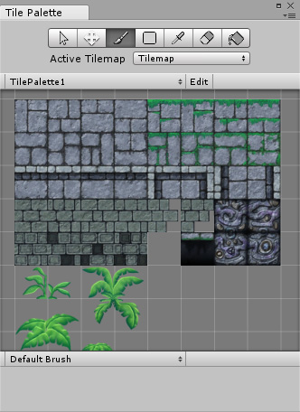
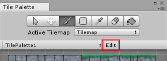

# Tilemap Palette

 

* 使用 Alt + 鼠标左键可进行平移

* 使用鼠标中键可进行平移

* 使用鼠标滚轮可进行放大或缩小

* 单击鼠标左键可选择瓦片

* 单击鼠标左键并拖动可选择多个瓦片

## 编辑 Tilemap Palette

从下拉菜单中选择所需的面板。单击面板选择菜单侧面的 Edit 按钮。

 

使用瓦片面板 (Tile Palette) 工具调整面板，就像在场景中编辑瓦片地图一样。完成后，单击 Edit 按钮退出编辑模式。请记住保存项目以便保存面板！

---

* 2017-09-06 Page published with limited [editorial review](DocumentationEditorialReview.html)

