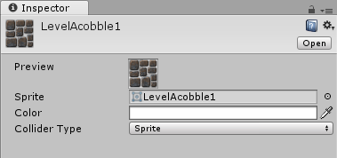

# 瓦片资源

通常，瓦片实际上是排列在瓦片地图上的精灵。在 Unity 的实现中，我们实际采用一种引用精灵的中间资源。因此，我们能够以多种方式扩展瓦片本身，为瓦片和瓦片地图创建一个强大而灵活的系统。

## 属性

 

| 属性 | 功能 |
|:--|:--|
| __Sprite__ |此瓦片资源使用的精灵|
| __Color__ |用于为材质着色|
| __Collider Type__ |None、Sprite 或 Grid|

---

* 2017-09-06 Page published with limited [editorial review](DocumentationEditorialReview.html)

