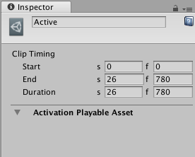

# 激活剪辑属性

使用 Inspector 窗口可更改激活剪辑的名称及其 **Clip Timing**。

## 显示名称

Timeline Editor 窗口中显示的激活剪辑的名称。默认情况下，每个激活剪辑都命名为“Active”。

## Clip Timing 属性

使用 **Clip Timing** 属性可修剪和更改激活剪辑的持续时间。大多数时间属性以秒 (s) 和帧 (f) 表示。指定以秒修改 **Clip Timing** 属性时，所有十进制值均可接受。指定帧时，仅接受整数值。例如，如果尝试在帧 (f) 字段中输入12.5，则会将其设置为 12 帧。

|**属性：** |**功能：** |
|:---|:---|
|__Start__| 剪辑开始的帧或时间（以秒为单位）。更改 Start 属性会更改时间轴资源中的剪辑轨道上的剪辑位置。更改 Start 属性也可能会影响 Duration 属性。所有剪辑都使用 Start 属性。 |
|__End__ | 剪辑结束的帧或时间（以秒为单位）。更改 End 属性会影响 Duration 属性。所有剪辑都使用 End 属性。 |
|__Duration__ | 剪辑的持续时间（以帧或秒为单位）。更改 Duration 属性也会影响 End 属性。所有剪辑都使用 Duration 属性。 |

---
* 2017-12-07  Page published with limited [editorial review](DocumentationEditorialReview.html)

