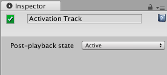

# 激活轨道属性

使用 Inspector 窗口可更改激活轨道的名称，并设置在时间轴资源完成播放时其绑定游戏对象的状态。

|**属性：** |**功能：** |
|:---|:---|
|__显示名称__| 激活轨道在 Timeline Editor 窗口和 Playable Director 组件中显示的名称。显示名称适用于时间轴资源及其所有时间轴实例。只能通过在编辑时间轴实例时选择激活轨道来修改显示名称。 |
|__Post-playback state__ | 使用 Post-playback state 可设置当时间轴资源停止播放时绑定的游戏对象的激活状态。Post-playback state 适用于时间轴资源及其所有时间轴实例。 |
|&amp;#160;&amp;#160;&amp;#160;&amp;#160;_Active_ | 选择此选项可在时间轴资源完成播放时激活绑定的游戏对象。 |
|&amp;#160;&amp;#160;&amp;#160;&amp;#160;_Inactive_ | 选择此选项可在时间轴资源完成播放时停用绑定的游戏对象。 |
|&amp;#160;&amp;#160;&amp;#160;&amp;#160;_Revert_ | 选择此选项可在时间轴资源开始播放之前将绑定的游戏对象恢复为其激活状态。例如，如果时间轴资源结束时的游戏对象设置为不活动状态，但游戏对象在时间轴资源开始播放之前处于活动状态，则游戏对象将恢复为活动状态。 |
|&amp;#160;&amp;#160;&amp;#160;&amp;#160;_Leave As Is_ | 选择此选项可将绑定的游戏对象的激活状态设置为时间轴资源结束时的状态。例如，如果时间轴资源结束时的游戏对象设置为不活动状态，则游戏对象将保持不活动状态。 |

---
* 2017-12-07  Page published with limited [editorial review](DocumentationEditorialReview.html)

